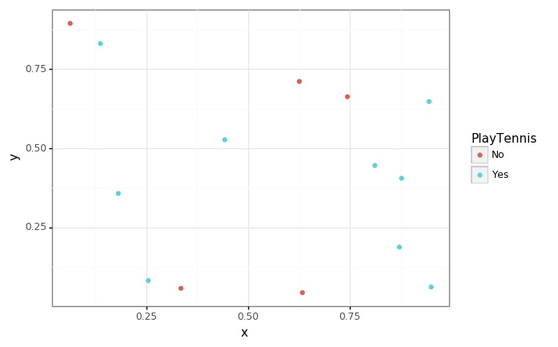
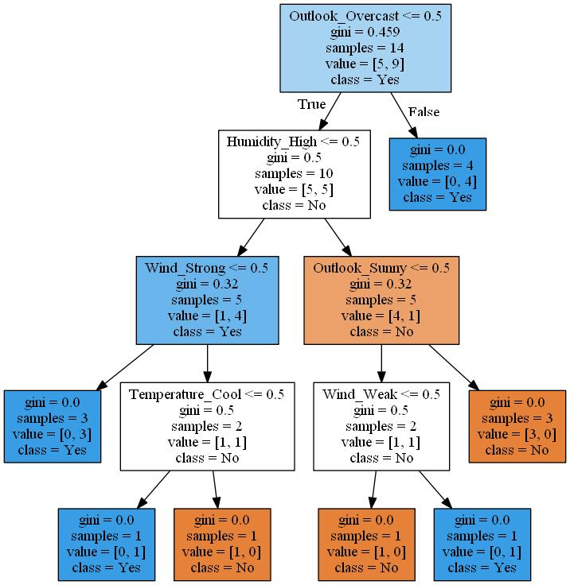

## **목적**
- 지난번 포스팅에 ensemble 모델에 관하여 이야기하면서 약한 모형으로 의사결정나무를 많이 사용하는 것을 알 수 있었습니다. 이번에는 의사결정 나무를 만들기 위하여 사용되는 Entropy와 gini index에 대해서 알아보도록 하겠습니다.
<br/>
<br/>


### **트리 구축의 원칙**

> 출처 : https://m.blog.naver.com/PostView.naver?isHttpsRedirect=true&blogId=ehdrndd&logNo=221158124011
- 결정 트리를 구축할 때는 Occamm의 면도날처럼 데이터의 특성을 가장 잘 반영하는 간단한 가설을 먼저 채택하도록 되어있습니다. 어떻게 간단하고 합리적인 트리를 만들 수 있을 지 알아보겠습니다.
<br>
<br>

---

### **1. 결정 트리**
의사결정나무를 효율적으로 만들기 위해서는 변수의 기준에 따라 불순도/불확실성을 낮추는 방식으로 선택하여 만들게 됩니다.<br>
이에 불순도(Impurity) / 불확실성(Uncertainty)를 감소하는 것을 Information gain이라고 하며 이것을 최소화시키기 위하여 Gini Index와 Entropy라는 개념을 사용하게 되고 의사결정 나무의 종류에 따라 다르게 쓰입니다.<br>
sklearn에서 default로 쓰이는 건 gini계수이며 이는 CART(Classificatioin And Regression Tree)에 쓰입니다.<br>
ID3 그리고 이것을 개선한 C4.5, C5.0에서는 Entropy를 계산한다고 합니다. <br>
CART tree는 항상 2진 분류를 하는 방식으로 나타나며, Entropy 혹은 Entropy 기반으로 계산되는 Information gain으로 계산되며 다중 분리가 됩니다. <br>

- Gini계수와 Entropy 모두 높을수록 불순도가 높아져 분류를 하기 어렵습니다. <br>


|비 고|ID3|C4.5, C5|CART|
|:---:|:---:|:---:|:---:|
|평가지수|Entropy|Information gain|Gini Index(범주), 분산의 차이(수치)|
|분리방식|다지분리|다지분리(범주) 및 이진분리(수치)|항상2진 분리|
|비고|수치형 데이터 못 다룸|||

<br>
<br>
> 출처/참고자료 : https://ko.wikipedia.org/wiki/%EA%B2%B0%EC%A0%95_%ED%8A%B8%EB%A6%AC_%ED%95%99%EC%8A%B5%EB%B2%95 <br>
> 출처/참고자료 : https://m.blog.naver.com/PostView.naver?isHttpsRedirect=true&blogId=trashx&logNo=60099037740 <br>
> 출처/참고자료 : https://ratsgo.github.io/machine%20learning/2017/03/26/tree/

---

### **1. Gini Index**
일단 sklearn의 DecisionTreeClassifier의 default 값인 Gini 계수에 대해서 먼저 설명하겠습니다. <br> 

우선 Gini index의 공식입니다. <br>

- 영역의 데이터 비율을 제곱하여 더한 값을 1에서 빼주게 된다.<br>
 <br>
<br>
- 두개 영역 이상이 되면 비율의 제곱의 비율을 곱하여 1에서 빼주게 된다.<br>

> 출처 : https://soobarkbar.tistory.com/17

<br>

- 최대값을 보게되면 1 - ( (1/2)^2 + (1/2)^2 ) = 0.5
- 최소값을 보게되면 1 - ( 1^2 + 0^2 ) = 0


```python
import os
import sys
import warnings

import math
import random
import numpy as np
import pandas as pd
import scipy

from sklearn import tree
from sklearn.tree import DecisionTreeClassifier

import matplotlib as mpl
from matplotlib import pyplot as plt
from plotnine import *

import graphviz
from sklearn.preprocessing import OneHotEncoder

%matplotlib inline
warnings.filterwarnings("ignore")
```


```python
tennis = pd.read_csv("data/tennis.csv", index_col = "Day")
tennis
```


<div>
<style scoped>
    .dataframe tbody tr th:only-of-type {
        vertical-align: middle;
    }

    .dataframe tbody tr th {
        vertical-align: top;
    }

    .dataframe thead th {
        text-align: right;
    }
</style>
<table border="1" class="dataframe">
  <thead>
    <tr style="text-align: right;">
      <th></th>
      <th>Outlook</th>
      <th>Temperature</th>
      <th>Humidity</th>
      <th>Wind</th>
      <th>PlayTennis</th>
    </tr>
    <tr>
      <th>Day</th>
      <th></th>
      <th></th>
      <th></th>
      <th></th>
      <th></th>
    </tr>
  </thead>
  <tbody>
    <tr>
      <th>D1</th>
      <td>Sunny</td>
      <td>Hot</td>
      <td>High</td>
      <td>Weak</td>
      <td>No</td>
    </tr>
    <tr>
      <th>D2</th>
      <td>Sunny</td>
      <td>Hot</td>
      <td>High</td>
      <td>Strong</td>
      <td>No</td>
    </tr>
    <tr>
      <th>D3</th>
      <td>Overcast</td>
      <td>Hot</td>
      <td>High</td>
      <td>Weak</td>
      <td>Yes</td>
    </tr>
    <tr>
      <th>D4</th>
      <td>Rain</td>
      <td>Mild</td>
      <td>High</td>
      <td>Weak</td>
      <td>Yes</td>
    </tr>
    <tr>
      <th>D5</th>
      <td>Rain</td>
      <td>Cool</td>
      <td>Normal</td>
      <td>Weak</td>
      <td>Yes</td>
    </tr>
    <tr>
      <th>D6</th>
      <td>Rain</td>
      <td>Cool</td>
      <td>Normal</td>
      <td>Strong</td>
      <td>No</td>
    </tr>
    <tr>
      <th>D7</th>
      <td>Overcast</td>
      <td>Cool</td>
      <td>Normal</td>
      <td>Strong</td>
      <td>Yes</td>
    </tr>
    <tr>
      <th>D8</th>
      <td>Sunny</td>
      <td>Mild</td>
      <td>High</td>
      <td>Weak</td>
      <td>No</td>
    </tr>
    <tr>
      <th>D9</th>
      <td>Sunny</td>
      <td>Cool</td>
      <td>Normal</td>
      <td>Weak</td>
      <td>Yes</td>
    </tr>
    <tr>
      <th>D10</th>
      <td>Rain</td>
      <td>Mild</td>
      <td>Normal</td>
      <td>Weak</td>
      <td>Yes</td>
    </tr>
    <tr>
      <th>D11</th>
      <td>Sunny</td>
      <td>Mild</td>
      <td>Normal</td>
      <td>Strong</td>
      <td>Yes</td>
    </tr>
    <tr>
      <th>D12</th>
      <td>Overcast</td>
      <td>Mild</td>
      <td>High</td>
      <td>Strong</td>
      <td>Yes</td>
    </tr>
    <tr>
      <th>D13</th>
      <td>Overcast</td>
      <td>Hot</td>
      <td>Normal</td>
      <td>Weak</td>
      <td>Yes</td>
    </tr>
    <tr>
      <th>D14</th>
      <td>Rain</td>
      <td>Mild</td>
      <td>High</td>
      <td>Strong</td>
      <td>No</td>
    </tr>
  </tbody>
</table>
</div>


- 위와 같은 데이터가 있다고 할 때, 우리는 어떤 요인이 가장 확실한(불확실성이 적은) 변수일지 생각을 하고 트리를 만들어야합니다.

<br>
<br>

아무것도 나누지 않았을 때 gini계수를 구하는 함수를 만든 후 얼마인지 출력해보겠습니다


```python
def get_unique_dict(df) :
    return {x : list(df[x].unique()) for x in ["Outlook", "Temperature", "Humidity", "Wind"]}
```


```python
def get_gini(df, y_col) :
    Ys = df[y_col].value_counts()
    total_row = len(df)
    return 1 - np.sum([np.square(len(df[df[y_col] == y]) / total_row) for y in Ys.index])
```


```python
def gini_split(df, y_col, col, feature) :
    r1 = len(df[df[col] == feature])
    Y1 = dict(df[df[col] == feature][y_col].value_counts())
    r2 = len(df[df[col] != feature])
    Y2 = dict(df[df[col] != feature][y_col].value_counts())
    
    ratio = r1 / (r1 + r2)
    gi1 = 1 - np.sum([np.square(len(df[(df[col] == feature) & (df[y_col] == x)]) / r1) for x, y in Y1.items()])
    gi2 = 1 - np.sum([np.square(len(df[(df[col] != feature) & (df[y_col] == x)]) / r2) for x, y in Y2.items()])
    
    return (ratio * gi1) + ((1-ratio) * gi2)
```

어떤 기준으로 나누었을 때 gini계수를 구하는 함수를 만들어 예시로 Outlook이 Sunny일 때 gini 계수를 구해보겠습니다.


```python
get_gini(tennis, "PlayTennis")
```


    0.4591836734693877


아무것도 나누지 않았을 때보다, Sunny로 나누었을 때 gini계수가 줄어드는 것을 볼 수 있습니다.<br>
이 때 이 차이값을 Information gain(정보획득)이라고 합니다. 그리고 정보획득량이 많은 쪽을 선택하여 트리의 구조를 만들기 시작합니다.


```python
split_point = ["Outlook", "Sunny"]
print("{}, {} 기준 split 후 gini 계수 : {}".format(*split_point, gini_split(tennis, "PlayTennis", *split_point)))
print("information gain : {}".format(get_gini(tennis, "PlayTennis") - gini_split(tennis, "PlayTennis", *split_point)))
```

    Outlook, Sunny 기준 split 후 gini 계수 : 0.3936507936507936
    information gain : 0.06553287981859413
    

- 이제 모든 변수에 대해서 각각의 gini계수를 구하여 정보획득량이 많은, 즉 gini계수가 적은 변수를 선정하여 트리를 만들어갑니다.


```python
y_col = "PlayTennis"
unique_dict = get_unique_dict(tennis)
unique_dict
```


    {'Outlook': ['Sunny', 'Overcast', 'Rain'],
     'Temperature': ['Hot', 'Mild', 'Cool'],
     'Humidity': ['High', 'Normal'],
     'Wind': ['Weak', 'Strong']}


```python
[f"col : {idx}, split_feature : {v} : gini_index = {gini_split(tennis, y_col, idx, v)}" for idx, val in unique_dict.items() for v in val]
```


    ['col : Outlook, split_feature : Sunny : gini_index = 0.3936507936507936',
     'col : Outlook, split_feature : Overcast : gini_index = 0.35714285714285715',
     'col : Outlook, split_feature : Rain : gini_index = 0.4571428571428571',
     'col : Temperature, split_feature : Hot : gini_index = 0.4428571428571429',
     'col : Temperature, split_feature : Mild : gini_index = 0.4583333333333333',
     'col : Temperature, split_feature : Cool : gini_index = 0.45',
     'col : Humidity, split_feature : High : gini_index = 0.3673469387755103',
     'col : Humidity, split_feature : Normal : gini_index = 0.3673469387755103',
     'col : Wind, split_feature : Weak : gini_index = 0.4285714285714286',
     'col : Wind, split_feature : Strong : gini_index = 0.42857142857142855']


```python
gini_df = pd.DataFrame([[idx, v, gini_split(tennis, y_col, idx, v)] for idx, val in unique_dict.items() for v in val], columns = ["cat1", "cat2", "gini"])
```


```python
print(gini_df.iloc[gini_df["gini"].argmax()])
print(gini_df.iloc[gini_df["gini"].argmin()])
```

    cat1    Temperature
    cat2           Mild
    gini       0.458333
    Name: 4, dtype: object
    cat1     Outlook
    cat2    Overcast
    gini    0.357143
    Name: 1, dtype: object
    

---
임의로 x, y좌표를 생성하여 정보들이 얼마나 흩어져있는지 확인해보겠습니다.


```python
def generate_xy(df, split_col = None, split_value = None) :
    if split_col == None :
        return df.assign(x = [random.random() for _ in range(len(df))], y = [random.random() for _ in range(len(df))])
    else :
        tmp_ = df[df[split_col] == split_value]
        tmp__ = df[df[split_col] != split_value]
        return pd.concat([tmp_.assign(x = [random.random() / 2 for _ in range(len(tmp_))], y = [random.random() for _ in range(len(tmp_))]),
                 tmp__.assign(x = [(random.random() / 2) + 0.5 for _ in range(len(tmp__))], y = [random.random() for _ in range(len(tmp__))])] )
```

- 아무런 기준을 두지 않았을 때는 정보를 구분할 수 있는 정보가 없습니다.


```python
p = (
    ggplot(data = generate_xy(tennis), mapping = aes(x = "x", y = "y", color = y_col)) +
    geom_point() +
    theme_bw()
)
p.save(filename = "../assets/img/2021-06-01-Entropy/1.jpg")
```



- Outlook이 Overcast로 나누었을 때, Yes 4개가 확실히 구분되는 것을 볼 수 있습니다.


```python
split_list = ["Outlook", "Overcast"]
p = (
    ggplot(data = generate_xy(tennis, *split_list), mapping = aes(x = "x", y = "y", color = y_col)) +
    geom_point() +
    geom_vline(xintercept = 0.5, color = "red", alpha = 0.7) +
    theme_bw()
)
p.save(filename = "../assets/img/2021-06-01-Entropy/2.jpg")
```


- 정보획득량이 가장 큰 Temperature가 Mild로 나누었을 때입니다.


```python
split_list = ["Temperature", "Mild"]
p = (
    ggplot(data = generate_xy(tennis, *split_list), mapping = aes(x = "x", y = "y", color = y_col)) +
    geom_point() +
    geom_vline(xintercept = 0.5, color = "red", alpha = 0.7) +
    theme_bw()
)
p.save(filename = "../assets/img/2021-06-01-Entropy/3.jpg")
```


- Outlook이 Sunny, Rain으로 각각 나누었을 때입니다.


```python
split_list = ["Outlook", "Sunny"]
p = (
    ggplot(data = generate_xy(tennis, *split_list), mapping = aes(x = "x", y = "y", color = y_col)) +
    geom_point() +
    geom_vline(xintercept = 0.5, color = "red", alpha = 0.7) +
    theme_bw()
)
p.save(filename = "../assets/img/2021-06-01-Entropy/4.jpg")
```


```python
split_list = ["Outlook", "Rain"]
p = (
    ggplot(data = generate_xy(tennis, *split_list), mapping = aes(x = "x", y = "y", color = y_col)) +
    geom_point() +
    geom_vline(xintercept = 0.5, color = "red", alpha = 0.7) +
    theme_bw()
)
p.save("../assets/img/2021-06-01-Entropy/5.jpg")
```


#### **실제 tree 모델과 비교하기 위하여 OneHotEncoding 후 트리모형을 돌려보도록 하겠습니다.


```python
cols = ["Outlook", "Temperature", "Humidity", "Wind"]
oe = OneHotEncoder()
```


```python
Xs = pd.get_dummies(tennis[cols])
Ys = tennis[y_col]
```


```python
dt_gini = DecisionTreeClassifier(criterion="gini")
dt_gini.fit(Xs, Ys)
```


    DecisionTreeClassifier(ccp_alpha=0.0, class_weight=None, criterion='gini',
                           max_depth=None, max_features=None, max_leaf_nodes=None,
                           min_impurity_decrease=0.0, min_impurity_split=None,
                           min_samples_leaf=1, min_samples_split=2,
                           min_weight_fraction_leaf=0.0, presort='deprecated',
                           random_state=None, splitter='best')


```python
def save_graphviz(grp, grp_num) :
    p = graphviz.Source(grp)
    p.save(filename = f"../assets/img/2021-06-01-Entropy/{grp_num}")
    p.render(filename = f"../assets/img/2021-06-01-Entropy/{grp_num}", format = "jpg")
```


```python
grp = tree.export_graphviz(dt_gini, out_file = None, feature_names=Xs.columns,  
                   class_names=Ys.unique(),
                   filled=True)
save_graphviz(grp, 6)
```



#### **실제로 이 순서가 맞는지 확인해보겠습니다**


```python
get_gini(tennis, "PlayTennis")
```


    0.4591836734693877


```python
gini_df.iloc[gini_df["gini"].argmin()]
```


    cat1     Outlook
    cat2    Overcast
    gini    0.357143
    Name: 1, dtype: object


```python
tennis_node1 = tennis[tennis["Outlook"] != "Overcast"]
[print(f"col : {idx}, split_feature : {v} : gini_index = {gini_split(tennis_node1, y_col, idx, v)}") for idx, val in get_unique_dict(tennis_node1).items() for v in val]
gini_df = pd.DataFrame([[idx, v, gini_split(tennis_node1, y_col, idx, v)] for idx, val in get_unique_dict(tennis_node1).items() for v in val], columns = ["cat1", "cat2", "gini"])
print("")
print("gini index : {}".format(get_gini(tennis_node1, y_col)))
print(gini_df.iloc[gini_df["gini"].argmin()])
```

    col : Outlook, split_feature : Sunny : gini_index = 0.48
    col : Outlook, split_feature : Rain : gini_index = 0.48
    col : Temperature, split_feature : Hot : gini_index = 0.375
    col : Temperature, split_feature : Mild : gini_index = 0.48
    col : Temperature, split_feature : Cool : gini_index = 0.4761904761904763
    col : Humidity, split_feature : High : gini_index = 0.31999999999999984
    col : Humidity, split_feature : Normal : gini_index = 0.31999999999999984
    col : Wind, split_feature : Weak : gini_index = 0.4166666666666667
    col : Wind, split_feature : Strong : gini_index = 0.4166666666666667
    
    gini index : 0.5
    cat1    Humidity
    cat2        High
    gini        0.32
    Name: 5, dtype: object
    


```python
tennis_node2 = tennis[(tennis["Outlook"] != "Overcast") & (tennis["Humidity"] == "High")]
[print(f"col : {idx}, split_feature : {v} : gini_index = {gini_split(tennis_node2, y_col, idx, v)}") for idx, val in get_unique_dict(tennis_node2).items() for v in val]
gini_df = pd.DataFrame([[idx, v, gini_split(tennis_node2, y_col, idx, v)] for idx, val in get_unique_dict(tennis_node2).items() for v in val], columns = ["cat1", "cat2", "gini"])
print("")
print("gini index : {}".format(get_gini(tennis_node2, y_col)))
gini_df.iloc[gini_df["gini"].argmin()]
```

    col : Outlook, split_feature : Sunny : gini_index = 0.2
    col : Outlook, split_feature : Rain : gini_index = 0.2
    col : Temperature, split_feature : Hot : gini_index = 0.26666666666666666
    col : Temperature, split_feature : Mild : gini_index = 0.26666666666666666
    col : Humidity, split_feature : High : gini_index = 0.31999999999999984
    col : Wind, split_feature : Weak : gini_index = 0.26666666666666666
    col : Wind, split_feature : Strong : gini_index = 0.26666666666666666
    
    gini index : 0.31999999999999984
    


    cat1    Outlook
    cat2      Sunny
    gini        0.2
    Name: 0, dtype: object


#### - gini계수가 0이면 가장 끝쪽에 있는 terminal node가 됩니다.(데이터가 많으면 overfitting을 막기위하여 가지치기 컨셉이 활용됩니다)


```python
tennis_ter1 = tennis[tennis["Outlook"] == "Overcast"]
[print(f"col : {idx}, split_feature : {v} : gini_index = {gini_split(tennis_ter1, y_col, idx, v)}") for idx, val in get_unique_dict(tennis_ter1).items() for v in val]
gini_df = pd.DataFrame([[idx, v, gini_split(tennis_ter1, y_col, idx, v)] for idx, val in get_unique_dict(tennis_ter1).items() for v in val], columns = ["cat1", "cat2", "gini"])
gini_df.iloc[gini_df["gini"].argmin()]
```

    col : Outlook, split_feature : Overcast : gini_index = 0.0
    col : Temperature, split_feature : Hot : gini_index = 0.0
    col : Temperature, split_feature : Cool : gini_index = 0.0
    col : Temperature, split_feature : Mild : gini_index = 0.0
    col : Humidity, split_feature : High : gini_index = 0.0
    col : Humidity, split_feature : Normal : gini_index = 0.0
    col : Wind, split_feature : Weak : gini_index = 0.0
    col : Wind, split_feature : Strong : gini_index = 0.0
    


    cat1     Outlook
    cat2    Overcast
    gini           0
    Name: 0, dtype: object


---

### **2. Entropy**
다음은 ID3, C4.5 등 트리에서 정보획득량을 측정하기 위해 쓰이는 Entropy입니다.<br> 

우선 Entropy의 공식입니다. <br>

- 영역의 데이터 비율을 제곱하여 더한 값을 1에서 빼주게 된다.<br>

<br>


```python
max_entropy = (-1 * ((0.5*np.log2(0.5)) + (0.5*np.log2(0.5))))
min_entropy = (-1 * ((1*np.log2(1))))
print(f"Entropy의 최대값 : {max_entropy}")
print(f"Entropy의 최대값 : {min_entropy}")
```

    Entropy의 최대값 : 1.0
    Entropy의 최대값 : -0.0
    


```python
tennis
```


<div>
<style scoped>
    .dataframe tbody tr th:only-of-type {
        vertical-align: middle;
    }

    .dataframe tbody tr th {
        vertical-align: top;
    }

    .dataframe thead th {
        text-align: right;
    }
</style>
<table border="1" class="dataframe">
  <thead>
    <tr style="text-align: right;">
      <th></th>
      <th>Outlook</th>
      <th>Temperature</th>
      <th>Humidity</th>
      <th>Wind</th>
      <th>PlayTennis</th>
    </tr>
    <tr>
      <th>Day</th>
      <th></th>
      <th></th>
      <th></th>
      <th></th>
      <th></th>
    </tr>
  </thead>
  <tbody>
    <tr>
      <th>D1</th>
      <td>Sunny</td>
      <td>Hot</td>
      <td>High</td>
      <td>Weak</td>
      <td>No</td>
    </tr>
    <tr>
      <th>D2</th>
      <td>Sunny</td>
      <td>Hot</td>
      <td>High</td>
      <td>Strong</td>
      <td>No</td>
    </tr>
    <tr>
      <th>D3</th>
      <td>Overcast</td>
      <td>Hot</td>
      <td>High</td>
      <td>Weak</td>
      <td>Yes</td>
    </tr>
    <tr>
      <th>D4</th>
      <td>Rain</td>
      <td>Mild</td>
      <td>High</td>
      <td>Weak</td>
      <td>Yes</td>
    </tr>
    <tr>
      <th>D5</th>
      <td>Rain</td>
      <td>Cool</td>
      <td>Normal</td>
      <td>Weak</td>
      <td>Yes</td>
    </tr>
    <tr>
      <th>D6</th>
      <td>Rain</td>
      <td>Cool</td>
      <td>Normal</td>
      <td>Strong</td>
      <td>No</td>
    </tr>
    <tr>
      <th>D7</th>
      <td>Overcast</td>
      <td>Cool</td>
      <td>Normal</td>
      <td>Strong</td>
      <td>Yes</td>
    </tr>
    <tr>
      <th>D8</th>
      <td>Sunny</td>
      <td>Mild</td>
      <td>High</td>
      <td>Weak</td>
      <td>No</td>
    </tr>
    <tr>
      <th>D9</th>
      <td>Sunny</td>
      <td>Cool</td>
      <td>Normal</td>
      <td>Weak</td>
      <td>Yes</td>
    </tr>
    <tr>
      <th>D10</th>
      <td>Rain</td>
      <td>Mild</td>
      <td>Normal</td>
      <td>Weak</td>
      <td>Yes</td>
    </tr>
    <tr>
      <th>D11</th>
      <td>Sunny</td>
      <td>Mild</td>
      <td>Normal</td>
      <td>Strong</td>
      <td>Yes</td>
    </tr>
    <tr>
      <th>D12</th>
      <td>Overcast</td>
      <td>Mild</td>
      <td>High</td>
      <td>Strong</td>
      <td>Yes</td>
    </tr>
    <tr>
      <th>D13</th>
      <td>Overcast</td>
      <td>Hot</td>
      <td>Normal</td>
      <td>Weak</td>
      <td>Yes</td>
    </tr>
    <tr>
      <th>D14</th>
      <td>Rain</td>
      <td>Mild</td>
      <td>High</td>
      <td>Strong</td>
      <td>No</td>
    </tr>
  </tbody>
</table>
</div>


```python
def get_entropy(df, y_col) :
    Ys = df[y_col].value_counts()
    total_row = len(df)
    (-1 * ((0.5*np.log2(0.5)) + (0.5*np.log2(0.5))))
    return -1 *  np.sum([(len(df[df[y_col] == y]) / total_row) * np.log2(len(df[df[y_col] == y]) / total_row) for y in Ys.index])
```


```python
get_entropy(tennis, y_col)
```


    0.9402859586706311


```python
def entropy_split(df, y_col, col, feature) :
    r1 = len(df[df[col] == feature])
    Y1 = dict(df[df[col] == feature][y_col].value_counts())
    r2 = len(df[df[col] != feature])
    Y2 = dict(df[df[col] != feature][y_col].value_counts())
    
    ratio = r1 / (r1 + r2)
    ent1 = np.sum([(len(df[(df[col] == feature) & (df[y_col] == x)]) / r1) * np.log2(len(df[(df[col] == feature) & (df[y_col] == x)]) / r1) for x, y in Y1.items()])
    ent2 = np.sum([(len(df[(df[col] != feature) & (df[y_col] == x)]) / r2) * np.log2(len(df[(df[col] != feature) & (df[y_col] == x)]) / r2) for x, y in Y2.items()])
    
    return -1 * ((ratio * ent1) + ((1-ratio) * ent2))
```


```python
entropy_split(tennis, "PlayTennis", "Outlook", "Sunny")
```


    0.8380423950607803


Entropy 역시 gini index와 똑같은 개념으로 아무것도 나누지 않았을 때보다, Sunny로 나누었을 때 줄어드는 것을 볼 수 있습니다.<br>
이 때 차이값(Information gain)을 이용하여 트리를 만들면 ID3, C4.5 등의 트리 구조를 만들게 됩니다.


```python
[f"col : {idx}, split_feature : {v} : Entropy = {entropy_split(tennis, y_col, idx, v)}" for idx, val in get_unique_dict(tennis).items() for v in val]
```


    ['col : Outlook, split_feature : Sunny : Entropy = 0.8380423950607803',
     'col : Outlook, split_feature : Overcast : Entropy = 0.7142857142857143',
     'col : Outlook, split_feature : Rain : Entropy = 0.937101105625982',
     'col : Temperature, split_feature : Hot : Entropy = 0.9152077851647805',
     'col : Temperature, split_feature : Mild : Entropy = 0.9389462162661898',
     'col : Temperature, split_feature : Cool : Entropy = 0.9253298887416583',
     'col : Humidity, split_feature : High : Entropy = 0.7884504573082896',
     'col : Humidity, split_feature : Normal : Entropy = 0.7884504573082896',
     'col : Wind, split_feature : Weak : Entropy = 0.8921589282623617',
     'col : Wind, split_feature : Strong : Entropy = 0.8921589282623617']


```python
entropy_df = pd.DataFrame([[idx, v, entropy_split(tennis, y_col, idx, v)] for idx, val in unique_dict.items() for v in val], columns = ["cat1", "cat2", "entropy"])
```


```python
print(entropy_df.iloc[entropy_df["entropy"].argmin()])
print(entropy_df.iloc[gini_df["gini"].argmax()])
```

    cat1        Outlook
    cat2       Overcast
    entropy    0.714286
    Name: 1, dtype: object
    cat1        Outlook
    cat2          Sunny
    entropy    0.838042
    Name: 0, dtype: object
    

#### **실제 tree 모델과 비교하기 위하여 OneHotEncoding 후 트리모형을 돌려보도록 하겠습니다.**


```python
dt_entropy = DecisionTreeClassifier(criterion="entropy")
dt_entropy.fit(Xs, Ys)
```


    DecisionTreeClassifier(ccp_alpha=0.0, class_weight=None, criterion='entropy',
                           max_depth=None, max_features=None, max_leaf_nodes=None,
                           min_impurity_decrease=0.0, min_impurity_split=None,
                           min_samples_leaf=1, min_samples_split=2,
                           min_weight_fraction_leaf=0.0, presort='deprecated',
                           random_state=None, splitter='best')


```python
grp = tree.export_graphviz(dt_entropy, out_file = None, feature_names=Xs.columns,  
                   class_names=Ys.unique(),
                   filled=True)
save_graphviz(grp, 7)
```


#### **실제로 이 순서가 맞는지 확인해보겠습니다**


```python
get_entropy(tennis, "PlayTennis")
```


    0.9402859586706311


```python
entropy_df.iloc[entropy_df["entropy"].argmin()]
```


    cat1        Outlook
    cat2       Overcast
    entropy    0.714286
    Name: 1, dtype: object


```python
tennis_ter1 = tennis[tennis["Outlook"] == "Overcast"]
[print(f"col : {idx}, split_feature : {v} : entropy = {entropy_split(tennis_ter1, y_col, idx, v)}") for idx, val in get_unique_dict(tennis_ter1).items() for v in val]
entropy_df = pd.DataFrame([[idx, v, entropy_split(tennis, y_col, idx, v)] for idx, val in get_unique_dict(tennis_ter1).items() for v in val], columns = ["cat1", "cat2", "entropy"])
entropy_df.iloc[entropy_df["entropy"].argmin()]
```

    col : Outlook, split_feature : Overcast : entropy = -0.0
    col : Temperature, split_feature : Hot : entropy = -0.0
    col : Temperature, split_feature : Cool : entropy = -0.0
    col : Temperature, split_feature : Mild : entropy = -0.0
    col : Humidity, split_feature : High : entropy = -0.0
    col : Humidity, split_feature : Normal : entropy = -0.0
    col : Wind, split_feature : Weak : entropy = -0.0
    col : Wind, split_feature : Strong : entropy = -0.0
    


    cat1        Outlook
    cat2       Overcast
    entropy    0.714286
    Name: 0, dtype: object


```python
tennis_ter1 = tennis[tennis["Outlook"] != "Overcast"]
[print(f"col : {idx}, split_feature : {v} : entropy = {entropy_split(tennis_ter1, y_col, idx, v)}") for idx, val in get_unique_dict(tennis_ter1).items() for v in val]
entropy_df = pd.DataFrame([[idx, v, entropy_split(tennis, y_col, idx, v)] for idx, val in get_unique_dict(tennis_ter1).items() for v in val], columns = ["cat1", "cat2", "entropy"])
entropy_df.iloc[entropy_df["entropy"].argmin()]
```

    col : Outlook, split_feature : Sunny : entropy = 0.9709505944546686
    col : Outlook, split_feature : Rain : entropy = 0.9709505944546686
    col : Temperature, split_feature : Hot : entropy = 0.7635472023399721
    col : Temperature, split_feature : Mild : entropy = 0.9709505944546686
    col : Temperature, split_feature : Cool : entropy = 0.965148445440323
    col : Humidity, split_feature : High : entropy = 0.7219280948873623
    col : Humidity, split_feature : Normal : entropy = 0.7219280948873623
    col : Wind, split_feature : Weak : entropy = 0.8754887502163469
    col : Wind, split_feature : Strong : entropy = 0.8754887502163469
    


    cat1       Humidity
    cat2           High
    entropy     0.78845
    Name: 5, dtype: object


---
### **마지막으로 gini index와 entropy를 활용한 tree가 어떻게 노드가 나뉘었는지 보고 포스팅 마치겠습니다.**

 

<br>
<br>

---

<br>

- code : [https://github.com/Chanjun-kim/Chanjun-kim.github.io/blob/main/_ipynb/2021-06-01-Entropy.ipynb](https://github.com/Chanjun-kim/Chanjun-kim.github.io/blob/main/_ipynb/2021-06-01-Entropy.ipynb) <br>
- 참고 자료 : [https://m.blog.naver.com/PostView.naver?isHttpsRedirect=true&blogId=ehdrndd&logNo=221158124011](https://m.blog.naver.com/PostView.naver?isHttpsRedirect=true&blogId=ehdrndd&logNo=221158124011)
