## **학습목적**
이 포스팅에선 시계열 데이터를 다루는 딥러닝 기술인 LSTM을 활용하여 예측을 해보겠습니다.<br>
데이터를 쉽게 만들기 위하여 제공되는 TimeseriesGenerator를 활용하여 데이터셋을 구축을 해보겠습니다.<br>
> - 이 글은 LSTM을 활용하고 다양하게 모델 및 파라미터를 바꾸는 것에 집중되어 있습니다. (LSTM의 원리 등은 나중에 따로 포스팅하도록 하겠습니다.) <br>
> - 또한 데이터 EDA에 대한 글은 따로 포스팅하겠습니다.


```python
import os
import sys
import warnings
from tqdm import tqdm

import itertools
import numpy as np
import pandas as pd

import matplotlib as mpl
import matplotlib.pyplot as plt
import plotnine as p9
import seaborn as sns

import scipy
import stats
from statsmodels.tsa.arima.model import ARIMA
from statsmodels.graphics.tsaplots import plot_acf, plot_pacf
from sklearn.metrics import mean_absolute_error
from sklearn.preprocessing import OneHotEncoder
from sklearn.preprocessing import MinMaxScaler


import tensorflow as tf
from tensorflow import keras
from tensorflow.keras.models import Sequential, Model
from tensorflow.keras.layers import Dense, LSTM, GRU, RNN, Reshape
from keras.preprocessing.sequence import TimeseriesGenerator
```


```python
%matplotlib inline
warnings.filterwarnings("ignore")
```


```python
mpl.rcParams['axes.unicode_minus'] = False
# fm._rebuild()
plt.rcParams["font.family"] = 'NanumMyeongjo'
plt.rcParams["figure.figsize"] = (10,10)
```

#### - 데이터는 기존 ARIMA 포스팅과 같습니다.


```python
train = pd.read_csv("data/dacon/energy/train.csv", encoding = "cp949")
train.head()
```


<div>
<style scoped>
    .dataframe tbody tr th:only-of-type {
        vertical-align: middle;
    }

    .dataframe tbody tr th {
        vertical-align: top;
    }

    .dataframe thead th {
        text-align: right;
    }
</style>
<table border="1" class="dataframe">
  <thead>
    <tr style="text-align: right;">
      <th></th>
      <th>num</th>
      <th>date_time</th>
      <th>전력사용량(kWh)</th>
      <th>기온(°C)</th>
      <th>풍속(m/s)</th>
      <th>습도(%)</th>
      <th>강수량(mm)</th>
      <th>일조(hr)</th>
      <th>비전기냉방설비운영</th>
      <th>태양광보유</th>
    </tr>
  </thead>
  <tbody>
    <tr>
      <th>0</th>
      <td>1</td>
      <td>2020-06-01 00</td>
      <td>8179.056</td>
      <td>17.6</td>
      <td>2.5</td>
      <td>92.0</td>
      <td>0.8</td>
      <td>0.0</td>
      <td>0.0</td>
      <td>0.0</td>
    </tr>
    <tr>
      <th>1</th>
      <td>1</td>
      <td>2020-06-01 01</td>
      <td>8135.640</td>
      <td>17.7</td>
      <td>2.9</td>
      <td>91.0</td>
      <td>0.3</td>
      <td>0.0</td>
      <td>0.0</td>
      <td>0.0</td>
    </tr>
    <tr>
      <th>2</th>
      <td>1</td>
      <td>2020-06-01 02</td>
      <td>8107.128</td>
      <td>17.5</td>
      <td>3.2</td>
      <td>91.0</td>
      <td>0.0</td>
      <td>0.0</td>
      <td>0.0</td>
      <td>0.0</td>
    </tr>
    <tr>
      <th>3</th>
      <td>1</td>
      <td>2020-06-01 03</td>
      <td>8048.808</td>
      <td>17.1</td>
      <td>3.2</td>
      <td>91.0</td>
      <td>0.0</td>
      <td>0.0</td>
      <td>0.0</td>
      <td>0.0</td>
    </tr>
    <tr>
      <th>4</th>
      <td>1</td>
      <td>2020-06-01 04</td>
      <td>8043.624</td>
      <td>17.0</td>
      <td>3.3</td>
      <td>92.0</td>
      <td>0.0</td>
      <td>0.0</td>
      <td>0.0</td>
      <td>0.0</td>
    </tr>
  </tbody>
</table>
</div>


```python
test = pd.read_csv("data/dacon/energy/test.csv", encoding = "cp949")
test.head()
```


<div>
<style scoped>
    .dataframe tbody tr th:only-of-type {
        vertical-align: middle;
    }

    .dataframe tbody tr th {
        vertical-align: top;
    }

    .dataframe thead th {
        text-align: right;
    }
</style>
<table border="1" class="dataframe">
  <thead>
    <tr style="text-align: right;">
      <th></th>
      <th>num</th>
      <th>date_time</th>
      <th>기온(°C)</th>
      <th>풍속(m/s)</th>
      <th>습도(%)</th>
      <th>강수량(mm, 6시간)</th>
      <th>일조(hr, 3시간)</th>
      <th>비전기냉방설비운영</th>
      <th>태양광보유</th>
    </tr>
  </thead>
  <tbody>
    <tr>
      <th>0</th>
      <td>1</td>
      <td>2020-08-25 00</td>
      <td>27.8</td>
      <td>1.5</td>
      <td>74.0</td>
      <td>0.0</td>
      <td>0.0</td>
      <td>NaN</td>
      <td>NaN</td>
    </tr>
    <tr>
      <th>1</th>
      <td>1</td>
      <td>2020-08-25 01</td>
      <td>NaN</td>
      <td>NaN</td>
      <td>NaN</td>
      <td>NaN</td>
      <td>NaN</td>
      <td>NaN</td>
      <td>NaN</td>
    </tr>
    <tr>
      <th>2</th>
      <td>1</td>
      <td>2020-08-25 02</td>
      <td>NaN</td>
      <td>NaN</td>
      <td>NaN</td>
      <td>NaN</td>
      <td>NaN</td>
      <td>NaN</td>
      <td>NaN</td>
    </tr>
    <tr>
      <th>3</th>
      <td>1</td>
      <td>2020-08-25 03</td>
      <td>27.3</td>
      <td>1.1</td>
      <td>78.0</td>
      <td>NaN</td>
      <td>0.0</td>
      <td>NaN</td>
      <td>NaN</td>
    </tr>
    <tr>
      <th>4</th>
      <td>1</td>
      <td>2020-08-25 04</td>
      <td>NaN</td>
      <td>NaN</td>
      <td>NaN</td>
      <td>NaN</td>
      <td>NaN</td>
      <td>NaN</td>
      <td>NaN</td>
    </tr>
  </tbody>
</table>
</div>


```python
y_col = "전력사용량(kWh)"
```

- Traing set에 대하여 MinMax Scaling을 시켜주고, validation set에도 적용시켜주기 위한 함수


```python
def fit_minmmax_scaler(val_data, minmax_value) :
    val_data = pd.merge(val_data, minmax_value, on = "num")
    val_data[y_col]  = val_data.apply(lambda x : (x[y_col] - x["min"]) / (x["max"] - x["min"]), axis = 1)
    val_data.drop(columns = ["max", "min"], inplace = True)
    
    return val_data
```

- Keras의 TimeSeriesGenerator를 통하여 length를 넣으면 X값과 Y값을 학습시킬 수 있도록 만들어주는 함수.


```python
def make_data(data, y_col, length, start_idx = 1) :
    for i, x in tqdm(enumerate(data.num.unique())):
        X = data.loc[data.num == x].iloc[ : , 1:].reset_index(drop = True)
        Y = data.loc[data.num == x][[y_col]].reset_index(drop = True)
        X = np.array(X)
        Y = np.array(Y)
        data_gen = TimeseriesGenerator(X, Y, length=length, batch_size = len(X) - length)

        if i == 0 :
            Xs = data_gen[0][0]
            Ys = data_gen[0][1]
        else :
            Xs = np.concatenate((Xs, data_gen[0][0]))
            Ys = np.concatenate((Ys, data_gen[0][1]))

    return Xs, Ys        
```


```python
def history_plot(history) :
    fig, loss_ax = plt.subplots()
    acc_ax = loss_ax.twinx()

    loss_ax.plot(history.history['loss'], 'y', label='train loss')
    loss_ax.plot(history.history['val_loss'], 'r', label='val loss')
    loss_ax.set_xlabel('epoch')
    loss_ax.set_ylabel('loss')
    loss_ax.legend(loc='upper left')

    acc_ax.plot(history.history['mse'], 'b', label='train mse')
    acc_ax.plot(history.history['val_mse'], 'g', label='val mse')
    acc_ax.set_ylabel('mse')
    acc_ax.legend(loc='upper right')

    plt.show()
```


```python
def return_predict(train, test, date_idx, length) :
    result = np.zeros(len(val))
    result_idx = 0

    for i in tqdm(test.num.unique()):
        onehot_value = train.loc[train.num == i].iloc[-1: , 1:-1]
        for n, m in enumerate(range(len(val[val.num == i]))) :
            if n == 0 :
                predict_data = np.array(train.loc[train.num == i].iloc[-24: , 1:])
            else : 
                predict_data = predict_data[-24:]
            next_= model.predict(np.reshape(predict_data, (1, length, predict_data.shape[1])))
            predict_data = np.concatenate([predict_data, np.array([list(onehot_value.values[0]) + [next_[0][0]]])])
            result[result_idx] = next_
            result_idx += 1
    
    ret = date_idx[["num", "date_time"]]
    ret["predict"] = result
    ret.reset_index(drop = True, inplace = True)
    return ret
```


```python
def predict_grp_idx(df, idx, y_col) :
    g = (
        p9.ggplot() +
        p9.geom_line(data = df[df.num == idx].assign(num = lambda x : x.num.astype(str)), 
                     mapping = p9.aes(x = "date_time", y = y_col), group = 1, color = "green", alpha = 0.6) +
        p9.geom_line(data = df[df.num == idx].assign(num = lambda x : x.num.astype(str)), 
                     mapping = p9.aes(x = "date_time", y = "predict", ), group = 1, color = "red", alpha = 0.6) +
        p9.theme_bw() +
        p9.theme(text = p9.element_text(family = "NanumMyeongjo"))
    )
    return g
```


```python
def metric_plot(grp_val) :
    g = (
        p9.ggplot() +
        p9.geom_col(data = pd.DataFrame(grp_val.groupby("num").apply(lambda x : mean_absolute_error(x.predict, x[y_col]))).reset_index().rename(columns = {0 : "MAE"}), 
                 mapping = p9.aes(x = "num", y = "MAE", fill = "num"), color = "white") +
        p9.theme_bw() +
        p9.theme(text = p9.element_text(family = "NanumMyeongjo"))
    )
    return g
```

- 다양한 모델의 검증을 위하여 train과 val을 나눈다. 기준의 이유는 딱히 없다.


```python
val = train[train.date_time >= "2020-08-15"]
train = train[train.date_time < "2020-08-15"]
```


```python
oh_encoder = OneHotEncoder()
```

#### **LSTM 모델의 구성 및 EPOCH, LOSS FUNCTION 등을 바꿔가며 정확도에 어떤 영향을 미치는 지 알아보도록 하겠습니다.**

---

### **모델 공통부분**
- CALL_BACK : Early Stopping, Validation loss가 가장 낮은 모델 저장
- DROP OUT : 0.2
- BATCH SIZE : 128
<br>

### **첫번째 모델**
- LOSS FUNCTION : MAE
- EPOCH : 30
- LSTM LAYER : 1
- LSTM UNIT : 32
- LENGTH : 24


```python
tf_train = pd.concat([
    train["num"].reset_index(drop = True),
    pd.DataFrame(oh_encoder.fit_transform(train[["num"]]).toarray()).add_prefix("num"), 
    train[[y_col]].reset_index(drop = True)], 
    axis = 1)
```


```python
tf_val = pd.concat([
    val["num"].reset_index(drop = True),
    pd.DataFrame(oh_encoder.transform(val[["num"]]).toarray()).add_prefix("num"), 
    val[y_col].reset_index(drop = True)], 
    axis = 1)
```


```python
minmax_value = tf_train.groupby("num").agg({y_col : [max, min]}).reset_index().droplevel(axis = 1, level = 0)
minmax_value.columns = ["num", "max", "min"]
```


```python
tf_train[y_col] = tf_train.groupby("num").apply(lambda x : (x[y_col]-min(x[y_col]))/(max(x[y_col])-min(x[y_col]))).values
```


```python
tf_val = fit_minmmax_scaler(tf_val, minmax_value)
```


```python
save_best_only=tf.keras.callbacks.ModelCheckpoint(filepath="h5/lstm_model.h5", monitor='val_loss', save_best_only=True)
early_stop = tf.keras.callbacks.EarlyStopping(monitor='val_loss', patience=20)
```


```python
trainX, trainY = make_data(data = tf_train, y_col = y_col, length = 24)
```

    60it [00:12,  4.78it/s]
    


```python
valX, valY = make_data(data = tf_val, y_col = y_col, length = 24)
```

    60it [00:01, 37.49it/s]
    


```python
print(trainX.shape)
print(trainY.shape)
```

    (106560, 24, 61)
    (106560, 1)
    


```python
print(valX.shape)
print(valY.shape)
```

    (12960, 24, 61)
    (12960, 1)
    


```python
lstm_units=32
dropout=0.2
EPOCH=30
BATCH_SIZE=128
```


```python
model=Sequential([
    LSTM(lstm_units, return_sequences=False, recurrent_dropout=dropout),
    Dense(1, kernel_initializer=tf.initializers.zeros())
])
```


```python
model.compile(optimizer='adam', loss='mae', metrics=['mse'])
```


```python
%%time
history = model.fit(trainX, trainY, validation_data = (valX, valY), 
                    epochs=EPOCH, batch_size=BATCH_SIZE, verbose=1,
                    callbacks=[early_stop, save_best_only])
```

    Epoch 1/30
    833/833 [==============================] - 16s 16ms/step - loss: 0.0974 - mse: 0.0236 - val_loss: 0.0529 - val_mse: 0.0071985 - mse:
    Epoch 2/30
    833/833 [==============================] - 13s 16ms/step - loss: 0.0491 - mse: 0.0057 - val_loss: 0.0456 - val_mse: 0.0058
    Epoch 3/30
    833/833 [==============================] - 14s 17ms/step - loss: 0.0429 - mse: 0.0048 - val_loss: 0.0436 - val_mse: 0.0054
    Epoch 4/30
    833/833 [==============================] - 14s 16ms/step - loss: 0.0401 - mse: 0.0043 - val_loss: 0.0433 - val_mse: 0.0055
    Epoch 5/30
    833/833 [==============================] - 14s 17ms/step - loss: 0.0384 - mse: 0.0040 - val_loss: 0.0435 - val_mse: 0.0051
    Epoch 6/30
    833/833 [==============================] - 14s 16ms/step - loss: 0.0371 - mse: 0.0038 - val_loss: 0.0411 - val_mse: 0.0047:
    Epoch 7/30
    833/833 [==============================] - 14s 16ms/step - loss: 0.0363 - mse: 0.0037 - val_loss: 0.0406 - val_mse: 0.0046
    Epoch 8/30
    833/833 [==============================] - 13s 16ms/step - loss: 0.0357 - mse: 0.0036 - val_loss: 0.0417 - val_mse: 0.0048
    Epoch 9/30
    833/833 [==============================] - 13s 16ms/step - loss: 0.0350 - mse: 0.0035 - val_loss: 0.0404 - val_mse: 0.0043
    Epoch 10/30
    833/833 [==============================] - 14s 16ms/step - loss: 0.0346 - mse: 0.0034 - val_loss: 0.0387 - val_mse: 0.0042
    Epoch 11/30
    833/833 [==============================] - 13s 16ms/step - loss: 0.0341 - mse: 0.0033 - val_loss: 0.0389 - val_mse: 0.0042
    Epoch 12/30
    833/833 [==============================] - 13s 16ms/step - loss: 0.0338 - mse: 0.0032 - val_loss: 0.0391 - val_mse: 0.0042
    Epoch 13/30
    833/833 [==============================] - 13s 16ms/step - loss: 0.0334 - mse: 0.0032 - val_loss: 0.0386 - val_mse: 0.0042
    Epoch 14/30
    833/833 [==============================] - 13s 16ms/step - loss: 0.0330 - mse: 0.0031 - val_loss: 0.0384 - val_mse: 0.0041
    Epoch 15/30
    833/833 [==============================] - 14s 16ms/step - loss: 0.0328 - mse: 0.0031 - val_loss: 0.0381 - val_mse: 0.0040
    Epoch 16/30
    833/833 [==============================] - 14s 17ms/step - loss: 0.0325 - mse: 0.0030 - val_loss: 0.0380 - val_mse: 0.0040
    Epoch 17/30
    833/833 [==============================] - 14s 16ms/step - loss: 0.0323 - mse: 0.0030 - val_loss: 0.0376 - val_mse: 0.0039
    Epoch 18/30
    833/833 [==============================] - 14s 16ms/step - loss: 0.0321 - mse: 0.0029 - val_loss: 0.0373 - val_mse: 0.0039
    Epoch 19/30
    833/833 [==============================] - 14s 16ms/step - loss: 0.0318 - mse: 0.0029 - val_loss: 0.0367 - val_mse: 0.0038
    Epoch 20/30
    833/833 [==============================] - 14s 17ms/step - loss: 0.0317 - mse: 0.0029 - val_loss: 0.0371 - val_mse: 0.0039
    Epoch 21/30
    833/833 [==============================] - 14s 16ms/step - loss: 0.0314 - mse: 0.0028 - val_loss: 0.0373 - val_mse: 0.0039
    Epoch 22/30
    833/833 [==============================] - 13s 16ms/step - loss: 0.0313 - mse: 0.0028 - val_loss: 0.0364 - val_mse: 0.0038
    Epoch 23/30
    833/833 [==============================] - 14s 16ms/step - loss: 0.0311 - mse: 0.0028 - val_loss: 0.0363 - val_mse: 0.0038
    Epoch 24/30
    833/833 [==============================] - 14s 16ms/step - loss: 0.0310 - mse: 0.0027 - val_loss: 0.0356 - val_mse: 0.0036
    Epoch 25/30
    833/833 [==============================] - 14s 17ms/step - loss: 0.0308 - mse: 0.0027 - val_loss: 0.0360 - val_mse: 0.0036
    Epoch 26/30
    833/833 [==============================] - 14s 17ms/step - loss: 0.0307 - mse: 0.0027 - val_loss: 0.0354 - val_mse: 0.0036
    Epoch 27/30
    833/833 [==============================] - 14s 17ms/step - loss: 0.0305 - mse: 0.0027 - val_loss: 0.0358 - val_mse: 0.0037
    Epoch 28/30
    833/833 [==============================] - 14s 16ms/step - loss: 0.0305 - mse: 0.0027 - val_loss: 0.0358 - val_mse: 0.0036
    Epoch 29/30
    833/833 [==============================] - 14s 16ms/step - loss: 0.0302 - mse: 0.0027 - val_loss: 0.0358 - val_mse: 0.0037
    Epoch 30/30
    833/833 [==============================] - 13s 16ms/step - loss: 0.0302 - mse: 0.0026 - val_loss: 0.0354 - val_mse: 0.0036
    Wall time: 6min 51s
    


```python
model.summary()
```

    Model: "sequential"
    _________________________________________________________________
    Layer (type)                 Output Shape              Param #   
    =================================================================
    lstm (LSTM)                  (None, 32)                12032     
    _________________________________________________________________
    dense (Dense)                (None, 1)                 33        
    =================================================================
    Total params: 12,065
    Trainable params: 12,065
    Non-trainable params: 0
    _________________________________________________________________
    


```python
history_plot(history)
```


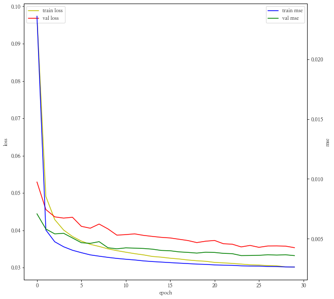


```python
%time result = return_predict(tf_train, tf_val, val, 24)
```

    100%|███████████████████████████████████████████████████| 60/60 [09:17<00:00,  9.29s/it]

    Wall time: 9min 17s
    

    
    


```python
grp_val = pd.concat([result, tf_val[y_col]], axis = 1)
```


```python
print(mean_absolute_error(grp_val.predict, grp_val[y_col]))
metric_plot(grp_val)
```

    0.17285940353905294
    


    <ggplot: (124046410132)>


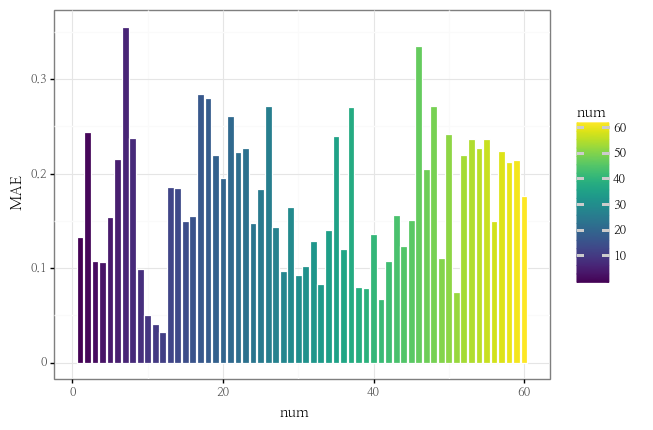


```python
mae_min = grp_val.groupby("num").apply(lambda x : mean_absolute_error(x["predict"], x[y_col])).idxmin()
mae_max = grp_val.groupby("num").apply(lambda x : mean_absolute_error(x["predict"], x[y_col])).idxmax()
print(f"mae가 가장 낮은 건물은 {mae_min}번 건물이고 mae가 가장 높은 건물은 {mae_max}번 건물입니다.")
```

    mae가 가장 낮은 건물은 12번 건물이고 mae가 가장 높은 건물은 7번 건물입니다.
    


```python
predict_grp_idx(grp_val, mae_min, y_col)
```


    <ggplot: (124045548532)>


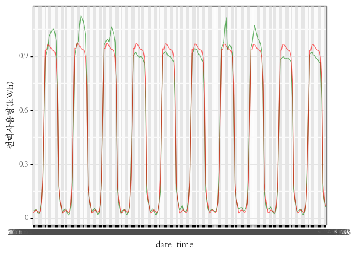


```python
predict_grp_idx(grp_val, mae_max, y_col)
```


    <ggplot: (124046148337)>


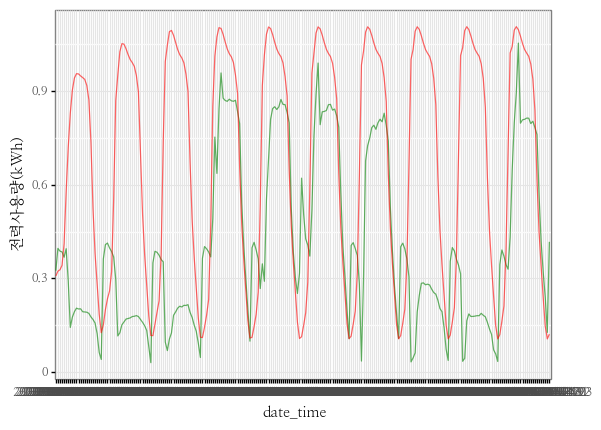

#### **첫번째 모델 평가**
- 모델의 LOSS를 봤을 때 전체적으로 수렴해가는 과정을 볼 수 있습니다.
- MAE가 가장 낮은 12번 건물의 경우 꽤 정교하게 맞춘 듯 보이나, 7번 건물은 계절성 정도만 맞춘 것처럼 보입니다. 
    - 12번 건물의 경우도 패턴이 거의 일정한 모습을 보이는 건물로, 아직까지는 복잡한 모형에 대하여 제대로 피팅이 되지 않았다는 판단이 듭니다.

---

### **두번째 모델**
- LOSS FUNCTION : MSE
- EPOCH : 30
- LSTM LAYER : 1
- LSTM UNIT : 32
- LENGTH : 24


```python
model=Sequential([
    LSTM(lstm_units, return_sequences=False, recurrent_dropout=dropout),
    Dense(1, kernel_initializer=tf.initializers.zeros())
])
```


```python
model.compile(optimizer='adam', loss='mse', metrics=['mse'])
```


```python
%%time
history = model.fit(trainX, trainY, validation_data = (valX, valY), 
                    epochs=EPOCH, batch_size=BATCH_SIZE, verbose=1,
                    callbacks=[early_stop, save_best_only])
```

    Epoch 1/30
    833/833 [==============================] - 16s 16ms/step - loss: 0.0246 - mse: 0.0246 - val_loss: 0.0082 - val_mse: 0.0082
    Epoch 2/30
    833/833 [==============================] - 13s 16ms/step - loss: 0.0062 - mse: 0.0062 - val_loss: 0.0063 - val_mse: 0.0063
    Epoch 3/30
    833/833 [==============================] - 13s 16ms/step - loss: 0.0049 - mse: 0.0049 - val_loss: 0.0051 - val_mse: 0.0051
    Epoch 4/30
    833/833 [==============================] - 13s 16ms/step - loss: 0.0043 - mse: 0.0043 - val_loss: 0.0047 - val_mse: 0.0047
    Epoch 5/30
    833/833 [==============================] - 13s 16ms/step - loss: 0.0040 - mse: 0.0040 - val_loss: 0.0047 - val_mse: 0.0047
    Epoch 6/30
    833/833 [==============================] - 14s 16ms/step - loss: 0.0037 - mse: 0.0037 - val_loss: 0.0044 - val_mse: 0.0044
    Epoch 7/30
    833/833 [==============================] - 13s 16ms/step - loss: 0.0035 - mse: 0.0035 - val_loss: 0.0044 - val_mse: 0.0044
    Epoch 8/30
    833/833 [==============================] - 13s 16ms/step - loss: 0.0033 - mse: 0.0033 - val_loss: 0.0042 - val_mse: 0.0042
    Epoch 9/30
    833/833 [==============================] - 14s 16ms/step - loss: 0.0032 - mse: 0.0032 - val_loss: 0.0042 - val_mse: 0.0042
    Epoch 10/30
    833/833 [==============================] - 14s 16ms/step - loss: 0.0031 - mse: 0.0031 - val_loss: 0.0040 - val_mse: 0.0040
    Epoch 11/30
    833/833 [==============================] - 13s 16ms/step - loss: 0.0030 - mse: 0.0030 - val_loss: 0.0040 - val_mse: 0.0040
    Epoch 12/30
    833/833 [==============================] - 14s 16ms/step - loss: 0.0029 - mse: 0.0029 - val_loss: 0.0039 - val_mse: 0.0039
    Epoch 13/30
    833/833 [==============================] - 14s 16ms/step - loss: 0.0029 - mse: 0.0029 - val_loss: 0.0039 - val_mse: 0.0039
    Epoch 14/30
    833/833 [==============================] - 14s 16ms/step - loss: 0.0028 - mse: 0.0028 - val_loss: 0.0041 - val_mse: 0.0041
    Epoch 15/30
    833/833 [==============================] - 13s 16ms/step - loss: 0.0028 - mse: 0.0028 - val_loss: 0.0038 - val_mse: 0.0038
    Epoch 16/30
    833/833 [==============================] - 13s 16ms/step - loss: 0.0027 - mse: 0.0027 - val_loss: 0.0037 - val_mse: 0.0037
    Epoch 17/30
    833/833 [==============================] - 13s 16ms/step - loss: 0.0027 - mse: 0.0027 - val_loss: 0.0037 - val_mse: 0.0037
    Epoch 18/30
    833/833 [==============================] - 13s 16ms/step - loss: 0.0027 - mse: 0.0027 - val_loss: 0.0036 - val_mse: 0.0036
    Epoch 19/30
    833/833 [==============================] - 13s 16ms/step - loss: 0.0026 - mse: 0.0026 - val_loss: 0.0036 - val_mse: 0.0036
    Epoch 20/30
    833/833 [==============================] - 13s 16ms/step - loss: 0.0026 - mse: 0.0026 - val_loss: 0.0037 - val_mse: 0.0037
    Epoch 21/30
    833/833 [==============================] - 13s 16ms/step - loss: 0.0026 - mse: 0.0026 - val_loss: 0.0036 - val_mse: 0.0036
    Epoch 22/30
    833/833 [==============================] - 13s 16ms/step - loss: 0.0026 - mse: 0.0026 - val_loss: 0.0035 - val_mse: 0.0035
    Epoch 23/30
    833/833 [==============================] - 13s 16ms/step - loss: 0.0025 - mse: 0.0025 - val_loss: 0.0036 - val_mse: 0.0036
    Epoch 24/30
    833/833 [==============================] - 13s 16ms/step - loss: 0.0025 - mse: 0.0025 - val_loss: 0.0036 - val_mse: 0.0036
    Epoch 25/30
    833/833 [==============================] - 13s 16ms/step - loss: 0.0025 - mse: 0.0025 - val_loss: 0.0035 - val_mse: 0.0035
    Epoch 26/30
    833/833 [==============================] - 13s 16ms/step - loss: 0.0025 - mse: 0.0025 - val_loss: 0.0035 - val_mse: 0.0035
    Epoch 27/30
    833/833 [==============================] - 13s 16ms/step - loss: 0.0025 - mse: 0.0025 - val_loss: 0.0035 - val_mse: 0.0035
    Epoch 28/30
    833/833 [==============================] - 13s 16ms/step - loss: 0.0024 - mse: 0.0024 - val_loss: 0.0033 - val_mse: 0.0033
    Epoch 29/30
    833/833 [==============================] - 13s 16ms/step - loss: 0.0024 - mse: 0.0024 - val_loss: 0.0034 - val_mse: 0.0034
    Epoch 30/30
    833/833 [==============================] - 13s 16ms/step - loss: 0.0024 - mse: 0.0024 - val_loss: 0.0035 - val_mse: 0.0035
    Wall time: 6min 42s
    


```python
history_plot(history)
```


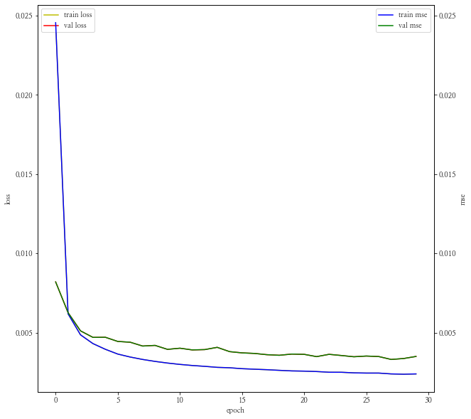


```python
%time result = return_predict(tf_train, tf_val, val, 24)
```

    100%|███████████████████████████████████████████████████| 60/60 [09:40<00:00,  9.67s/it]

    Wall time: 9min 40s
    

    
    


```python
grp_val = pd.concat([result, tf_val[y_col]], axis = 1)
```


```python
print(mean_absolute_error(grp_val.predict, grp_val[y_col]))
metric_plot(grp_val)
```

    0.2174252761180616
    


    <ggplot: (124046271639)>


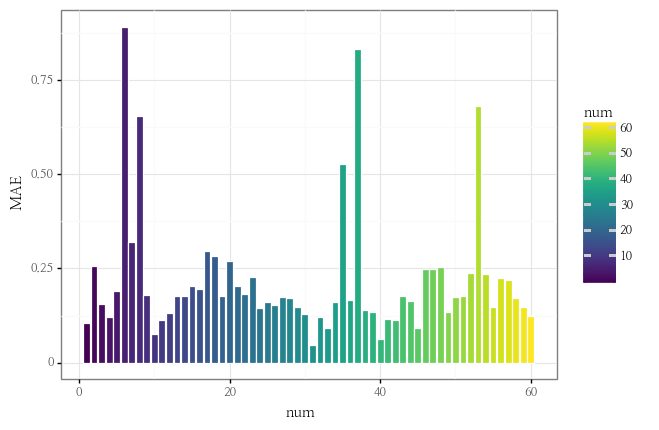


```python
mae_min = grp_val.groupby("num").apply(lambda x : mean_absolute_error(x["predict"], x[y_col])).idxmin()
mae_max = grp_val.groupby("num").apply(lambda x : mean_absolute_error(x["predict"], x[y_col])).idxmax()
print(f"mae가 가장 낮은 건물은 {mae_min}번 건물이고 mae가 가장 높은 건물은 {mae_max}번 건물입니다.")
```

    mae가 가장 낮은 건물은 31번 건물이고 mae가 가장 높은 건물은 6번 건물입니다.
    


```python
predict_grp_idx(grp_val, mae_min, y_col)
```


    <ggplot: (124028755234)>


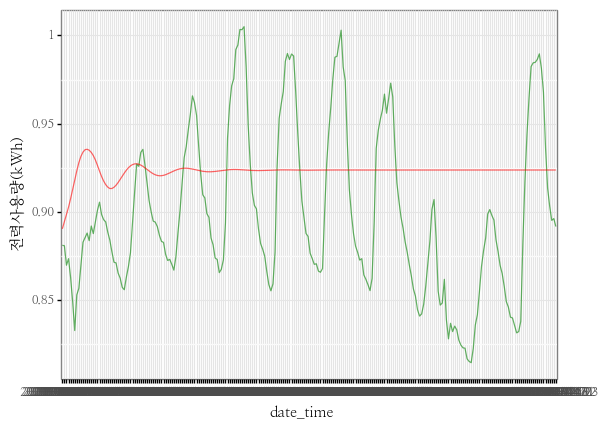


```python
predict_grp_idx(grp_val, mae_max, y_col)
```


    <ggplot: (124046655166)>


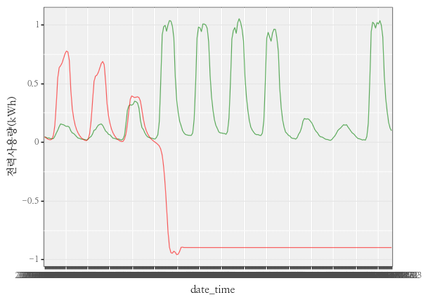

#### **두번째 모델 평가**
- 역시 LOSS 부분을 봤을 때 수렴하는 단계에 있는 것 같습니다만, 아래의 두 건물의 그래프 모두 어디론가 값이 수렴해버리는 현상이 나타났습니다.
    - EPOCH를 좀 더 늘려 학습시키는 것을 고려해야겠습니다.
- 또한 첫번째 모델에 비해서 MAE가 높게 나왔습니다. LOSS FUNCTION이 MSE로 바꾸다보니 상대적으로 MAE가 높게 나온 것인지, 그냥 모델 fitting이 덜 된 것인지 확인이 불가능합니다..ㅜㅜ 다음엔 이런것도 고려해서 모델링을 실시해야겠습니다.

---

### **세번째 모델**
- LOSS FUNCTION : MSE
- EPOCH : 100
- LSTM LAYER : 1
- LSTM UNIT : 32
- LENGTH : 24


```python
EPOCH=100
```


```python
model=Sequential([
    LSTM(lstm_units, return_sequences=False, recurrent_dropout=dropout),
    Dense(1, kernel_initializer=tf.initializers.zeros())
])
```


```python
model.compile(optimizer='adam', loss='mse', metrics=['mse'])
```


```python
%%time
history = model.fit(trainX, trainY, validation_data = (valX, valY), 
                    epochs=EPOCH, batch_size=BATCH_SIZE, verbose=1,
                    callbacks=[early_stop, save_best_only])
```

    Epoch 1/100
    833/833 [==============================] - 16s 17ms/step - loss: 0.0261 - mse: 0.0261 - val_loss: 0.0091 - val_mse: 0.0091
    Epoch 2/100
    833/833 [==============================] - 14s 16ms/step - loss: 0.0064 - mse: 0.0064 - val_loss: 0.0066 - val_mse: 0.0066
    Epoch 3/100
    833/833 [==============================] - 14s 16ms/step - loss: 0.0049 - mse: 0.0049 - val_loss: 0.0050 - val_mse: 0.0050
    Epoch 4/100
    833/833 [==============================] - 14s 16ms/step - loss: 0.0044 - mse: 0.0044 - val_loss: 0.0048 - val_mse: 0.0048
    Epoch 5/100
    833/833 [==============================] - 14s 17ms/step - loss: 0.0040 - mse: 0.0040 - val_loss: 0.0046 - val_mse: 0.0046
    Epoch 6/100
    833/833 [==============================] - 14s 17ms/step - loss: 0.0037 - mse: 0.0037 - val_loss: 0.0043 - val_mse: 0.0043
    Epoch 7/100
    833/833 [==============================] - 14s 17ms/step - loss: 0.0035 - mse: 0.0035 - val_loss: 0.0042 - val_mse: 0.0042
    Epoch 8/100
    833/833 [==============================] - 14s 17ms/step - loss: 0.0033 - mse: 0.0033 - val_loss: 0.0043 - val_mse: 0.0043
    Epoch 9/100
    833/833 [==============================] - 14s 17ms/step - loss: 0.0032 - mse: 0.0032 - val_loss: 0.0045 - val_mse: 0.0045
    Epoch 10/100
    833/833 [==============================] - 14s 17ms/step - loss: 0.0031 - mse: 0.0031 - val_loss: 0.0040 - val_mse: 0.0040
    Epoch 11/100
    833/833 [==============================] - 14s 17ms/step - loss: 0.0030 - mse: 0.0030 - val_loss: 0.0040 - val_mse: 0.0040
    Epoch 12/100
    833/833 [==============================] - 14s 17ms/step - loss: 0.0030 - mse: 0.0030 - val_loss: 0.0039 - val_mse: 0.0039
    Epoch 13/100
    833/833 [==============================] - 14s 17ms/step - loss: 0.0029 - mse: 0.0029 - val_loss: 0.0038 - val_mse: 0.0038
    Epoch 14/100
    833/833 [==============================] - 14s 17ms/step - loss: 0.0028 - mse: 0.0028 - val_loss: 0.0040 - val_mse: 0.0040
    Epoch 15/100
    833/833 [==============================] - 14s 17ms/step - loss: 0.0028 - mse: 0.0028 - val_loss: 0.0038 - val_mse: 0.0038
    Epoch 16/100
    833/833 [==============================] - 14s 17ms/step - loss: 0.0027 - mse: 0.0027 - val_loss: 0.0041 - val_mse: 0.0041
    Epoch 17/100
    833/833 [==============================] - 14s 17ms/step - loss: 0.0027 - mse: 0.0027 - val_loss: 0.0038 - val_mse: 0.0038
    Epoch 18/100
    833/833 [==============================] - 14s 17ms/step - loss: 0.0026 - mse: 0.0026 - val_loss: 0.0036 - val_mse: 0.0036
    Epoch 19/100
    833/833 [==============================] - 14s 17ms/step - loss: 0.0026 - mse: 0.0026 - val_loss: 0.0038 - val_mse: 0.0038
    Epoch 20/100
    833/833 [==============================] - 14s 17ms/step - loss: 0.0026 - mse: 0.0026 - val_loss: 0.0037 - val_mse: 0.0037
    Epoch 21/100
    833/833 [==============================] - 14s 17ms/step - loss: 0.0026 - mse: 0.0026 - val_loss: 0.0037 - val_mse: 0.0037
    Epoch 22/100
    833/833 [==============================] - 14s 17ms/step - loss: 0.0025 - mse: 0.0025 - val_loss: 0.0035 - val_mse: 0.0035
    Epoch 23/100
    833/833 [==============================] - 14s 17ms/step - loss: 0.0025 - mse: 0.0025 - val_loss: 0.0038 - val_mse: 0.0038
    Epoch 24/100
    833/833 [==============================] - 14s 17ms/step - loss: 0.0025 - mse: 0.0025 - val_loss: 0.0036 - val_mse: 0.0036
    Epoch 25/100
    833/833 [==============================] - 14s 17ms/step - loss: 0.0025 - mse: 0.0025 - val_loss: 0.0037 - val_mse: 0.0037
    Epoch 26/100
    833/833 [==============================] - 14s 17ms/step - loss: 0.0025 - mse: 0.0025 - val_loss: 0.0036 - val_mse: 0.0036
    Epoch 27/100
    833/833 [==============================] - 14s 17ms/step - loss: 0.0025 - mse: 0.0025 - val_loss: 0.0035 - val_mse: 0.0035
    Epoch 28/100
    833/833 [==============================] - 14s 17ms/step - loss: 0.0024 - mse: 0.0024 - val_loss: 0.0036 - val_mse: 0.0036
    Epoch 29/100
    833/833 [==============================] - 14s 17ms/step - loss: 0.0024 - mse: 0.0024 - val_loss: 0.0038 - val_mse: 0.0038
    Epoch 30/100
    833/833 [==============================] - 14s 17ms/step - loss: 0.0024 - mse: 0.0024 - val_loss: 0.0036 - val_mse: 0.0036
    Epoch 31/100
    833/833 [==============================] - 14s 17ms/step - loss: 0.0024 - mse: 0.0024 - val_loss: 0.0034 - val_mse: 0.0034
    Epoch 32/100
    833/833 [==============================] - 14s 17ms/step - loss: 0.0024 - mse: 0.0024 - val_loss: 0.0037 - val_mse: 0.0037
    Epoch 33/100
    833/833 [==============================] - 14s 17ms/step - loss: 0.0023 - mse: 0.0023 - val_loss: 0.0037 - val_mse: 0.0037
    Epoch 34/100
    833/833 [==============================] - 14s 17ms/step - loss: 0.0024 - mse: 0.0024 - val_loss: 0.0036 - val_mse: 0.0036
    Epoch 35/100
    833/833 [==============================] - 14s 16ms/step - loss: 0.0023 - mse: 0.0023 - val_loss: 0.0036 - val_mse: 0.0036
    Epoch 36/100
    833/833 [==============================] - 13s 16ms/step - loss: 0.0023 - mse: 0.0023 - val_loss: 0.0033 - val_mse: 0.0033
    Epoch 37/100
    833/833 [==============================] - 13s 16ms/step - loss: 0.0023 - mse: 0.0023 - val_loss: 0.0034 - val_mse: 0.0034
    Epoch 38/100
    833/833 [==============================] - 13s 16ms/step - loss: 0.0023 - mse: 0.0023 - val_loss: 0.0036 - val_mse: 0.0036
    Epoch 39/100
    833/833 [==============================] - 13s 16ms/step - loss: 0.0023 - mse: 0.0023 - val_loss: 0.0035 - val_mse: 0.0035
    Epoch 40/100
    833/833 [==============================] - 13s 16ms/step - loss: 0.0023 - mse: 0.0023 - val_loss: 0.0036 - val_mse: 0.0036
    Epoch 41/100
    833/833 [==============================] - 13s 16ms/step - loss: 0.0023 - mse: 0.0023 - val_loss: 0.0034 - val_mse: 0.0034
    Epoch 42/100
    833/833 [==============================] - 13s 16ms/step - loss: 0.0023 - mse: 0.0023 - val_loss: 0.0033 - val_mse: 0.0033
    Epoch 43/100
    833/833 [==============================] - 13s 16ms/step - loss: 0.0022 - mse: 0.0022 - val_loss: 0.0034 - val_mse: 0.0034
    Epoch 44/100
    833/833 [==============================] - 13s 16ms/step - loss: 0.0022 - mse: 0.0022 - val_loss: 0.0033 - val_mse: 0.0033
    Epoch 45/100
    833/833 [==============================] - 13s 16ms/step - loss: 0.0022 - mse: 0.0022 - val_loss: 0.0034 - val_mse: 0.0034
    Epoch 46/100
    833/833 [==============================] - 13s 16ms/step - loss: 0.0022 - mse: 0.0022 - val_loss: 0.0032 - val_mse: 0.003222 - mse: 0
    Epoch 47/100
    833/833 [==============================] - 13s 16ms/step - loss: 0.0022 - mse: 0.0022 - val_loss: 0.0034 - val_mse: 0.0034
    Epoch 48/100
    833/833 [==============================] - 13s 16ms/step - loss: 0.0022 - mse: 0.0022 - val_loss: 0.0033 - val_mse: 0.0033
    Epoch 49/100
    833/833 [==============================] - 13s 16ms/step - loss: 0.0022 - mse: 0.0022 - val_loss: 0.0034 - val_mse: 0.0034
    Epoch 50/100
    833/833 [==============================] - 13s 16ms/step - loss: 0.0022 - mse: 0.0022 - val_loss: 0.0034 - val_mse: 0.0034
    Epoch 51/100
    833/833 [==============================] - 13s 16ms/step - loss: 0.0022 - mse: 0.0022 - val_loss: 0.0033 - val_mse: 0.0033
    Epoch 52/100
    833/833 [==============================] - 13s 16ms/step - loss: 0.0022 - mse: 0.0022 - val_loss: 0.0033 - val_mse: 0.0033
    Epoch 53/100
    833/833 [==============================] - 13s 16ms/step - loss: 0.0022 - mse: 0.0022 - val_loss: 0.0032 - val_mse: 0.0032
    Epoch 54/100
    833/833 [==============================] - 13s 16ms/step - loss: 0.0022 - mse: 0.0022 - val_loss: 0.0033 - val_mse: 0.0033
    Epoch 55/100
    833/833 [==============================] - 13s 16ms/step - loss: 0.0021 - mse: 0.0021 - val_loss: 0.0033 - val_mse: 0.0033
    Epoch 56/100
    833/833 [==============================] - 13s 16ms/step - loss: 0.0021 - mse: 0.0021 - val_loss: 0.0034 - val_mse: 0.0034
    Epoch 57/100
    833/833 [==============================] - 13s 16ms/step - loss: 0.0021 - mse: 0.0021 - val_loss: 0.0033 - val_mse: 0.0033
    Epoch 58/100
    833/833 [==============================] - 13s 16ms/step - loss: 0.0021 - mse: 0.0021 - val_loss: 0.0032 - val_mse: 0.0032
    Epoch 59/100
    833/833 [==============================] - 13s 16ms/step - loss: 0.0021 - mse: 0.0021 - val_loss: 0.0032 - val_mse: 0.0032 - ETA: 3s - los
    Epoch 60/100
    833/833 [==============================] - 13s 16ms/step - loss: 0.0021 - mse: 0.0021 - val_loss: 0.0032 - val_mse: 0.0032
    Epoch 61/100
    833/833 [==============================] - 13s 16ms/step - loss: 0.0021 - mse: 0.0021 - val_loss: 0.0033 - val_mse: 0.0033
    Epoch 62/100
    833/833 [==============================] - 14s 16ms/step - loss: 0.0021 - mse: 0.0021 - val_loss: 0.0032 - val_mse: 0.0032
    Epoch 63/100
    833/833 [==============================] - 14s 17ms/step - loss: 0.0021 - mse: 0.0021 - val_loss: 0.0032 - val_mse: 0.0032
    Epoch 64/100
    833/833 [==============================] - 14s 16ms/step - loss: 0.0021 - mse: 0.0021 - val_loss: 0.0033 - val_mse: 0.0033
    Epoch 65/100
    833/833 [==============================] - 14s 16ms/step - loss: 0.0021 - mse: 0.0021 - val_loss: 0.0032 - val_mse: 0.0032
    Epoch 66/100
    833/833 [==============================] - 14s 16ms/step - loss: 0.0021 - mse: 0.0021 - val_loss: 0.0033 - val_mse: 0.0033
    Epoch 67/100
    833/833 [==============================] - 14s 16ms/step - loss: 0.0021 - mse: 0.0021 - val_loss: 0.0032 - val_mse: 0.0032
    Epoch 68/100
    833/833 [==============================] - 14s 16ms/step - loss: 0.0021 - mse: 0.0021 - val_loss: 0.0033 - val_mse: 0.0033
    Epoch 69/100
    833/833 [==============================] - 14s 16ms/step - loss: 0.0020 - mse: 0.0020 - val_loss: 0.0032 - val_mse: 0.0032
    Epoch 70/100
    833/833 [==============================] - 14s 16ms/step - loss: 0.0020 - mse: 0.0020 - val_loss: 0.0031 - val_mse: 0.0031
    Epoch 71/100
    833/833 [==============================] - 14s 16ms/step - loss: 0.0020 - mse: 0.0020 - val_loss: 0.0032 - val_mse: 0.0032
    Epoch 72/100
    833/833 [==============================] - 14s 16ms/step - loss: 0.0020 - mse: 0.0020 - val_loss: 0.0032 - val_mse: 0.0032
    Epoch 73/100
    833/833 [==============================] - 14s 17ms/step - loss: 0.0020 - mse: 0.0020 - val_loss: 0.0031 - val_mse: 0.0031
    Epoch 74/100
    833/833 [==============================] - 14s 16ms/step - loss: 0.0020 - mse: 0.0020 - val_loss: 0.0031 - val_mse: 0.0031
    Epoch 75/100
    833/833 [==============================] - 14s 16ms/step - loss: 0.0020 - mse: 0.0020 - val_loss: 0.0032 - val_mse: 0.0032
    Epoch 76/100
    833/833 [==============================] - 14s 16ms/step - loss: 0.0020 - mse: 0.0020 - val_loss: 0.0032 - val_mse: 0.0032
    Epoch 77/100
    833/833 [==============================] - 14s 17ms/step - loss: 0.0020 - mse: 0.0020 - val_loss: 0.0031 - val_mse: 0.0031 loss: 0.0020 - m - ETA: 0s - loss: 0.00
    Epoch 78/100
    833/833 [==============================] - 14s 16ms/step - loss: 0.0020 - mse: 0.0020 - val_loss: 0.0031 - val_mse: 0.0031
    Epoch 79/100
    833/833 [==============================] - 14s 17ms/step - loss: 0.0020 - mse: 0.0020 - val_loss: 0.0033 - val_mse: 0.0033
    Epoch 80/100
    833/833 [==============================] - 14s 17ms/step - loss: 0.0020 - mse: 0.0020 - val_loss: 0.0032 - val_mse: 0.0032
    Epoch 81/100
    833/833 [==============================] - 14s 16ms/step - loss: 0.0020 - mse: 0.0020 - val_loss: 0.0032 - val_mse: 0.0032
    Epoch 82/100
    833/833 [==============================] - 14s 16ms/step - loss: 0.0020 - mse: 0.0020 - val_loss: 0.0031 - val_mse: 0.0031
    Epoch 83/100
    833/833 [==============================] - 14s 16ms/step - loss: 0.0020 - mse: 0.0020 - val_loss: 0.0032 - val_mse: 0.0032
    Epoch 84/100
    833/833 [==============================] - 14s 17ms/step - loss: 0.0020 - mse: 0.0020 - val_loss: 0.0032 - val_mse: 0.0032
    Epoch 85/100
    833/833 [==============================] - 14s 16ms/step - loss: 0.0020 - mse: 0.0020 - val_loss: 0.0032 - val_mse: 0.0032
    Epoch 86/100
    833/833 [==============================] - 14s 16ms/step - loss: 0.0020 - mse: 0.0020 - val_loss: 0.0031 - val_mse: 0.0031
    Epoch 87/100
    833/833 [==============================] - 14s 16ms/step - loss: 0.0020 - mse: 0.0020 - val_loss: 0.0031 - val_mse: 0.0031
    Epoch 88/100
    833/833 [==============================] - 14s 16ms/step - loss: 0.0019 - mse: 0.0019 - val_loss: 0.0032 - val_mse: 0.0032
    Epoch 89/100
    833/833 [==============================] - 14s 16ms/step - loss: 0.0019 - mse: 0.0019 - val_loss: 0.0032 - val_mse: 0.0032
    Epoch 90/100
    833/833 [==============================] - 14s 16ms/step - loss: 0.0020 - mse: 0.0020 - val_loss: 0.0030 - val_mse: 0.0030
    Epoch 91/100
    833/833 [==============================] - 14s 16ms/step - loss: 0.0019 - mse: 0.0019 - val_loss: 0.0032 - val_mse: 0.0032
    Epoch 92/100
    833/833 [==============================] - 14s 16ms/step - loss: 0.0019 - mse: 0.0019 - val_loss: 0.0032 - val_mse: 0.0032
    Epoch 93/100
    833/833 [==============================] - 13s 16ms/step - loss: 0.0019 - mse: 0.0019 - val_loss: 0.0031 - val_mse: 0.0031
    Epoch 94/100
    833/833 [==============================] - 13s 16ms/step - loss: 0.0019 - mse: 0.0019 - val_loss: 0.0032 - val_mse: 0.0032
    Epoch 95/100
    833/833 [==============================] - 13s 16ms/step - loss: 0.0019 - mse: 0.0019 - val_loss: 0.0031 - val_mse: 0.0031
    Epoch 96/100
    833/833 [==============================] - 13s 16ms/step - loss: 0.0019 - mse: 0.0019 - val_loss: 0.0032 - val_mse: 0.0032
    Epoch 97/100
    833/833 [==============================] - 13s 16ms/step - loss: 0.0019 - mse: 0.0019 - val_loss: 0.0030 - val_mse: 0.0030
    Epoch 98/100
    833/833 [==============================] - 13s 16ms/step - loss: 0.0019 - mse: 0.0019 - val_loss: 0.0031 - val_mse: 0.0031
    Epoch 99/100
    833/833 [==============================] - 13s 16ms/step - loss: 0.0019 - mse: 0.0019 - val_loss: 0.0031 - val_mse: 0.0031
    Epoch 100/100
    833/833 [==============================] - 13s 16ms/step - loss: 0.0019 - mse: 0.0019 - val_loss: 0.0030 - val_mse: 0.0030
    Wall time: 22min 42s
    


```python
model.summary()
```

    Model: "sequential_2"
    _________________________________________________________________
    Layer (type)                 Output Shape              Param #   
    =================================================================
    lstm_2 (LSTM)                (None, 32)                12032     
    _________________________________________________________________
    dense_2 (Dense)              (None, 1)                 33        
    =================================================================
    Total params: 12,065
    Trainable params: 12,065
    Non-trainable params: 0
    _________________________________________________________________
    


```python
history_plot(history)
```


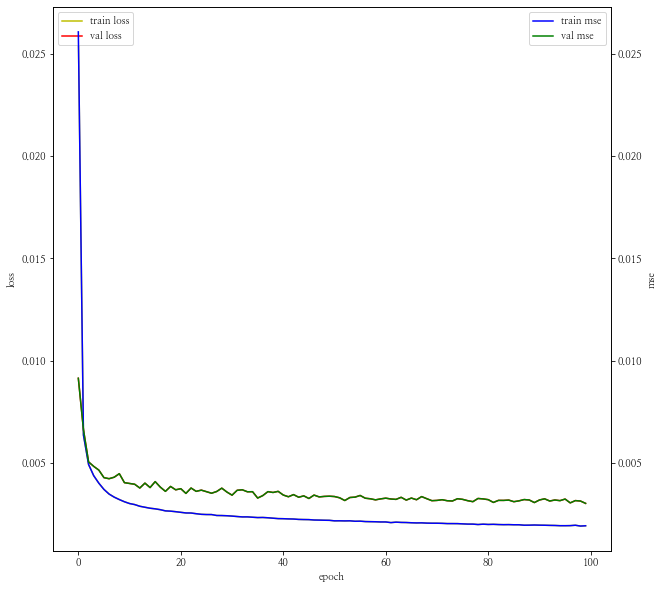


```python
%time result = return_predict(tf_train, tf_val, val, 24)
```

    100%|███████████████████████████████████████████████████| 60/60 [08:48<00:00,  8.81s/it]

    Wall time: 8min 48s
    

    
    


```python
grp_val = pd.concat([result, tf_val[y_col]], axis = 1)
```


```python
print(mean_absolute_error(grp_val.predict, grp_val[y_col]))
metric_plot(grp_val)
```

    0.1945719474061676
    


    <ggplot: (124029003331)>


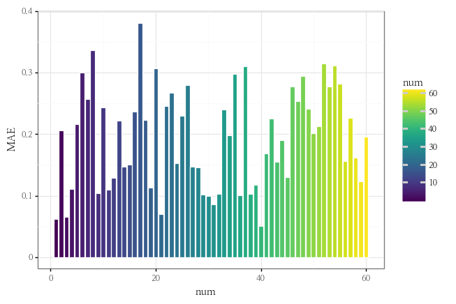


```python
mae_min = grp_val.groupby("num").apply(lambda x : mean_absolute_error(x["predict"], x[y_col])).idxmin()
mae_max = grp_val.groupby("num").apply(lambda x : mean_absolute_error(x["predict"], x[y_col])).idxmax()
print(f"mae가 가장 낮은 건물은 {mae_min}번 건물이고 mae가 가장 높은 건물은 {mae_max}번 건물입니다.")
```

    mae가 가장 낮은 건물은 40번 건물이고 mae가 가장 높은 건물은 17번 건물입니다.
    


```python
predict_grp_idx(grp_val, mae_min, y_col)
```


    <ggplot: (124045346338)>


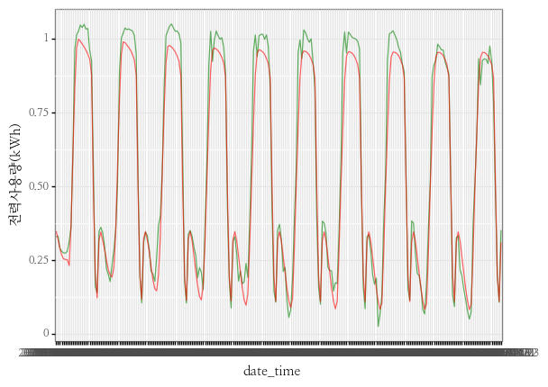


```python
predict_grp_idx(grp_val, mae_max, y_col)
```


    <ggplot: (124046120418)>


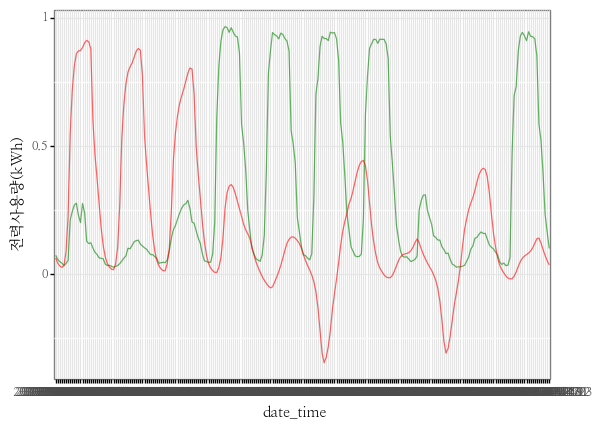

#### **세번째 모델 평가**
- MAE가 EPOCH 30일 때보다 확연히 줄어든 것을 확인할 수 있고, MAE를 LOSS FUNCTION으로 했던 모델과 거의 비슷하게 나온 것을 확인할 수 있습니다.
- 40번 건물에 대해서 조금 더 복잡한 패턴에도 잘 FITTING된 모습을 보이나, 17번 건물은 뭔가 한박자 느리다?라는 느낌이 듭니다.
- 그래프 상 거의 수렴치에서 학습이 안되는 것 같지만, Early Stopping이 있음에도 100회를 다 실시한 것으로 보아 조금 더 학습시키는 것도 나쁘지 않았을 것으로 판단됩니다.

---

### **네번째 모델**
- LOSS FUNCTION : MSE
- EPOCH : 100
- LSTM LAYER : 6
- LSTM UNIT : 
- LENGTH : 24


```python
EPOCH=100
lstm_units = 64
```


```python
model=Sequential([
    LSTM(lstm_units, return_sequences=True, recurrent_dropout=dropout),
    LSTM(int(lstm_units / 2), return_sequences=True, recurrent_dropout=dropout),
    LSTM(int(lstm_units / 2**2), return_sequences=True, recurrent_dropout=dropout),
    LSTM(int(lstm_units / 2**3), return_sequences=True, recurrent_dropout=dropout),
    LSTM(int(lstm_units / 2**4), return_sequences=True, recurrent_dropout=dropout),
    LSTM(int(lstm_units / 2**5), return_sequences=False, recurrent_dropout=dropout),
    Dense(1, kernel_initializer=tf.initializers.zeros())
])
```


```python
model.compile(optimizer='adam', loss='mae', metrics=['mse'])
```


```python
%%time
history = model.fit(trainX, trainY, validation_data = (valX, valY), 
                    epochs=EPOCH, batch_size=BATCH_SIZE, verbose=1,
                    callbacks=[early_stop, save_best_only])
```

    Epoch 1/100
    833/833 [==============================] - 83s 84ms/step - loss: 0.1699 - mse: 0.0605 - val_loss: 0.1064 - val_mse: 0.0340
    Epoch 2/100
    833/833 [==============================] - 77s 92ms/step - loss: 0.0823 - mse: 0.0210 - val_loss: 0.0997 - val_mse: 0.0320
    Epoch 3/100
    833/833 [==============================] - 70s 85ms/step - loss: 0.0788 - mse: 0.0205 - val_loss: 0.0963 - val_mse: 0.0308
    Epoch 4/100
    833/833 [==============================] - 71s 86ms/step - loss: 0.0784 - mse: 0.0205 - val_loss: 0.0978 - val_mse: 0.0310
    Epoch 5/100
    833/833 [==============================] - 72s 86ms/step - loss: 0.0776 - mse: 0.0204 - val_loss: 0.0956 - val_mse: 0.0316
    Epoch 6/100
    833/833 [==============================] - 71s 86ms/step - loss: 0.0767 - mse: 0.0203 - val_loss: 0.0979 - val_mse: 0.0315
    Epoch 7/100
    833/833 [==============================] - 71s 86ms/step - loss: 0.0757 - mse: 0.0201 - val_loss: 0.0955 - val_mse: 0.0319
    Epoch 8/100
    833/833 [==============================] - 71s 86ms/step - loss: 0.0749 - mse: 0.0198 - val_loss: 0.0938 - val_mse: 0.0302
    Epoch 9/100
    833/833 [==============================] - 71s 85ms/step - loss: 0.0742 - mse: 0.0194 - val_loss: 0.0946 - val_mse: 0.0302
    Epoch 10/100
    833/833 [==============================] - 72s 86ms/step - loss: 0.0732 - mse: 0.0187 - val_loss: 0.0932 - val_mse: 0.0291
    Epoch 11/100
    833/833 [==============================] - 72s 86ms/step - loss: 0.0713 - mse: 0.0174 - val_loss: 0.0897 - val_mse: 0.0257
    Epoch 12/100
    833/833 [==============================] - 71s 85ms/step - loss: 0.0670 - mse: 0.0148 - val_loss: 0.0795 - val_mse: 0.0194
    Epoch 13/100
    833/833 [==============================] - 72s 86ms/step - loss: 0.0542 - mse: 0.0082 - val_loss: 0.0545 - val_mse: 0.0072
    Epoch 14/100
    833/833 [==============================] - 72s 86ms/step - loss: 0.0439 - mse: 0.0044 - val_loss: 0.0469 - val_mse: 0.0054
    Epoch 15/100
    833/833 [==============================] - 72s 86ms/step - loss: 0.0398 - mse: 0.0037 - val_loss: 0.0494 - val_mse: 0.0054
    Epoch 16/100
    833/833 [==============================] - 72s 86ms/step - loss: 0.0378 - mse: 0.0034 - val_loss: 0.0428 - val_mse: 0.0047
    Epoch 17/100
    833/833 [==============================] - 72s 86ms/step - loss: 0.0364 - mse: 0.0032 - val_loss: 0.0423 - val_mse: 0.0047
    Epoch 18/100
    833/833 [==============================] - 72s 86ms/step - loss: 0.0354 - mse: 0.0031 - val_loss: 0.0417 - val_mse: 0.0045
    Epoch 19/100
    833/833 [==============================] - 71s 86ms/step - loss: 0.0345 - mse: 0.0030 - val_loss: 0.0422 - val_mse: 0.0046
    Epoch 20/100
    833/833 [==============================] - 71s 86ms/step - loss: 0.0337 - mse: 0.0028 - val_loss: 0.0405 - val_mse: 0.0042
    Epoch 21/100
    833/833 [==============================] - 71s 86ms/step - loss: 0.0330 - mse: 0.0028 - val_loss: 0.0407 - val_mse: 0.0043
    Epoch 22/100
    833/833 [==============================] - 72s 86ms/step - loss: 0.0326 - mse: 0.0027 - val_loss: 0.0391 - val_mse: 0.0041
    Epoch 23/100
    833/833 [==============================] - 72s 86ms/step - loss: 0.0321 - mse: 0.0027 - val_loss: 0.0387 - val_mse: 0.0041
    Epoch 24/100
    833/833 [==============================] - 71s 86ms/step - loss: 0.0316 - mse: 0.0026 - val_loss: 0.0380 - val_mse: 0.0038
    Epoch 25/100
    833/833 [==============================] - 72s 86ms/step - loss: 0.0312 - mse: 0.0026 - val_loss: 0.0385 - val_mse: 0.0039
    Epoch 26/100
    833/833 [==============================] - 72s 86ms/step - loss: 0.0309 - mse: 0.0025 - val_loss: 0.0379 - val_mse: 0.0039
    Epoch 27/100
    833/833 [==============================] - 72s 86ms/step - loss: 0.0306 - mse: 0.0025 - val_loss: 0.0375 - val_mse: 0.0037
    Epoch 28/100
    833/833 [==============================] - 72s 86ms/step - loss: 0.0303 - mse: 0.0024 - val_loss: 0.0373 - val_mse: 0.0038
    Epoch 29/100
    833/833 [==============================] - 73s 87ms/step - loss: 0.0299 - mse: 0.0024 - val_loss: 0.0384 - val_mse: 0.0040
    Epoch 30/100
    833/833 [==============================] - 73s 88ms/step - loss: 0.0297 - mse: 0.0024 - val_loss: 0.0369 - val_mse: 0.0037
    Epoch 31/100
    833/833 [==============================] - 72s 87ms/step - loss: 0.0295 - mse: 0.0023 - val_loss: 0.0387 - val_mse: 0.0038
    Epoch 32/100
    833/833 [==============================] - 72s 86ms/step - loss: 0.0292 - mse: 0.0023 - val_loss: 0.0356 - val_mse: 0.0035
    Epoch 33/100
    833/833 [==============================] - 72s 87ms/step - loss: 0.0290 - mse: 0.0023 - val_loss: 0.0368 - val_mse: 0.0037
    Epoch 34/100
    833/833 [==============================] - 72s 87ms/step - loss: 0.0289 - mse: 0.0023 - val_loss: 0.0356 - val_mse: 0.0035
    Epoch 35/100
    833/833 [==============================] - 72s 87ms/step - loss: 0.0286 - mse: 0.0023 - val_loss: 0.0381 - val_mse: 0.0038
    Epoch 36/100
    833/833 [==============================] - 72s 86ms/step - loss: 0.0283 - mse: 0.0022 - val_loss: 0.0365 - val_mse: 0.0039
    Epoch 37/100
    833/833 [==============================] - 72s 86ms/step - loss: 0.0282 - mse: 0.0022 - val_loss: 0.0357 - val_mse: 0.0035
    Epoch 38/100
    833/833 [==============================] - 72s 87ms/step - loss: 0.0281 - mse: 0.0022 - val_loss: 0.0361 - val_mse: 0.0035
    Epoch 39/100
    833/833 [==============================] - 85s 102ms/step - loss: 0.0280 - mse: 0.0022 - val_loss: 0.0356 - val_mse: 0.0035
    Epoch 40/100
    833/833 [==============================] - 72s 87ms/step - loss: 0.0278 - mse: 0.0021 - val_loss: 0.0351 - val_mse: 0.0034
    Epoch 41/100
    833/833 [==============================] - 96s 116ms/step - loss: 0.0277 - mse: 0.0021 - val_loss: 0.0355 - val_mse: 0.0034
    Epoch 42/100
    833/833 [==============================] - 71s 86ms/step - loss: 0.0275 - mse: 0.0021 - val_loss: 0.0352 - val_mse: 0.0035
    Epoch 43/100
    833/833 [==============================] - 71s 86ms/step - loss: 0.0275 - mse: 0.0021 - val_loss: 0.0347 - val_mse: 0.0034
    Epoch 44/100
    833/833 [==============================] - 71s 86ms/step - loss: 0.0272 - mse: 0.0021 - val_loss: 0.0354 - val_mse: 0.0036
    Epoch 45/100
    833/833 [==============================] - 72s 86ms/step - loss: 0.0271 - mse: 0.0021 - val_loss: 0.0342 - val_mse: 0.0033
    Epoch 46/100
    833/833 [==============================] - 72s 86ms/step - loss: 0.0270 - mse: 0.0021 - val_loss: 0.0342 - val_mse: 0.0033
    Epoch 47/100
    833/833 [==============================] - 72s 87ms/step - loss: 0.0269 - mse: 0.0020 - val_loss: 0.0359 - val_mse: 0.0035
    Epoch 48/100
    833/833 [==============================] - 72s 86ms/step - loss: 0.0268 - mse: 0.0020 - val_loss: 0.0351 - val_mse: 0.0035
    Epoch 49/100
    833/833 [==============================] - 72s 86ms/step - loss: 0.0266 - mse: 0.0020 - val_loss: 0.0342 - val_mse: 0.0034
    Epoch 50/100
    833/833 [==============================] - 72s 86ms/step - loss: 0.0266 - mse: 0.0020 - val_loss: 0.0344 - val_mse: 0.0034
    Epoch 51/100
    833/833 [==============================] - 72s 87ms/step - loss: 0.0263 - mse: 0.0020 - val_loss: 0.0342 - val_mse: 0.0034
    Epoch 52/100
    833/833 [==============================] - 72s 86ms/step - loss: 0.0265 - mse: 0.0020 - val_loss: 0.0341 - val_mse: 0.0034
    Epoch 53/100
    833/833 [==============================] - 72s 86ms/step - loss: 0.0262 - mse: 0.0020 - val_loss: 0.0335 - val_mse: 0.0032
    Epoch 54/100
    833/833 [==============================] - 72s 86ms/step - loss: 0.0261 - mse: 0.0019 - val_loss: 0.0348 - val_mse: 0.0034
    Epoch 55/100
    833/833 [==============================] - 72s 86ms/step - loss: 0.0261 - mse: 0.0020 - val_loss: 0.0343 - val_mse: 0.0034
    Epoch 56/100
    833/833 [==============================] - 72s 86ms/step - loss: 0.0259 - mse: 0.0019 - val_loss: 0.0338 - val_mse: 0.0033
    Epoch 57/100
    833/833 [==============================] - 72s 86ms/step - loss: 0.0259 - mse: 0.0019 - val_loss: 0.0366 - val_mse: 0.0034
    Epoch 58/100
    833/833 [==============================] - 72s 87ms/step - loss: 0.0259 - mse: 0.0019 - val_loss: 0.0337 - val_mse: 0.0033
    Epoch 59/100
    833/833 [==============================] - 72s 86ms/step - loss: 0.0257 - mse: 0.0019 - val_loss: 0.0337 - val_mse: 0.0033
    Epoch 60/100
    833/833 [==============================] - 72s 86ms/step - loss: 0.0257 - mse: 0.0019 - val_loss: 0.0333 - val_mse: 0.0033
    Epoch 61/100
    833/833 [==============================] - 72s 86ms/step - loss: 0.0256 - mse: 0.0019 - val_loss: 0.0340 - val_mse: 0.0033
    Epoch 62/100
    833/833 [==============================] - 72s 87ms/step - loss: 0.0256 - mse: 0.0019 - val_loss: 0.0344 - val_mse: 0.0032
    Epoch 63/100
    833/833 [==============================] - 72s 87ms/step - loss: 0.0254 - mse: 0.0019 - val_loss: 0.0341 - val_mse: 0.0032
    Epoch 64/100
    833/833 [==============================] - 72s 87ms/step - loss: 0.0254 - mse: 0.0019 - val_loss: 0.0340 - val_mse: 0.0033
    Epoch 65/100
    833/833 [==============================] - 73s 87ms/step - loss: 0.0253 - mse: 0.0019 - val_loss: 0.0335 - val_mse: 0.0033
    Epoch 66/100
    833/833 [==============================] - 73s 87ms/step - loss: 0.0252 - mse: 0.0018 - val_loss: 0.0334 - val_mse: 0.0031
    Epoch 67/100
    833/833 [==============================] - 73s 87ms/step - loss: 0.0252 - mse: 0.0018 - val_loss: 0.0333 - val_mse: 0.0032oss: 0.0252 - mse: 0.0
    Epoch 68/100
    833/833 [==============================] - 73s 87ms/step - loss: 0.0251 - mse: 0.0018 - val_loss: 0.0333 - val_mse: 0.0031
    Epoch 69/100
    833/833 [==============================] - 73s 87ms/step - loss: 0.0250 - mse: 0.0018 - val_loss: 0.0332 - val_mse: 0.0032
    Epoch 70/100
    833/833 [==============================] - 73s 87ms/step - loss: 0.0250 - mse: 0.0018 - val_loss: 0.0332 - val_mse: 0.0032
    Epoch 71/100
    833/833 [==============================] - 73s 87ms/step - loss: 0.0249 - mse: 0.0018 - val_loss: 0.0330 - val_mse: 0.0032
    Epoch 72/100
    833/833 [==============================] - 72s 87ms/step - loss: 0.0249 - mse: 0.0018 - val_loss: 0.0327 - val_mse: 0.0031
    Epoch 73/100
    833/833 [==============================] - 72s 87ms/step - loss: 0.0248 - mse: 0.0018 - val_loss: 0.0327 - val_mse: 0.0031
    Epoch 74/100
    833/833 [==============================] - 72s 87ms/step - loss: 0.0248 - mse: 0.0018 - val_loss: 0.0324 - val_mse: 0.0031
    Epoch 75/100
    833/833 [==============================] - 72s 87ms/step - loss: 0.0247 - mse: 0.0018 - val_loss: 0.0329 - val_mse: 0.0032
    Epoch 76/100
    833/833 [==============================] - 72s 87ms/step - loss: 0.0246 - mse: 0.0018 - val_loss: 0.0328 - val_mse: 0.0031
    Epoch 77/100
    833/833 [==============================] - 72s 87ms/step - loss: 0.0246 - mse: 0.0018 - val_loss: 0.0326 - val_mse: 0.0031
    Epoch 78/100
    833/833 [==============================] - 72s 87ms/step - loss: 0.0245 - mse: 0.0018 - val_loss: 0.0332 - val_mse: 0.0033
    Epoch 79/100
    833/833 [==============================] - 72s 87ms/step - loss: 0.0245 - mse: 0.0017 - val_loss: 0.0325 - val_mse: 0.0030
    Epoch 80/100
    833/833 [==============================] - 72s 87ms/step - loss: 0.0244 - mse: 0.0017 - val_loss: 0.0327 - val_mse: 0.0031
    Epoch 81/100
    833/833 [==============================] - 76s 91ms/step - loss: 0.0244 - mse: 0.0017 - val_loss: 0.0326 - val_mse: 0.0030
    Epoch 82/100
    833/833 [==============================] - 83s 100ms/step - loss: 0.0244 - mse: 0.0017 - val_loss: 0.0322 - val_mse: 0.0030
    Epoch 83/100
    833/833 [==============================] - 79s 95ms/step - loss: 0.0243 - mse: 0.0017 - val_loss: 0.0326 - val_mse: 0.0030
    Epoch 84/100
    833/833 [==============================] - 78s 93ms/step - loss: 0.0242 - mse: 0.0017 - val_loss: 0.0322 - val_mse: 0.0031
    Epoch 85/100
    833/833 [==============================] - 76s 91ms/step - loss: 0.0242 - mse: 0.0017 - val_loss: 0.0322 - val_mse: 0.0030
    Epoch 86/100
    833/833 [==============================] - 75s 90ms/step - loss: 0.0242 - mse: 0.0017 - val_loss: 0.0321 - val_mse: 0.0031
    Epoch 87/100
    833/833 [==============================] - 76s 91ms/step - loss: 0.0241 - mse: 0.0017 - val_loss: 0.0328 - val_mse: 0.0031
    Epoch 88/100
    833/833 [==============================] - 78s 93ms/step - loss: 0.0241 - mse: 0.0017 - val_loss: 0.0321 - val_mse: 0.0031
    Epoch 89/100
    833/833 [==============================] - 78s 94ms/step - loss: 0.0240 - mse: 0.0017 - val_loss: 0.0326 - val_mse: 0.0031
    Epoch 90/100
    833/833 [==============================] - 78s 94ms/step - loss: 0.0241 - mse: 0.0017 - val_loss: 0.0326 - val_mse: 0.0030
    Epoch 91/100
    833/833 [==============================] - 78s 94ms/step - loss: 0.0239 - mse: 0.0017 - val_loss: 0.0328 - val_mse: 0.0031
    Epoch 92/100
    833/833 [==============================] - 78s 94ms/step - loss: 0.0240 - mse: 0.0017 - val_loss: 0.0324 - val_mse: 0.0030
    Epoch 93/100
    833/833 [==============================] - 78s 94ms/step - loss: 0.0239 - mse: 0.0017 - val_loss: 0.0319 - val_mse: 0.0030
    Epoch 94/100
    833/833 [==============================] - 79s 95ms/step - loss: 0.0238 - mse: 0.0017 - val_loss: 0.0321 - val_mse: 0.0030
    Epoch 95/100
    833/833 [==============================] - 79s 95ms/step - loss: 0.0238 - mse: 0.0017 - val_loss: 0.0324 - val_mse: 0.0030
    Epoch 96/100
    833/833 [==============================] - 79s 95ms/step - loss: 0.0237 - mse: 0.0017 - val_loss: 0.0320 - val_mse: 0.0030
    Epoch 97/100
    833/833 [==============================] - 79s 94ms/step - loss: 0.0237 - mse: 0.0016 - val_loss: 0.0314 - val_mse: 0.0029
    Epoch 98/100
    833/833 [==============================] - 79s 95ms/step - loss: 0.0238 - mse: 0.0017 - val_loss: 0.0326 - val_mse: 0.0031
    Epoch 99/100
    833/833 [==============================] - 81s 97ms/step - loss: 0.0237 - mse: 0.0017 - val_loss: 0.0324 - val_mse: 0.0031
    Epoch 100/100
    833/833 [==============================] - 82s 99ms/step - loss: 0.0236 - mse: 0.0016 - val_loss: 0.0319 - val_mse: 0.0030
    Wall time: 2h 2min 58s
    


```python
model.summary()
```

    Model: "sequential_3"
    _________________________________________________________________
    Layer (type)                 Output Shape              Param #   
    =================================================================
    lstm_3 (LSTM)                (None, 24, 64)            32256     
    _________________________________________________________________
    lstm_4 (LSTM)                (None, 24, 32)            12416     
    _________________________________________________________________
    lstm_5 (LSTM)                (None, 24, 16)            3136      
    _________________________________________________________________
    lstm_6 (LSTM)                (None, 24, 8)             800       
    _________________________________________________________________
    lstm_7 (LSTM)                (None, 24, 4)             208       
    _________________________________________________________________
    lstm_8 (LSTM)                (None, 2)                 56        
    _________________________________________________________________
    dense_3 (Dense)              (None, 1)                 3         
    =================================================================
    Total params: 48,875
    Trainable params: 48,875
    Non-trainable params: 0
    _________________________________________________________________
    


```python
history_plot(history)
```


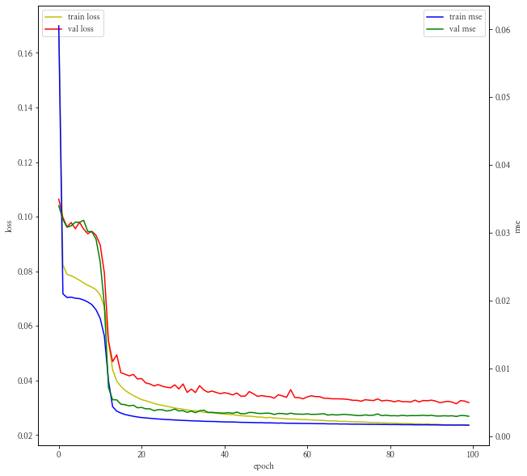


```python
%time result = return_predict(tf_train, tf_val, val, 24)
```

    100%|███████████████████████████████████████████████████| 60/60 [10:15<00:00, 10.26s/it]

    Wall time: 10min 15s
    

    
    


```python
grp_val = pd.concat([result, tf_val[y_col]], axis = 1)
```


```python
print(mean_absolute_error(grp_val.predict, grp_val[y_col]))
metric_plot(grp_val)
```

    0.16118038335659746
    


    <ggplot: (124031047138)>


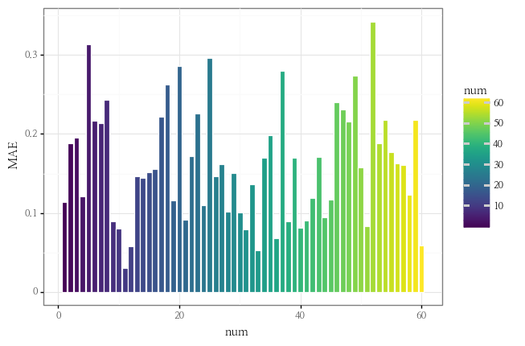


```python
mae_min = grp_val.groupby("num").apply(lambda x : mean_absolute_error(x["predict"], x[y_col])).idxmin()
mae_max = grp_val.groupby("num").apply(lambda x : mean_absolute_error(x["predict"], x[y_col])).idxmax()
print(f"mae가 가장 낮은 건물은 {mae_min}번 건물이고 mae가 가장 높은 건물은 {mae_max}번 건물입니다.")
```

    mae가 가장 낮은 건물은 11번 건물이고 mae가 가장 높은 건물은 52번 건물입니다.
    


```python
predict_grp_idx(grp_val, mae_min, y_col)
```


    <ggplot: (124116280823)>


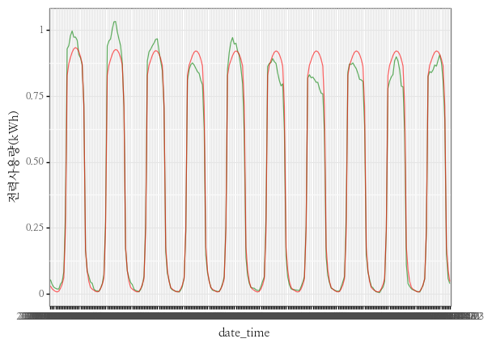


```python
predict_grp_idx(grp_val, mae_max, y_col)
```


    <ggplot: (124049826000)>


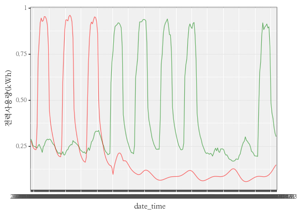

#### **네번째 모델 평가**
- 모델의 깊이를 좀 주었더니 모델의 LOSS가 한번 수렴되는 것 같은 지점에서 한번 더 대폭내려가는 것을 확인할 수 있습니다.
    - 모델의 깊이만 늘렸을 뿐인데 22분에서 2시간으로 엄청 오래걸리는 것을 확인할 수 있었습니다(CPU기준)
- 11번 건물에 대해서는 괜찮게 Fitting이 된 것 같지만, 여전히 잘 따라가지 못하는 샘플들도 있습니다. 아무래도 Y값만 가지고는 모델링이 조금 부족하지 않나라는 생각이 듭니다.

---

### **다섯번째 모델**
- LOSS FUNCTION : MSE
- EPOCH : 100
- LSTM LAYER : 6
- LSTM UNIT : 64
- LEGNTH : 24
- 데이터 추가


```python
tf_train = pd.concat([
    train["num"].reset_index(drop = True),
    pd.DataFrame(oh_encoder.fit_transform(train[["num"]]).toarray()).add_prefix("num"), 
    train[["기온(°C)", "풍속(m/s)", "습도(%)", "강수량(mm)", "일조(hr)"]].reset_index(drop = True),
    train[[y_col]].reset_index(drop = True)], 
    axis = 1)
```


```python
tf_val = pd.concat([
    val["num"].reset_index(drop = True),
    pd.DataFrame(oh_encoder.transform(val[["num"]]).toarray()).add_prefix("num"), 
    val[["기온(°C)", "풍속(m/s)", "습도(%)", "강수량(mm)", "일조(hr)"]].interpolate().reset_index(drop = True),
    val[y_col].reset_index(drop = True)], 
    axis = 1)
```


```python
minmax_value = tf_train.groupby("num").agg({y_col : [max, min]}).reset_index().droplevel(axis = 1, level = 0)
minmax_value.columns = ["num", "max", "min"]
```


```python
tf_train[y_col] = tf_train.groupby("num").apply(lambda x : (x[y_col]-min(x[y_col]))/(max(x[y_col])-min(x[y_col]))).values
```


```python
tf_val = fit_minmmax_scaler(tf_val, minmax_value)
```


```python
trainX, trainY = make_data(data = tf_train, y_col = y_col, length = 24)
```

    60it [00:14,  4.07it/s]
    


```python
valX, valY = make_data(data = tf_val, y_col = y_col, length = 24)
```

    60it [00:01, 30.88it/s]
    


```python
print(trainX.shape)
print(trainY.shape)
```

    (106560, 24, 66)
    (106560, 1)
    


```python
print(valX.shape)
print(valY.shape)
```

    (12960, 24, 66)
    (12960, 1)
    


```python
model=Sequential([
    LSTM(lstm_units, return_sequences=True, recurrent_dropout=dropout),
    LSTM(int(lstm_units / 2), return_sequences=True, recurrent_dropout=dropout),
    LSTM(int(lstm_units / 2**2), return_sequences=True, recurrent_dropout=dropout),
    LSTM(int(lstm_units / 2**3), return_sequences=True, recurrent_dropout=dropout),
    LSTM(int(lstm_units / 2**4), return_sequences=True, recurrent_dropout=dropout),
    LSTM(int(lstm_units / 2**5), return_sequences=False, recurrent_dropout=dropout),
    Dense(1, kernel_initializer=tf.initializers.zeros())
])
```


```python
model.compile(optimizer='adam', loss='mae', metrics=['mse'])
```


```python
%%time
history = model.fit(trainX, trainY, validation_data = (valX, valY), 
                    epochs=EPOCH, batch_size=BATCH_SIZE, verbose=1,
                    callbacks=[early_stop, save_best_only])
```

    Epoch 1/100
    833/833 [==============================] - 103s 108ms/step - loss: 0.2498 - mse: 0.0916 - val_loss: 0.2716 - val_mse: 0.1046
    Epoch 2/100
    833/833 [==============================] - 82s 99ms/step - loss: 0.2354 - mse: 0.0767 - val_loss: 0.2714 - val_mse: 0.1043
    Epoch 3/100
    833/833 [==============================] - 83s 99ms/step - loss: 0.1544 - mse: 0.0443 - val_loss: 0.1121 - val_mse: 0.0334
    Epoch 4/100
    833/833 [==============================] - 84s 100ms/step - loss: 0.0853 - mse: 0.0207 - val_loss: 0.1032 - val_mse: 0.0294
    Epoch 5/100
    833/833 [==============================] - 83s 99ms/step - loss: 0.0805 - mse: 0.0201 - val_loss: 0.0962 - val_mse: 0.0302
    Epoch 6/100
    833/833 [==============================] - 83s 99ms/step - loss: 0.0781 - mse: 0.0198 - val_loss: 0.0991 - val_mse: 0.0312
    Epoch 7/100
    833/833 [==============================] - 83s 100ms/step - loss: 0.0773 - mse: 0.0196 - val_loss: 0.0994 - val_mse: 0.0295
    Epoch 8/100
    833/833 [==============================] - 83s 100ms/step - loss: 0.0762 - mse: 0.0192 - val_loss: 0.0933 - val_mse: 0.0280
    Epoch 9/100
    833/833 [==============================] - 83s 100ms/step - loss: 0.0734 - mse: 0.0177 - val_loss: 0.0873 - val_mse: 0.0239
    Epoch 10/100
    833/833 [==============================] - 83s 99ms/step - loss: 0.0675 - mse: 0.0137 - val_loss: 0.0735 - val_mse: 0.0136
    Epoch 11/100
    833/833 [==============================] - 84s 100ms/step - loss: 0.0563 - mse: 0.0080 - val_loss: 0.0603 - val_mse: 0.0077
    Epoch 12/100
    833/833 [==============================] - 83s 99ms/step - loss: 0.0474 - mse: 0.0052 - val_loss: 0.0512 - val_mse: 0.0059
    Epoch 13/100
    833/833 [==============================] - 82s 99ms/step - loss: 0.0436 - mse: 0.0042 - val_loss: 0.0589 - val_mse: 0.0063
    Epoch 14/100
    833/833 [==============================] - 83s 99ms/step - loss: 0.0412 - mse: 0.0038 - val_loss: 0.0505 - val_mse: 0.0054
    Epoch 15/100
    833/833 [==============================] - 82s 99ms/step - loss: 0.0397 - mse: 0.0035 - val_loss: 0.0447 - val_mse: 0.0047
    Epoch 16/100
    833/833 [==============================] - 82s 99ms/step - loss: 0.0387 - mse: 0.0034 - val_loss: 0.0443 - val_mse: 0.0046
    Epoch 17/100
    833/833 [==============================] - 83s 99ms/step - loss: 0.0376 - mse: 0.0033 - val_loss: 0.0431 - val_mse: 0.0043
    Epoch 18/100
    833/833 [==============================] - 83s 99ms/step - loss: 0.0369 - mse: 0.0032 - val_loss: 0.0418 - val_mse: 0.0042
    Epoch 19/100
    833/833 [==============================] - 83s 99ms/step - loss: 0.0359 - mse: 0.0031 - val_loss: 0.0417 - val_mse: 0.0042
    Epoch 20/100
    833/833 [==============================] - 84s 101ms/step - loss: 0.0360 - mse: 0.0030 - val_loss: 0.0413 - val_mse: 0.0040
    Epoch 21/100
    833/833 [==============================] - 84s 101ms/step - loss: 0.0352 - mse: 0.0030 - val_loss: 0.0400 - val_mse: 0.0039
    Epoch 22/100
    833/833 [==============================] - 83s 100ms/step - loss: 0.0348 - mse: 0.0029 - val_loss: 0.0402 - val_mse: 0.0040
    Epoch 23/100
    833/833 [==============================] - 83s 100ms/step - loss: 0.0343 - mse: 0.0029 - val_loss: 0.0465 - val_mse: 0.0046
    Epoch 24/100
    833/833 [==============================] - 83s 100ms/step - loss: 0.0342 - mse: 0.0029 - val_loss: 0.0475 - val_mse: 0.0045
    Epoch 25/100
    833/833 [==============================] - 84s 100ms/step - loss: 0.0336 - mse: 0.0028 - val_loss: 0.0385 - val_mse: 0.0037
    Epoch 26/100
    833/833 [==============================] - 79s 95ms/step - loss: 0.0332 - mse: 0.0028 - val_loss: 0.0427 - val_mse: 0.0041
    Epoch 27/100
    833/833 [==============================] - 78s 94ms/step - loss: 0.0331 - mse: 0.0027 - val_loss: 0.0385 - val_mse: 0.0036
    Epoch 28/100
    833/833 [==============================] - 79s 94ms/step - loss: 0.0331 - mse: 0.0027 - val_loss: 0.0384 - val_mse: 0.0037
    Epoch 29/100
    833/833 [==============================] - 78s 94ms/step - loss: 0.0325 - mse: 0.0027 - val_loss: 0.0384 - val_mse: 0.0038
    Epoch 30/100
    833/833 [==============================] - 78s 94ms/step - loss: 0.0321 - mse: 0.0026 - val_loss: 0.0396 - val_mse: 0.0038
    Epoch 31/100
    833/833 [==============================] - 78s 94ms/step - loss: 0.0320 - mse: 0.0026 - val_loss: 0.0391 - val_mse: 0.0039
    Epoch 32/100
    833/833 [==============================] - 78s 94ms/step - loss: 0.0317 - mse: 0.0026 - val_loss: 0.0374 - val_mse: 0.0037
    Epoch 33/100
    833/833 [==============================] - 79s 94ms/step - loss: 0.0314 - mse: 0.0026 - val_loss: 0.0374 - val_mse: 0.0037
    Epoch 34/100
    833/833 [==============================] - 79s 95ms/step - loss: 0.0313 - mse: 0.0025 - val_loss: 0.0369 - val_mse: 0.0036
    Epoch 35/100
    833/833 [==============================] - 78s 94ms/step - loss: 0.0312 - mse: 0.0025 - val_loss: 0.0378 - val_mse: 0.0036
    Epoch 36/100
    833/833 [==============================] - 78s 94ms/step - loss: 0.0308 - mse: 0.0025 - val_loss: 0.0414 - val_mse: 0.0039
    Epoch 37/100
    833/833 [==============================] - 79s 95ms/step - loss: 0.0307 - mse: 0.0025 - val_loss: 0.0362 - val_mse: 0.0034
    Epoch 38/100
    833/833 [==============================] - 78s 94ms/step - loss: 0.0306 - mse: 0.0025 - val_loss: 0.0409 - val_mse: 0.0039
    Epoch 39/100
    833/833 [==============================] - 78s 94ms/step - loss: 0.0304 - mse: 0.0024 - val_loss: 0.0373 - val_mse: 0.0036
    Epoch 40/100
    833/833 [==============================] - 79s 94ms/step - loss: 0.0301 - mse: 0.0024 - val_loss: 0.0361 - val_mse: 0.0035
    Epoch 41/100
    833/833 [==============================] - 78s 94ms/step - loss: 0.0302 - mse: 0.0024 - val_loss: 0.0355 - val_mse: 0.0034
    Epoch 42/100
    833/833 [==============================] - 82s 99ms/step - loss: 0.0299 - mse: 0.0024 - val_loss: 0.0369 - val_mse: 0.0036
    Epoch 43/100
    833/833 [==============================] - 81s 98ms/step - loss: 0.0300 - mse: 0.0024 - val_loss: 0.0358 - val_mse: 0.0034
    Epoch 44/100
    833/833 [==============================] - 87s 104ms/step - loss: 0.0298 - mse: 0.0023 - val_loss: 0.0366 - val_mse: 0.0035
    Epoch 45/100
    833/833 [==============================] - 83s 100ms/step - loss: 0.0294 - mse: 0.0023 - val_loss: 0.0363 - val_mse: 0.0035
    Epoch 46/100
    833/833 [==============================] - 80s 96ms/step - loss: 0.0296 - mse: 0.0023 - val_loss: 0.0372 - val_mse: 0.0035
    Epoch 47/100
    833/833 [==============================] - 79s 95ms/step - loss: 0.0294 - mse: 0.0023 - val_loss: 0.0396 - val_mse: 0.0041
    Epoch 48/100
    833/833 [==============================] - 78s 94ms/step - loss: 0.0294 - mse: 0.0023 - val_loss: 0.0362 - val_mse: 0.0035
    Epoch 49/100
    833/833 [==============================] - 78s 94ms/step - loss: 0.0289 - mse: 0.0023 - val_loss: 0.0357 - val_mse: 0.0034
    Epoch 50/100
    833/833 [==============================] - 78s 94ms/step - loss: 0.0292 - mse: 0.0023 - val_loss: 0.0356 - val_mse: 0.0034
    Epoch 51/100
    833/833 [==============================] - 78s 94ms/step - loss: 0.0290 - mse: 0.0023 - val_loss: 0.0363 - val_mse: 0.0034
    Epoch 52/100
    833/833 [==============================] - 79s 95ms/step - loss: 0.0288 - mse: 0.0022 - val_loss: 0.0362 - val_mse: 0.0036
    Epoch 53/100
    833/833 [==============================] - 79s 94ms/step - loss: 0.0289 - mse: 0.0022 - val_loss: 0.0354 - val_mse: 0.0034
    Epoch 54/100
    833/833 [==============================] - 78s 94ms/step - loss: 0.0288 - mse: 0.0022 - val_loss: 0.0356 - val_mse: 0.0035
    Epoch 55/100
    833/833 [==============================] - 79s 94ms/step - loss: 0.0284 - mse: 0.0022 - val_loss: 0.0378 - val_mse: 0.0037
    Epoch 56/100
    833/833 [==============================] - 79s 95ms/step - loss: 0.0287 - mse: 0.0022 - val_loss: 0.0365 - val_mse: 0.0035
    Epoch 57/100
    833/833 [==============================] - 78s 94ms/step - loss: 0.0284 - mse: 0.0022 - val_loss: 0.0349 - val_mse: 0.0033
    Epoch 58/100
    833/833 [==============================] - 78s 94ms/step - loss: 0.0282 - mse: 0.0022 - val_loss: 0.0351 - val_mse: 0.0033
    Epoch 59/100
    833/833 [==============================] - 78s 94ms/step - loss: 0.0282 - mse: 0.0022 - val_loss: 0.0373 - val_mse: 0.0037
    Epoch 60/100
    833/833 [==============================] - 78s 94ms/step - loss: 0.0282 - mse: 0.0022 - val_loss: 0.0353 - val_mse: 0.0033
    Epoch 61/100
    833/833 [==============================] - 78s 94ms/step - loss: 0.0283 - mse: 0.0022 - val_loss: 0.0364 - val_mse: 0.0034
    Epoch 62/100
    833/833 [==============================] - 78s 94ms/step - loss: 0.0280 - mse: 0.0021 - val_loss: 0.0345 - val_mse: 0.0032
    Epoch 63/100
    833/833 [==============================] - 78s 94ms/step - loss: 0.0279 - mse: 0.0021 - val_loss: 0.0354 - val_mse: 0.0034
    Epoch 64/100
    833/833 [==============================] - 79s 94ms/step - loss: 0.0279 - mse: 0.0021 - val_loss: 0.0377 - val_mse: 0.003579 - mse: 0
    Epoch 65/100
    833/833 [==============================] - 79s 95ms/step - loss: 0.0278 - mse: 0.0021 - val_loss: 0.0370 - val_mse: 0.0035
    Epoch 66/100
    833/833 [==============================] - 79s 94ms/step - loss: 0.0279 - mse: 0.0021 - val_loss: 0.0346 - val_mse: 0.0032
    Epoch 67/100
    833/833 [==============================] - 79s 94ms/step - loss: 0.0280 - mse: 0.0021 - val_loss: 0.0399 - val_mse: 0.0039
    Epoch 68/100
    833/833 [==============================] - 78s 94ms/step - loss: 0.0276 - mse: 0.0021 - val_loss: 0.0354 - val_mse: 0.0034
    Epoch 69/100
    833/833 [==============================] - 78s 94ms/step - loss: 0.0277 - mse: 0.0021 - val_loss: 0.0344 - val_mse: 0.0033
    Epoch 70/100
    833/833 [==============================] - 78s 94ms/step - loss: 0.0275 - mse: 0.0021 - val_loss: 0.0364 - val_mse: 0.0034
    Epoch 71/100
    833/833 [==============================] - 78s 94ms/step - loss: 0.0274 - mse: 0.0021 - val_loss: 0.0370 - val_mse: 0.0035
    Epoch 72/100
    833/833 [==============================] - 78s 94ms/step - loss: 0.0274 - mse: 0.0021 - val_loss: 0.0341 - val_mse: 0.0032
    Epoch 73/100
    833/833 [==============================] - 78s 94ms/step - loss: 0.0273 - mse: 0.0021 - val_loss: 0.0352 - val_mse: 0.0033
    Epoch 74/100
    833/833 [==============================] - 79s 94ms/step - loss: 0.0273 - mse: 0.0020 - val_loss: 0.0349 - val_mse: 0.0032
    Epoch 75/100
    833/833 [==============================] - 79s 95ms/step - loss: 0.0273 - mse: 0.0020 - val_loss: 0.0347 - val_mse: 0.0032
    Epoch 76/100
    833/833 [==============================] - 79s 94ms/step - loss: 0.0272 - mse: 0.0020 - val_loss: 0.0354 - val_mse: 0.0034
    Epoch 77/100
    833/833 [==============================] - 78s 94ms/step - loss: 0.0270 - mse: 0.0020 - val_loss: 0.0343 - val_mse: 0.0032
    Epoch 78/100
    833/833 [==============================] - 79s 95ms/step - loss: 0.0272 - mse: 0.0020 - val_loss: 0.0358 - val_mse: 0.0034 - ETA: 2s - loss: 0.02 - ETA: 0s - loss: 0.0272 - ms
    Epoch 79/100
    833/833 [==============================] - 79s 94ms/step - loss: 0.0270 - mse: 0.0020 - val_loss: 0.0358 - val_mse: 0.0033
    Epoch 80/100
    833/833 [==============================] - 78s 94ms/step - loss: 0.0269 - mse: 0.0020 - val_loss: 0.0342 - val_mse: 0.0032
    Epoch 81/100
    833/833 [==============================] - 78s 94ms/step - loss: 0.0268 - mse: 0.0020 - val_loss: 0.0345 - val_mse: 0.0032
    Epoch 82/100
    833/833 [==============================] - 79s 94ms/step - loss: 0.0268 - mse: 0.0020 - val_loss: 0.0342 - val_mse: 0.0032
    Epoch 83/100
    833/833 [==============================] - 79s 95ms/step - loss: 0.0268 - mse: 0.0020 - val_loss: 0.0341 - val_mse: 0.0032
    Epoch 84/100
    833/833 [==============================] - 79s 94ms/step - loss: 0.0268 - mse: 0.0020 - val_loss: 0.0346 - val_mse: 0.0032
    Epoch 85/100
    833/833 [==============================] - 78s 94ms/step - loss: 0.0267 - mse: 0.0020 - val_loss: 0.0349 - val_mse: 0.0032
    Epoch 86/100
    833/833 [==============================] - 78s 94ms/step - loss: 0.0266 - mse: 0.0020 - val_loss: 0.0345 - val_mse: 0.0032
    Epoch 87/100
    833/833 [==============================] - 78s 94ms/step - loss: 0.0265 - mse: 0.0019 - val_loss: 0.0340 - val_mse: 0.0031
    Epoch 88/100
    833/833 [==============================] - 79s 94ms/step - loss: 0.0268 - mse: 0.0020 - val_loss: 0.0337 - val_mse: 0.0031
    Epoch 89/100
    833/833 [==============================] - 79s 95ms/step - loss: 0.0264 - mse: 0.0019 - val_loss: 0.0337 - val_mse: 0.0031
    Epoch 90/100
    833/833 [==============================] - 79s 95ms/step - loss: 0.0265 - mse: 0.0019 - val_loss: 0.0357 - val_mse: 0.0034
    Epoch 91/100
    833/833 [==============================] - 78s 94ms/step - loss: 0.0264 - mse: 0.0019 - val_loss: 0.0349 - val_mse: 0.0032
    Epoch 92/100
    833/833 [==============================] - 78s 94ms/step - loss: 0.0264 - mse: 0.0019 - val_loss: 0.0350 - val_mse: 0.0032
    Epoch 93/100
    833/833 [==============================] - 78s 94ms/step - loss: 0.0264 - mse: 0.0019 - val_loss: 0.0363 - val_mse: 0.0033
    Epoch 94/100
    833/833 [==============================] - 78s 94ms/step - loss: 0.0263 - mse: 0.0019 - val_loss: 0.0359 - val_mse: 0.0034
    Epoch 95/100
    833/833 [==============================] - 78s 94ms/step - loss: 0.0261 - mse: 0.0019 - val_loss: 0.0344 - val_mse: 0.0032
    Epoch 96/100
    833/833 [==============================] - 78s 94ms/step - loss: 0.0261 - mse: 0.0019 - val_loss: 0.0340 - val_mse: 0.0032
    Epoch 97/100
    833/833 [==============================] - 78s 94ms/step - loss: 0.0261 - mse: 0.0019 - val_loss: 0.0355 - val_mse: 0.0033
    Epoch 98/100
    833/833 [==============================] - 78s 94ms/step - loss: 0.0262 - mse: 0.0019 - val_loss: 0.0378 - val_mse: 0.0034
    Epoch 99/100
    833/833 [==============================] - 78s 94ms/step - loss: 0.0259 - mse: 0.0019 - val_loss: 0.0333 - val_mse: 0.0030
    Epoch 100/100
    833/833 [==============================] - 79s 94ms/step - loss: 0.0260 - mse: 0.0019 - val_loss: 0.0338 - val_mse: 0.0031
    Wall time: 2h 13min 22s
    


```python
model.summary()
```

    Model: "sequential_4"
    _________________________________________________________________
    Layer (type)                 Output Shape              Param #   
    =================================================================
    lstm_9 (LSTM)                (None, 24, 64)            33536     
    _________________________________________________________________
    lstm_10 (LSTM)               (None, 24, 32)            12416     
    _________________________________________________________________
    lstm_11 (LSTM)               (None, 24, 16)            3136      
    _________________________________________________________________
    lstm_12 (LSTM)               (None, 24, 8)             800       
    _________________________________________________________________
    lstm_13 (LSTM)               (None, 24, 4)             208       
    _________________________________________________________________
    lstm_14 (LSTM)               (None, 2)                 56        
    _________________________________________________________________
    dense_4 (Dense)              (None, 1)                 3         
    =================================================================
    Total params: 50,155
    Trainable params: 50,155
    Non-trainable params: 0
    _________________________________________________________________
    


```python
history_plot(history)
```


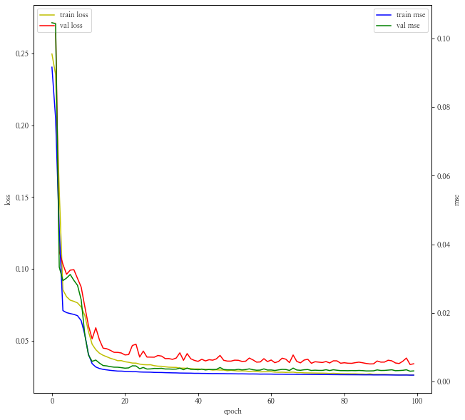


```python
%time result = return_predict(tf_train, tf_val, val, 24)
```

    100%|███████████████████████████████████████████████████| 60/60 [10:14<00:00, 10.24s/it]

    Wall time: 10min 14s
    

    
    


```python
grp_val = pd.concat([result, tf_val[y_col]], axis = 1)
```


```python
print(mean_absolute_error(grp_val.predict, grp_val[y_col]))
metric_plot(grp_val)
```

    0.1604490547287942
    


    <ggplot: (124080463080)>


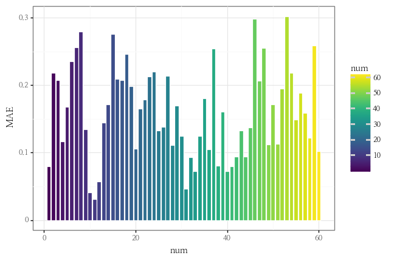


```python
mae_min = grp_val.groupby("num").apply(lambda x : mean_absolute_error(x["predict"], x[y_col])).idxmin()
mae_max = grp_val.groupby("num").apply(lambda x : mean_absolute_error(x["predict"], x[y_col])).idxmax()
print(f"mae가 가장 낮은 건물은 {mae_min}번 건물이고 mae가 가장 높은 건물은 {mae_max}번 건물입니다.")
```

    mae가 가장 낮은 건물은 11번 건물이고 mae가 가장 높은 건물은 53번 건물입니다.
    


```python
predict_grp_idx(grp_val, mae_min, y_col)
```


    <ggplot: (124100989085)>


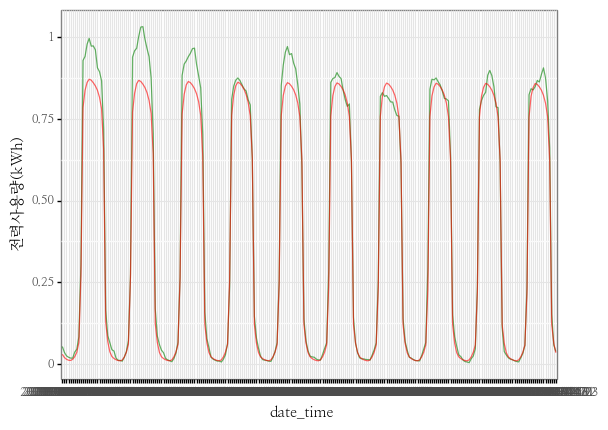


```python
predict_grp_idx(grp_val, mae_max, y_col)
```


    <ggplot: (124081794036)>


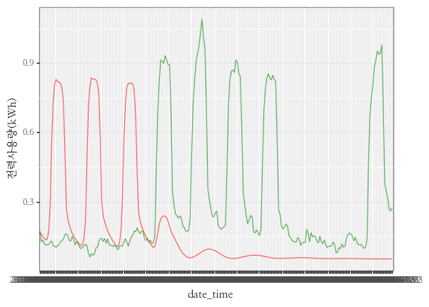

#### **다섯번째 모델 평가**
- 모델 LOSS로 봤을 때는 충분히 잘 Fitting된 것으로 보이나 여전히 건물에 따라서 정확도를 가지지 않은 경우들이 있는데, 패턴이 일정하지 않으면 확실히 잘 못 잡아내는 것으로 보입니다.
- 데이터 차원을 조금 늘렸음에도 불구하고 시간은 10분 정도 밖에 차이가 나지 않습니다. 모델의 깊이가 속도에 좀 더 영향을 주는 것 같습니다.

---

### **여섯번째 모델**
- LOSS FUNCTION : MSE
- EPOCH : 100
- LSTM LAYER : 1
- LSTM UNIT : 32
- LENGTH : 24 * 7 (일주일)


```python
EPOCH=100
length = 24 * 7
```


```python
tf_train = pd.concat([
    train["num"].reset_index(drop = True),
    pd.DataFrame(oh_encoder.fit_transform(train[["num"]]).toarray()).add_prefix("num"), 
    train[[y_col]].reset_index(drop = True)], 
    axis = 1)
```


```python
tf_val = pd.concat([
    val["num"].reset_index(drop = True),
    pd.DataFrame(oh_encoder.transform(val[["num"]]).toarray()).add_prefix("num"), 
    val[y_col].reset_index(drop = True)], 
    axis = 1)
```


```python
minmax_value = tf_train.groupby("num").agg({y_col : [max, min]}).reset_index().droplevel(axis = 1, level = 0)
minmax_value.columns = ["num", "max", "min"]
```


```python
tf_train[y_col] = tf_train.groupby("num").apply(lambda x : (x[y_col]-min(x[y_col]))/(max(x[y_col])-min(x[y_col]))).values
```


```python
tf_val = fit_minmmax_scaler(tf_val, minmax_value)
```


```python
save_best_only=tf.keras.callbacks.ModelCheckpoint(filepath="h5/lstm_model.h5", monitor='val_loss', save_best_only=True)
early_stop = tf.keras.callbacks.EarlyStopping(monitor='val_loss', patience=20)
```


```python
trainX, trainY = make_data(data = tf_train, y_col = y_col, length = length)
```

    60it [03:14,  3.24s/it]
    


```python
valX, valY = make_data(data = tf_val, y_col = y_col, length = length)
```

    60it [00:04, 14.80it/s]
    


```python
print(trainX.shape)
print(trainY.shape)
```

    (97920, 168, 61)
    (97920, 1)
    


```python
print(valX.shape)
print(valY.shape)
```

    (4320, 168, 61)
    (4320, 1)
    


```python
model=Sequential([
    LSTM(lstm_units, return_sequences=False, recurrent_dropout=dropout),
    Dense(1, kernel_initializer=tf.initializers.zeros())
])
```


```python
model.compile(optimizer='adam', loss='mae', metrics=['mse'])
```


```python
%%time
history = model.fit(trainX, trainY, validation_data = (valX, valY), 
                    epochs=EPOCH, batch_size=BATCH_SIZE, verbose=1,
                    callbacks=[early_stop, save_best_only])
```

    Epoch 1/100
    765/765 [==============================] - 66s 81ms/step - loss: 0.1019 - mse: 0.0252 - val_loss: 0.0517 - val_mse: 0.0069
    Epoch 2/100
    765/765 [==============================] - 61s 79ms/step - loss: 0.0504 - mse: 0.0059 - val_loss: 0.0443 - val_mse: 0.0054
    Epoch 3/100
    765/765 [==============================] - 60s 79ms/step - loss: 0.0445 - mse: 0.0049 - val_loss: 0.0417 - val_mse: 0.0050
    Epoch 4/100
    765/765 [==============================] - 61s 80ms/step - loss: 0.0414 - mse: 0.0045 - val_loss: 0.0402 - val_mse: 0.0045
    Epoch 5/100
    765/765 [==============================] - 59s 77ms/step - loss: 0.0396 - mse: 0.0042 - val_loss: 0.0388 - val_mse: 0.0044
    Epoch 6/100
    765/765 [==============================] - 58s 76ms/step - loss: 0.0383 - mse: 0.0041 - val_loss: 0.0381 - val_mse: 0.0042
    Epoch 7/100
    765/765 [==============================] - 58s 76ms/step - loss: 0.0375 - mse: 0.0039 - val_loss: 0.0386 - val_mse: 0.0041
    Epoch 8/100
    765/765 [==============================] - 59s 77ms/step - loss: 0.0368 - mse: 0.0038 - val_loss: 0.0376 - val_mse: 0.0041
    Epoch 9/100
    765/765 [==============================] - 59s 77ms/step - loss: 0.0362 - mse: 0.0037 - val_loss: 0.0373 - val_mse: 0.0040
    Epoch 10/100
    765/765 [==============================] - 58s 76ms/step - loss: 0.0358 - mse: 0.0036 - val_loss: 0.0383 - val_mse: 0.0040
    Epoch 11/100
    765/765 [==============================] - 58s 76ms/step - loss: 0.0353 - mse: 0.0036 - val_loss: 0.0377 - val_mse: 0.0039
    Epoch 12/100
    765/765 [==============================] - 58s 76ms/step - loss: 0.0350 - mse: 0.0035 - val_loss: 0.0370 - val_mse: 0.0039
    Epoch 13/100
    765/765 [==============================] - 58s 75ms/step - loss: 0.0346 - mse: 0.0035 - val_loss: 0.0367 - val_mse: 0.0039
    Epoch 14/100
    765/765 [==============================] - 58s 76ms/step - loss: 0.0343 - mse: 0.0034 - val_loss: 0.0372 - val_mse: 0.0040
    Epoch 15/100
    765/765 [==============================] - 58s 76ms/step - loss: 0.0341 - mse: 0.0034 - val_loss: 0.0369 - val_mse: 0.0039
    Epoch 16/100
    765/765 [==============================] - 58s 76ms/step - loss: 0.0339 - mse: 0.0033 - val_loss: 0.0366 - val_mse: 0.0038
    Epoch 17/100
    765/765 [==============================] - 58s 76ms/step - loss: 0.0336 - mse: 0.0033 - val_loss: 0.0359 - val_mse: 0.0038
    Epoch 18/100
    765/765 [==============================] - 58s 75ms/step - loss: 0.0335 - mse: 0.0033 - val_loss: 0.0368 - val_mse: 0.0038
    Epoch 19/100
    765/765 [==============================] - 58s 75ms/step - loss: 0.0333 - mse: 0.0032 - val_loss: 0.0367 - val_mse: 0.0038
    Epoch 20/100
    765/765 [==============================] - 58s 76ms/step - loss: 0.0330 - mse: 0.0032 - val_loss: 0.0356 - val_mse: 0.0037
    Epoch 21/100
    765/765 [==============================] - 58s 76ms/step - loss: 0.0329 - mse: 0.0031 - val_loss: 0.0356 - val_mse: 0.0037
    Epoch 22/100
    765/765 [==============================] - 58s 76ms/step - loss: 0.0326 - mse: 0.0031 - val_loss: 0.0367 - val_mse: 0.0038
    Epoch 23/100
    765/765 [==============================] - 58s 76ms/step - loss: 0.0326 - mse: 0.0031 - val_loss: 0.0351 - val_mse: 0.0036
    Epoch 24/100
    765/765 [==============================] - 58s 76ms/step - loss: 0.0324 - mse: 0.0030 - val_loss: 0.0359 - val_mse: 0.0037
    Epoch 25/100
    765/765 [==============================] - 60s 78ms/step - loss: 0.0322 - mse: 0.0030 - val_loss: 0.0348 - val_mse: 0.0036
    Epoch 26/100
    765/765 [==============================] - 58s 76ms/step - loss: 0.0320 - mse: 0.0030 - val_loss: 0.0352 - val_mse: 0.0035
    Epoch 27/100
    765/765 [==============================] - 58s 76ms/step - loss: 0.0320 - mse: 0.0030 - val_loss: 0.0346 - val_mse: 0.0035
    Epoch 28/100
    765/765 [==============================] - 59s 77ms/step - loss: 0.0318 - mse: 0.0029 - val_loss: 0.0355 - val_mse: 0.0037
    Epoch 29/100
    765/765 [==============================] - 59s 77ms/step - loss: 0.0317 - mse: 0.0029 - val_loss: 0.0351 - val_mse: 0.0036
    Epoch 30/100
    765/765 [==============================] - 59s 78ms/step - loss: 0.0317 - mse: 0.0029 - val_loss: 0.0350 - val_mse: 0.0035
    Epoch 31/100
    765/765 [==============================] - 59s 77ms/step - loss: 0.0316 - mse: 0.0029 - val_loss: 0.0354 - val_mse: 0.0036
    Epoch 32/100
    765/765 [==============================] - 59s 77ms/step - loss: 0.0314 - mse: 0.0029 - val_loss: 0.0356 - val_mse: 0.0035
    Epoch 33/100
    765/765 [==============================] - 59s 78ms/step - loss: 0.0313 - mse: 0.0029 - val_loss: 0.0352 - val_mse: 0.0035
    Epoch 34/100
    765/765 [==============================] - 59s 77ms/step - loss: 0.0312 - mse: 0.0028 - val_loss: 0.0346 - val_mse: 0.0035
    Epoch 35/100
    765/765 [==============================] - 60s 78ms/step - loss: 0.0310 - mse: 0.0028 - val_loss: 0.0343 - val_mse: 0.0035
    Epoch 36/100
    765/765 [==============================] - 60s 78ms/step - loss: 0.0311 - mse: 0.0028 - val_loss: 0.0352 - val_mse: 0.0036
    Epoch 37/100
    765/765 [==============================] - 59s 78ms/step - loss: 0.0310 - mse: 0.0028 - val_loss: 0.0342 - val_mse: 0.0034
    Epoch 38/100
    765/765 [==============================] - 59s 77ms/step - loss: 0.0309 - mse: 0.0028 - val_loss: 0.0349 - val_mse: 0.0035
    Epoch 39/100
    765/765 [==============================] - 59s 78ms/step - loss: 0.0309 - mse: 0.0028 - val_loss: 0.0345 - val_mse: 0.0034
    Epoch 40/100
    765/765 [==============================] - 60s 78ms/step - loss: 0.0307 - mse: 0.0028 - val_loss: 0.0342 - val_mse: 0.0034
    Epoch 41/100
    765/765 [==============================] - 59s 78ms/step - loss: 0.0307 - mse: 0.0028 - val_loss: 0.0355 - val_mse: 0.0035
    Epoch 42/100
    765/765 [==============================] - 59s 78ms/step - loss: 0.0305 - mse: 0.0027 - val_loss: 0.0340 - val_mse: 0.0034
    Epoch 43/100
    765/765 [==============================] - 60s 78ms/step - loss: 0.0304 - mse: 0.0027 - val_loss: 0.0343 - val_mse: 0.0034
    Epoch 44/100
    765/765 [==============================] - 59s 78ms/step - loss: 0.0304 - mse: 0.0027 - val_loss: 0.0342 - val_mse: 0.0034
    Epoch 45/100
    765/765 [==============================] - 60s 79ms/step - loss: 0.0304 - mse: 0.0027 - val_loss: 0.0342 - val_mse: 0.0034
    Epoch 46/100
    765/765 [==============================] - 60s 78ms/step - loss: 0.0303 - mse: 0.0027 - val_loss: 0.0350 - val_mse: 0.0035
    Epoch 47/100
    765/765 [==============================] - 60s 78ms/step - loss: 0.0306 - mse: 0.0028 - val_loss: 0.0346 - val_mse: 0.0035
    Epoch 48/100
    765/765 [==============================] - 60s 78ms/step - loss: 0.0306 - mse: 0.0028 - val_loss: 0.0348 - val_mse: 0.0035
    Epoch 49/100
    765/765 [==============================] - 61s 80ms/step - loss: 0.0302 - mse: 0.0027 - val_loss: 0.0346 - val_mse: 0.0035
    Epoch 50/100
    765/765 [==============================] - 60s 79ms/step - loss: 0.0300 - mse: 0.0027 - val_loss: 0.0347 - val_mse: 0.0034
    Epoch 51/100
    765/765 [==============================] - 61s 80ms/step - loss: 0.0299 - mse: 0.0026 - val_loss: 0.0344 - val_mse: 0.0034
    Epoch 52/100
    765/765 [==============================] - 60s 78ms/step - loss: 0.0300 - mse: 0.0027 - val_loss: 0.0353 - val_mse: 0.0037
    Epoch 53/100
    765/765 [==============================] - 60s 78ms/step - loss: 0.0298 - mse: 0.0026 - val_loss: 0.0337 - val_mse: 0.0033
    Epoch 54/100
    765/765 [==============================] - 59s 78ms/step - loss: 0.0297 - mse: 0.0026 - val_loss: 0.0344 - val_mse: 0.0034
    Epoch 55/100
    765/765 [==============================] - 60s 79ms/step - loss: 0.0298 - mse: 0.0026 - val_loss: 0.0341 - val_mse: 0.0034
    Epoch 56/100
    765/765 [==============================] - 60s 78ms/step - loss: 0.0297 - mse: 0.0026 - val_loss: 0.0339 - val_mse: 0.0033
    Epoch 57/100
    765/765 [==============================] - 60s 79ms/step - loss: 0.0299 - mse: 0.0027 - val_loss: 0.0343 - val_mse: 0.0034
    Epoch 58/100
    765/765 [==============================] - 60s 78ms/step - loss: 0.0296 - mse: 0.0026 - val_loss: 0.0336 - val_mse: 0.0033
    Epoch 59/100
    765/765 [==============================] - 60s 78ms/step - loss: 0.0297 - mse: 0.0026 - val_loss: 0.0346 - val_mse: 0.0034
    Epoch 60/100
    765/765 [==============================] - 60s 79ms/step - loss: 0.0300 - mse: 0.0027 - val_loss: 0.0346 - val_mse: 0.0034
    Epoch 61/100
    765/765 [==============================] - 60s 78ms/step - loss: 0.0295 - mse: 0.0026 - val_loss: 0.0344 - val_mse: 0.0034
    Epoch 62/100
    765/765 [==============================] - 60s 78ms/step - loss: 0.0295 - mse: 0.0026 - val_loss: 0.0338 - val_mse: 0.0033
    Epoch 63/100
    765/765 [==============================] - 60s 78ms/step - loss: 0.0296 - mse: 0.0026 - val_loss: 0.0340 - val_mse: 0.0033
    Epoch 64/100
    765/765 [==============================] - 60s 78ms/step - loss: 0.0296 - mse: 0.0026 - val_loss: 0.0340 - val_mse: 0.0034
    Epoch 65/100
    765/765 [==============================] - 60s 78ms/step - loss: 0.0294 - mse: 0.0025 - val_loss: 0.0343 - val_mse: 0.0033
    Epoch 66/100
    765/765 [==============================] - 60s 79ms/step - loss: 0.0294 - mse: 0.0025 - val_loss: 0.0337 - val_mse: 0.0032
    Epoch 67/100
    765/765 [==============================] - 60s 78ms/step - loss: 0.0293 - mse: 0.0025 - val_loss: 0.0337 - val_mse: 0.0033
    Epoch 68/100
    765/765 [==============================] - 60s 79ms/step - loss: 0.0295 - mse: 0.0026 - val_loss: 0.0343 - val_mse: 0.0034
    Epoch 69/100
    765/765 [==============================] - 60s 79ms/step - loss: 0.0292 - mse: 0.0025 - val_loss: 0.0345 - val_mse: 0.0034
    Epoch 70/100
    765/765 [==============================] - 60s 79ms/step - loss: 0.0291 - mse: 0.0025 - val_loss: 0.0339 - val_mse: 0.0034
    Epoch 71/100
    765/765 [==============================] - 60s 79ms/step - loss: 0.0291 - mse: 0.0025 - val_loss: 0.0338 - val_mse: 0.0033
    Epoch 72/100
    765/765 [==============================] - 60s 78ms/step - loss: 0.0291 - mse: 0.0025 - val_loss: 0.0336 - val_mse: 0.0033
    Epoch 73/100
    765/765 [==============================] - 60s 78ms/step - loss: 0.0290 - mse: 0.0025 - val_loss: 0.0339 - val_mse: 0.0033
    Epoch 74/100
    765/765 [==============================] - 60s 78ms/step - loss: 0.0292 - mse: 0.0025 - val_loss: 0.0341 - val_mse: 0.0034
    Epoch 75/100
    765/765 [==============================] - 60s 78ms/step - loss: 0.0292 - mse: 0.0025 - val_loss: 0.0335 - val_mse: 0.0034
    Epoch 76/100
    765/765 [==============================] - 60s 78ms/step - loss: 0.0290 - mse: 0.0025 - val_loss: 0.0341 - val_mse: 0.0035
    Epoch 77/100
    765/765 [==============================] - 60s 78ms/step - loss: 0.0289 - mse: 0.0025 - val_loss: 0.0332 - val_mse: 0.0033
    Epoch 78/100
    765/765 [==============================] - 60s 78ms/step - loss: 0.0287 - mse: 0.0024 - val_loss: 0.0345 - val_mse: 0.0035
    Epoch 79/100
    765/765 [==============================] - 60s 79ms/step - loss: 0.0290 - mse: 0.0025 - val_loss: 0.0337 - val_mse: 0.0033
    Epoch 80/100
    765/765 [==============================] - 60s 79ms/step - loss: 0.0288 - mse: 0.0024 - val_loss: 0.0336 - val_mse: 0.0033
    Epoch 81/100
    765/765 [==============================] - 60s 78ms/step - loss: 0.0287 - mse: 0.0025 - val_loss: 0.0339 - val_mse: 0.0033
    Epoch 82/100
    765/765 [==============================] - 60s 79ms/step - loss: 0.0295 - mse: 0.0026 - val_loss: 0.0339 - val_mse: 0.0033
    Epoch 83/100
    765/765 [==============================] - 60s 78ms/step - loss: 0.0292 - mse: 0.0025 - val_loss: 0.0336 - val_mse: 0.0032
    Epoch 84/100
    765/765 [==============================] - 60s 78ms/step - loss: 0.0289 - mse: 0.0025 - val_loss: 0.0335 - val_mse: 0.0033
    Epoch 85/100
    765/765 [==============================] - 60s 78ms/step - loss: 0.0291 - mse: 0.0025 - val_loss: 0.0350 - val_mse: 0.0035
    Epoch 86/100
    765/765 [==============================] - 60s 78ms/step - loss: 0.0290 - mse: 0.0025 - val_loss: 0.0336 - val_mse: 0.0033
    Epoch 87/100
    765/765 [==============================] - 60s 78ms/step - loss: 0.0290 - mse: 0.0025 - val_loss: 0.0341 - val_mse: 0.0034
    Epoch 88/100
    765/765 [==============================] - 60s 78ms/step - loss: 0.0287 - mse: 0.0024 - val_loss: 0.0334 - val_mse: 0.0032
    Epoch 89/100
    765/765 [==============================] - 60s 78ms/step - loss: 0.0293 - mse: 0.0025 - val_loss: 0.0373 - val_mse: 0.0038
    Epoch 90/100
    765/765 [==============================] - 61s 79ms/step - loss: 0.0291 - mse: 0.0025 - val_loss: 0.0333 - val_mse: 0.0032
    Epoch 91/100
    765/765 [==============================] - 60s 79ms/step - loss: 0.0285 - mse: 0.0024 - val_loss: 0.0335 - val_mse: 0.0032
    Epoch 92/100
    765/765 [==============================] - 60s 79ms/step - loss: 0.0287 - mse: 0.0024 - val_loss: 0.0336 - val_mse: 0.0033
    Epoch 93/100
    765/765 [==============================] - 61s 79ms/step - loss: 0.0288 - mse: 0.0025 - val_loss: 0.0340 - val_mse: 0.0034
    Epoch 94/100
    765/765 [==============================] - 60s 79ms/step - loss: 0.0286 - mse: 0.0024 - val_loss: 0.0332 - val_mse: 0.0033
    Epoch 95/100
    765/765 [==============================] - 60s 79ms/step - loss: 0.0328 - mse: 0.0032 - val_loss: 0.0381 - val_mse: 0.0043
    Epoch 96/100
    765/765 [==============================] - 60s 78ms/step - loss: 0.0303 - mse: 0.0027 - val_loss: 0.0343 - val_mse: 0.0034
    Epoch 97/100
    765/765 [==============================] - 60s 78ms/step - loss: 0.0290 - mse: 0.0025 - val_loss: 0.0334 - val_mse: 0.0033
    Wall time: 1h 36min 25s
    


```python
history_plot(history)
```


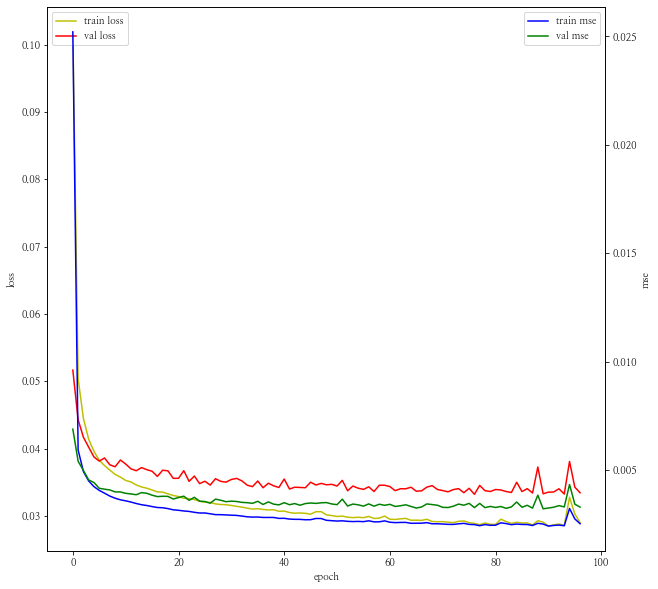


```python
%time result = return_predict(tf_train, tf_val, val, 24)
```

    100%|███████████████████████████████████████████████████| 60/60 [10:44<00:00, 10.74s/it]

    Wall time: 10min 44s
    

    
    


```python
grp_val = pd.concat([result, tf_val[y_col]], axis = 1)
```


```python
print(mean_absolute_error(grp_val.predict, grp_val[y_col]))
metric_plot(grp_val)
```

    0.3211827858864578
    


    <ggplot: (100421514981)>


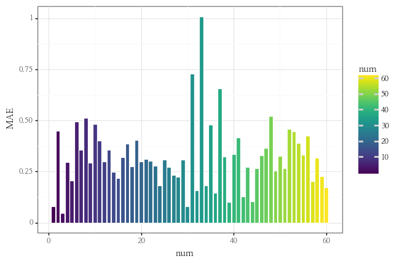


```python
mae_min = grp_val.groupby("num").apply(lambda x : mean_absolute_error(x["predict"], x[y_col])).idxmin()
mae_max = grp_val.groupby("num").apply(lambda x : mean_absolute_error(x["predict"], x[y_col])).idxmax()
print(f"mae가 가장 낮은 건물은 {mae_min}번 건물이고 mae가 가장 높은 건물은 {mae_max}번 건물입니다.")
```

    mae가 가장 낮은 건물은 3번 건물이고 mae가 가장 높은 건물은 33번 건물입니다.
    


```python
predict_grp_idx(grp_val, mae_min, y_col)
```


    <ggplot: (100422345045)>


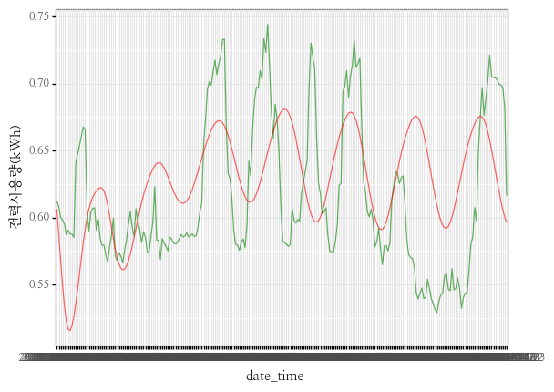


```python
predict_grp_idx(grp_val, mae_max, y_col)
```


    <ggplot: (100421532883)>


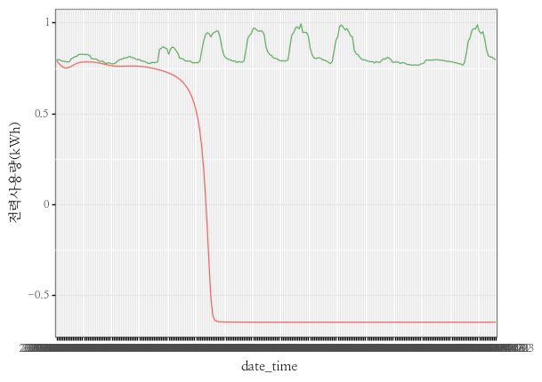


```python
model.summary()
```

    Model: "sequential_2"
    _________________________________________________________________
    Layer (type)                 Output Shape              Param #   
    =================================================================
    lstm_2 (LSTM)                (None, 32)                12032     
    _________________________________________________________________
    dense_2 (Dense)              (None, 1)                 33        
    =================================================================
    Total params: 12,065
    Trainable params: 12,065
    Non-trainable params: 0
    _________________________________________________________________
    

#### **여섯번째 모델 평가**
- LOSS를 보면 잘 수렴하다가 중간에 한번 커진 것을 확인할 수 있습니다.
- MAE를 보나 Validation set을 보나 무조건 길다고 잘 Fitting되는 것은 아닌 것 같습니다.(물론 다른 Hyper parameter 들을 조절하는 것이 관건이겠지만...)

---

### **일곱번째 모델**
- LOSS FUNCTION : MSE
- EPOCH : 100
- LSTM LAYER : 6
- LSTM UNIT : 32
- LENGTH : 24 * 7 (일주일)
- 데이터 추가


```python
model=Sequential([
    LSTM(lstm_units, return_sequences=True, recurrent_dropout=dropout),
    LSTM(int(lstm_units / 2), return_sequences=True, recurrent_dropout=dropout),
    LSTM(int(lstm_units / 2**2), return_sequences=True, recurrent_dropout=dropout),
    LSTM(int(lstm_units / 2**3), return_sequences=True, recurrent_dropout=dropout),
    LSTM(int(lstm_units / 2**4), return_sequences=True, recurrent_dropout=dropout),
    LSTM(int(lstm_units / 2**5), return_sequences=False, recurrent_dropout=dropout),
    Dense(1, kernel_initializer=tf.initializers.zeros())
])
```


```python
model.compile(optimizer='adam', loss='mae', metrics=['mse'])
```


```python
%%time
history = model.fit(trainX, trainY, validation_data = (valX, valY), 
                    epochs=EPOCH, batch_size=BATCH_SIZE, verbose=1,
                    callbacks=[early_stop, save_best_only])
```

    Epoch 1/100
    765/765 [==============================] - 297s 375ms/step - loss: 0.2577 - mse: 0.0984 - val_loss: 0.2497 - val_mse: 0.0862
    Epoch 2/100
    765/765 [==============================] - 293s 383ms/step - loss: 0.1851 - mse: 0.0548 - val_loss: 0.1536 - val_mse: 0.0487
    Epoch 3/100
    765/765 [==============================] - 294s 385ms/step - loss: 0.1058 - mse: 0.0232 - val_loss: 0.1429 - val_mse: 0.0456
    Epoch 4/100
    765/765 [==============================] - 277s 363ms/step - loss: 0.0953 - mse: 0.0193 - val_loss: 0.1278 - val_mse: 0.0353
    Epoch 5/100
    765/765 [==============================] - 271s 354ms/step - loss: 0.0864 - mse: 0.0159 - val_loss: 0.1139 - val_mse: 0.0286
    Epoch 6/100
    765/765 [==============================] - 282s 368ms/step - loss: 0.0773 - mse: 0.0128 - val_loss: 0.1082 - val_mse: 0.0246
    Epoch 7/100
    765/765 [==============================] - 298s 390ms/step - loss: 0.0708 - mse: 0.0108 - val_loss: 0.0955 - val_mse: 0.0203
    Epoch 8/100
    765/765 [==============================] - 287s 375ms/step - loss: 0.0665 - mse: 0.0096 - val_loss: 0.0889 - val_mse: 0.0170
    Epoch 9/100
    765/765 [==============================] - 280s 366ms/step - loss: 0.0636 - mse: 0.0087 - val_loss: 0.0842 - val_mse: 0.0159
    Epoch 10/100
    765/765 [==============================] - 282s 368ms/step - loss: 0.0609 - mse: 0.0080 - val_loss: 0.0808 - val_mse: 0.0146
    Epoch 11/100
    765/765 [==============================] - 285s 373ms/step - loss: 0.0590 - mse: 0.0075 - val_loss: 0.0757 - val_mse: 0.0129
    Epoch 12/100
    765/765 [==============================] - 288s 377ms/step - loss: 0.0567 - mse: 0.0070 - val_loss: 0.0729 - val_mse: 0.0118
    Epoch 13/100
    765/765 [==============================] - 297s 388ms/step - loss: 0.0548 - mse: 0.0066 - val_loss: 0.0721 - val_mse: 0.0120
    Epoch 14/100
    765/765 [==============================] - 289s 378ms/step - loss: 0.0569 - mse: 0.0075 - val_loss: 0.0896 - val_mse: 0.0215
    Epoch 15/100
    765/765 [==============================] - 284s 372ms/step - loss: 0.0559 - mse: 0.0073 - val_loss: 0.0681 - val_mse: 0.0118
    Epoch 16/100
    765/765 [==============================] - 284s 372ms/step - loss: 0.0510 - mse: 0.0059 - val_loss: 0.0610 - val_mse: 0.0087
    Epoch 17/100
    765/765 [==============================] - 285s 373ms/step - loss: 0.0482 - mse: 0.0053 - val_loss: 0.0580 - val_mse: 0.0078
    Epoch 18/100
    765/765 [==============================] - 300s 392ms/step - loss: 0.0459 - mse: 0.0048 - val_loss: 0.0528 - val_mse: 0.0068
    Epoch 19/100
    765/765 [==============================] - 286s 373ms/step - loss: 0.0437 - mse: 0.0043 - val_loss: 0.0495 - val_mse: 0.0057
    Epoch 20/100
    765/765 [==============================] - 288s 376ms/step - loss: 0.0431 - mse: 0.0042 - val_loss: 0.0461 - val_mse: 0.0052
    Epoch 21/100
    765/765 [==============================] - 283s 370ms/step - loss: 0.0449 - mse: 0.0046 - val_loss: 0.0464 - val_mse: 0.0054
    Epoch 22/100
    765/765 [==============================] - 282s 369ms/step - loss: 0.0405 - mse: 0.0038 - val_loss: 0.0444 - val_mse: 0.0048
    Epoch 23/100
    765/765 [==============================] - 290s 379ms/step - loss: 0.0390 - mse: 0.0036 - val_loss: 0.0421 - val_mse: 0.0045
    Epoch 24/100
    765/765 [==============================] - 288s 377ms/step - loss: 0.0378 - mse: 0.0034 - val_loss: 0.0432 - val_mse: 0.0046
    Epoch 25/100
    765/765 [==============================] - 284s 372ms/step - loss: 0.0369 - mse: 0.0033 - val_loss: 0.0419 - val_mse: 0.0044
    Epoch 26/100
    765/765 [==============================] - 276s 361ms/step - loss: 0.0364 - mse: 0.0032 - val_loss: 0.0418 - val_mse: 0.0045
    Epoch 27/100
    765/765 [==============================] - 276s 360ms/step - loss: 0.0354 - mse: 0.0031 - val_loss: 0.0405 - val_mse: 0.0041
    Epoch 28/100
    765/765 [==============================] - 282s 368ms/step - loss: 0.0347 - mse: 0.0030 - val_loss: 0.0387 - val_mse: 0.0038
    Epoch 29/100
    765/765 [==============================] - 280s 366ms/step - loss: 0.0340 - mse: 0.0029 - val_loss: 0.0386 - val_mse: 0.0039
    Epoch 30/100
    765/765 [==============================] - 277s 362ms/step - loss: 0.0336 - mse: 0.0029 - val_loss: 0.0381 - val_mse: 0.0038
    Epoch 31/100
    765/765 [==============================] - 279s 365ms/step - loss: 0.0333 - mse: 0.0028 - val_loss: 0.0392 - val_mse: 0.0039
    Epoch 32/100
    765/765 [==============================] - 279s 365ms/step - loss: 0.0329 - mse: 0.0028 - val_loss: 0.0368 - val_mse: 0.0036
    Epoch 33/100
    765/765 [==============================] - 282s 369ms/step - loss: 0.0324 - mse: 0.0027 - val_loss: 0.0370 - val_mse: 0.0036
    Epoch 34/100
    765/765 [==============================] - 282s 369ms/step - loss: 0.0319 - mse: 0.0026 - val_loss: 0.0357 - val_mse: 0.0035
    Epoch 35/100
    765/765 [==============================] - 283s 370ms/step - loss: 0.0316 - mse: 0.0026 - val_loss: 0.0349 - val_mse: 0.0033
    Epoch 36/100
    765/765 [==============================] - 284s 371ms/step - loss: 0.0314 - mse: 0.0026 - val_loss: 0.0353 - val_mse: 0.0035
    Epoch 37/100
    765/765 [==============================] - 284s 372ms/step - loss: 0.0328 - mse: 0.0029 - val_loss: 0.0357 - val_mse: 0.0035
    Epoch 38/100
    765/765 [==============================] - 285s 373ms/step - loss: 0.0311 - mse: 0.0026 - val_loss: 0.0357 - val_mse: 0.0035
    Epoch 39/100
    765/765 [==============================] - 288s 377ms/step - loss: 0.0307 - mse: 0.0026 - val_loss: 0.0346 - val_mse: 0.0033
    Epoch 40/100
    765/765 [==============================] - 298s 389ms/step - loss: 0.0306 - mse: 0.0025 - val_loss: 0.0361 - val_mse: 0.0035
    Epoch 41/100
    765/765 [==============================] - 307s 401ms/step - loss: 0.0303 - mse: 0.0025 - val_loss: 0.0356 - val_mse: 0.0035
    Epoch 42/100
    765/765 [==============================] - 309s 404ms/step - loss: 0.0301 - mse: 0.0025 - val_loss: 0.0358 - val_mse: 0.0035
    Epoch 43/100
    765/765 [==============================] - 301s 394ms/step - loss: 0.0299 - mse: 0.0024 - val_loss: 0.0350 - val_mse: 0.0035
    Epoch 44/100
    765/765 [==============================] - 293s 383ms/step - loss: 0.0296 - mse: 0.0024 - val_loss: 0.0337 - val_mse: 0.0031
    Epoch 45/100
    765/765 [==============================] - 305s 399ms/step - loss: 0.0295 - mse: 0.0024 - val_loss: 0.0338 - val_mse: 0.0033
    Epoch 46/100
    765/765 [==============================] - 323s 423ms/step - loss: 0.0294 - mse: 0.0024 - val_loss: 0.0335 - val_mse: 0.0032
    Epoch 47/100
    765/765 [==============================] - 329s 430ms/step - loss: 0.0292 - mse: 0.0024 - val_loss: 0.0333 - val_mse: 0.0031
    Epoch 48/100
    765/765 [==============================] - 334s 436ms/step - loss: 0.0290 - mse: 0.0023 - val_loss: 0.0339 - val_mse: 0.0032
    Epoch 49/100
    765/765 [==============================] - 315s 411ms/step - loss: 0.0289 - mse: 0.0023 - val_loss: 0.0341 - val_mse: 0.0032
    Epoch 50/100
    765/765 [==============================] - 310s 406ms/step - loss: 0.0296 - mse: 0.0024 - val_loss: 0.0337 - val_mse: 0.0032
    Epoch 51/100
    765/765 [==============================] - 336s 440ms/step - loss: 0.0293 - mse: 0.0024 - val_loss: 0.0342 - val_mse: 0.0034
    Epoch 52/100
    765/765 [==============================] - 315s 411ms/step - loss: 0.0291 - mse: 0.0024 - val_loss: 0.0332 - val_mse: 0.0032
    Epoch 53/100
    765/765 [==============================] - 317s 415ms/step - loss: 0.0289 - mse: 0.0023 - val_loss: 0.0338 - val_mse: 0.0033
    Epoch 54/100
    765/765 [==============================] - 313s 409ms/step - loss: 0.0287 - mse: 0.0023 - val_loss: 0.0339 - val_mse: 0.0032
    Epoch 55/100
    765/765 [==============================] - 334s 436ms/step - loss: 0.0285 - mse: 0.0023 - val_loss: 0.0328 - val_mse: 0.0031
    Epoch 56/100
    765/765 [==============================] - 330s 431ms/step - loss: 0.0283 - mse: 0.0023 - val_loss: 0.0331 - val_mse: 0.0032
    Epoch 57/100
    765/765 [==============================] - 319s 417ms/step - loss: 0.0303 - mse: 0.0025 - val_loss: 0.0399 - val_mse: 0.0045
    Epoch 58/100
    765/765 [==============================] - 320s 419ms/step - loss: 0.0307 - mse: 0.0026 - val_loss: 0.0346 - val_mse: 0.0034
    Epoch 59/100
    765/765 [==============================] - 344s 450ms/step - loss: 0.0290 - mse: 0.0024 - val_loss: 0.0331 - val_mse: 0.0032
    Epoch 60/100
    765/765 [==============================] - 341s 446ms/step - loss: 0.0286 - mse: 0.0023 - val_loss: 0.0336 - val_mse: 0.0033
    Epoch 61/100
    765/765 [==============================] - 340s 444ms/step - loss: 0.0285 - mse: 0.0023 - val_loss: 0.0335 - val_mse: 0.0033
    Epoch 62/100
    765/765 [==============================] - 350s 457ms/step - loss: 0.0283 - mse: 0.0023 - val_loss: 0.0340 - val_mse: 0.0034
    Epoch 63/100
    765/765 [==============================] - 354s 463ms/step - loss: 0.0282 - mse: 0.0023 - val_loss: 0.0337 - val_mse: 0.0033
    Epoch 64/100
    765/765 [==============================] - 348s 455ms/step - loss: 0.0282 - mse: 0.0023 - val_loss: 0.0332 - val_mse: 0.0032
    Epoch 65/100
    765/765 [==============================] - 353s 462ms/step - loss: 0.0279 - mse: 0.0022 - val_loss: 0.0332 - val_mse: 0.0033
    Epoch 66/100
    765/765 [==============================] - 349s 456ms/step - loss: 0.0278 - mse: 0.0022 - val_loss: 0.0324 - val_mse: 0.0031
    Epoch 67/100
    765/765 [==============================] - 367s 480ms/step - loss: 0.0277 - mse: 0.0022 - val_loss: 0.0355 - val_mse: 0.0037
    Epoch 68/100
    765/765 [==============================] - 369s 483ms/step - loss: 0.0287 - mse: 0.0024 - val_loss: 0.0385 - val_mse: 0.0040
    Epoch 69/100
    765/765 [==============================] - 374s 489ms/step - loss: 0.0294 - mse: 0.0025 - val_loss: 0.0337 - val_mse: 0.0032
    Epoch 70/100
    765/765 [==============================] - 359s 469ms/step - loss: 0.0279 - mse: 0.0022 - val_loss: 0.0319 - val_mse: 0.0029
    Epoch 71/100
    765/765 [==============================] - 362s 474ms/step - loss: 0.0276 - mse: 0.0022 - val_loss: 0.0327 - val_mse: 0.0031
    Epoch 72/100
    765/765 [==============================] - 371s 485ms/step - loss: 0.0273 - mse: 0.0021 - val_loss: 0.0320 - val_mse: 0.0030
    Epoch 73/100
    765/765 [==============================] - 365s 477ms/step - loss: 0.0276 - mse: 0.0022 - val_loss: 0.0331 - val_mse: 0.0032
    Epoch 74/100
    765/765 [==============================] - 358s 469ms/step - loss: 0.0275 - mse: 0.0022 - val_loss: 0.0325 - val_mse: 0.0031
    Epoch 75/100
    765/765 [==============================] - 356s 466ms/step - loss: 0.0282 - mse: 0.0023 - val_loss: 0.0349 - val_mse: 0.0035
    Epoch 76/100
    765/765 [==============================] - 377s 493ms/step - loss: 0.0281 - mse: 0.0023 - val_loss: 0.0329 - val_mse: 0.0031
    Epoch 77/100
    765/765 [==============================] - 377s 493ms/step - loss: 0.0278 - mse: 0.0023 - val_loss: 0.0331 - val_mse: 0.0032
    Epoch 78/100
    765/765 [==============================] - 382s 499ms/step - loss: 0.0277 - mse: 0.0022 - val_loss: 0.0331 - val_mse: 0.0033
    Epoch 79/100
    765/765 [==============================] - 375s 490ms/step - loss: 0.0275 - mse: 0.0022 - val_loss: 0.0335 - val_mse: 0.0032
    Epoch 80/100
    765/765 [==============================] - 382s 499ms/step - loss: 0.0279 - mse: 0.0023 - val_loss: 0.0330 - val_mse: 0.0032
    Epoch 81/100
    765/765 [==============================] - 396s 518ms/step - loss: 0.0273 - mse: 0.0022 - val_loss: 0.0329 - val_mse: 0.0032
    Epoch 82/100
    765/765 [==============================] - 366s 478ms/step - loss: 0.0272 - mse: 0.0022 - val_loss: 0.0329 - val_mse: 0.0033
    Epoch 83/100
    765/765 [==============================] - 371s 484ms/step - loss: 0.0271 - mse: 0.0022 - val_loss: 0.0329 - val_mse: 0.0033
    Epoch 84/100
    765/765 [==============================] - 378s 494ms/step - loss: 0.0270 - mse: 0.0021 - val_loss: 0.0329 - val_mse: 0.0033
    Epoch 85/100
    765/765 [==============================] - 372s 487ms/step - loss: 0.0268 - mse: 0.0021 - val_loss: 0.0329 - val_mse: 0.0032
    Epoch 86/100
    765/765 [==============================] - 360s 470ms/step - loss: 0.0267 - mse: 0.0021 - val_loss: 0.0334 - val_mse: 0.0032
    Epoch 87/100
    765/765 [==============================] - 397s 519ms/step - loss: 0.0266 - mse: 0.0021 - val_loss: 0.0328 - val_mse: 0.0032
    Epoch 88/100
    765/765 [==============================] - 357s 466ms/step - loss: 0.0266 - mse: 0.0021 - val_loss: 0.0323 - val_mse: 0.0031
    Epoch 89/100
    765/765 [==============================] - 356s 465ms/step - loss: 0.0265 - mse: 0.0021 - val_loss: 0.0328 - val_mse: 0.0032
    Epoch 90/100
    765/765 [==============================] - 356s 465ms/step - loss: 0.0271 - mse: 0.0021 - val_loss: 0.0328 - val_mse: 0.0032
    Wall time: 8h 2s
    


```python
history_plot(history)
```


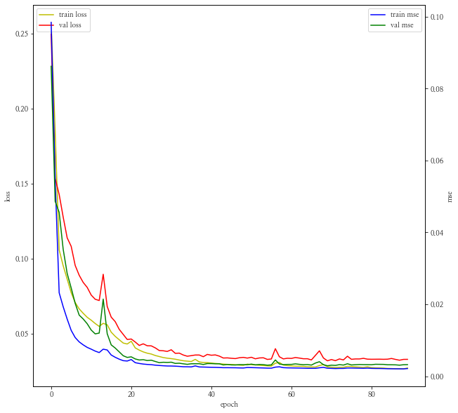


```python
%time result = return_predict(tf_train, tf_val, val, 24)
```

    100%|███████████████████████████████████████████████████| 60/60 [10:59<00:00, 11.00s/it]

    Wall time: 10min 59s
    

    
    


```python
grp_val = pd.concat([result, tf_val[y_col]], axis = 1)
```


```python
print(mean_absolute_error(grp_val.predict, grp_val[y_col]))
metric_plot(grp_val)
```

    0.31780043886528764
    


    <ggplot: (100438488929)>


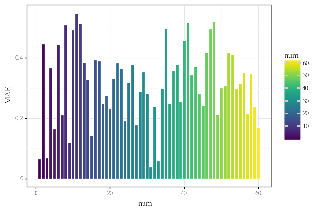


```python
mae_min = grp_val.groupby("num").apply(lambda x : mean_absolute_error(x["predict"], x[y_col])).idxmin()
mae_max = grp_val.groupby("num").apply(lambda x : mean_absolute_error(x["predict"], x[y_col])).idxmax()
print(f"mae가 가장 낮은 건물은 {mae_min}번 건물이고 mae가 가장 높은 건물은 {mae_max}번 건물입니다.")
```

    mae가 가장 낮은 건물은 31번 건물이고 mae가 가장 높은 건물은 11번 건물입니다.
    


```python
predict_grp_idx(grp_val, mae_min, y_col)
```


    <ggplot: (100408766474)>


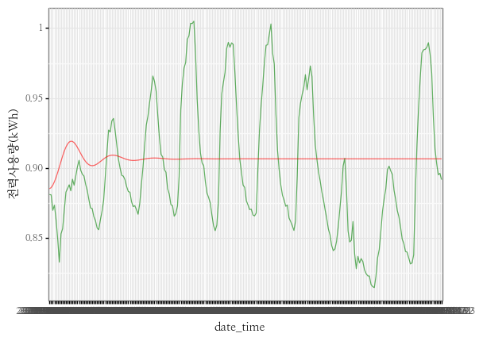


```python
predict_grp_idx(grp_val, mae_max, y_col)
```


    <ggplot: (100408874469)>


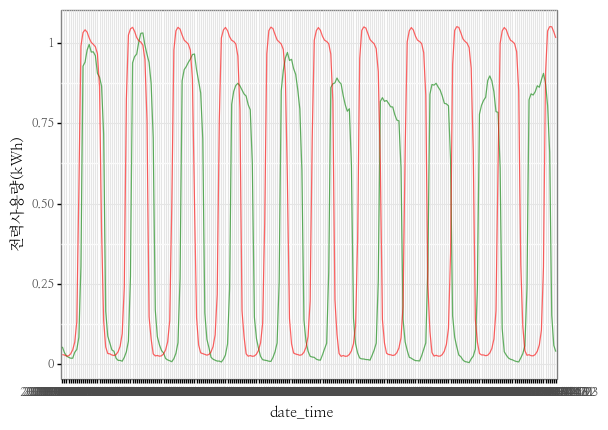


```python
model.summary()
```

    Model: "sequential_1"
    _________________________________________________________________
    Layer (type)                 Output Shape              Param #   
    =================================================================
    lstm_1 (LSTM)                (None, None, 32)          12032     
    _________________________________________________________________
    lstm_2 (LSTM)                (None, None, 16)          3136      
    _________________________________________________________________
    lstm_3 (LSTM)                (None, None, 8)           800       
    _________________________________________________________________
    lstm_4 (LSTM)                (None, None, 4)           208       
    _________________________________________________________________
    lstm_5 (LSTM)                (None, None, 2)           56        
    _________________________________________________________________
    lstm_6 (LSTM)                (None, 1)                 16        
    _________________________________________________________________
    dense_1 (Dense)              (None, 1)                 2         
    =================================================================
    Total params: 16,250
    Trainable params: 16,250
    Non-trainable params: 0
    _________________________________________________________________
    

#### **일곱번째 모델 평가**
- 데이터를 추가하니 MAE는 이전 모델보다 조금 떨어진 것을 볼 수 있습니다.
- 하지만 MAE가 가장 작은 건물은 Under Fitting이 된 것으로 보이고 MAE가 가장 높은 건물은 초반에 잘 예측하다가 후반부에 정반대의 양상을 보입니다.

---

#### **결론 :** 
- 시계열 데이터들은 패턴들을 따라가기 때문에 이상 패턴에 대해서 잘 적용되지 않을수도 있다는 생각이 들었고, 꼭 LSTM이 ARIMA보다 무조건 좋을 것 같다는 생각은 안 듭니다.
- 그리고 LSTM의 데이터를 넣을 때 무조건 많이 넣는 것이 자원 상이나 시간, 정확도 모든 측면에서 비효율적일 수 있다는 생각을 가지고 EDA를 통하여 적절한 데이터와 길이를 지정하는 것이 중요할 것 같습니다.

---

code : https://github.com/Chanjun-kim/Chanjun-kim.github.io/blob/main/_ipynb/2021-06-15-TimeSeries2.ipynb

---

참고 자료 : 
- https://dacon.io/competitions/official/235736/codeshare/2628?page=1&dtype=recent
- https://byeongkijeong.github.io/ARIMA-with-Python/
- https://otexts.com/fppkr/arima-estimation.html
