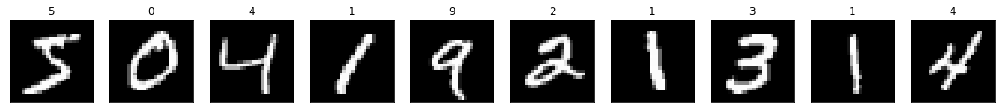
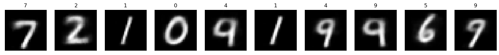
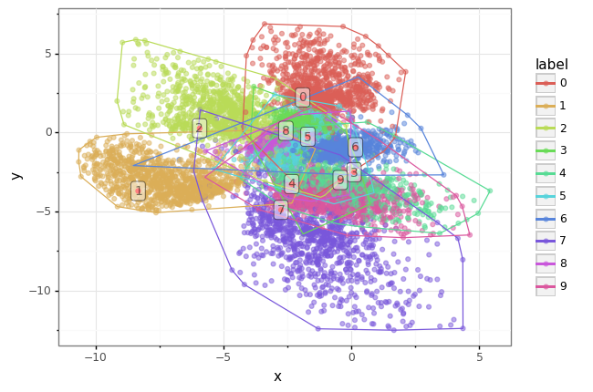
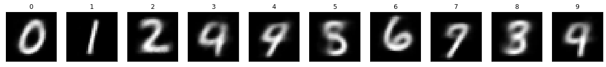
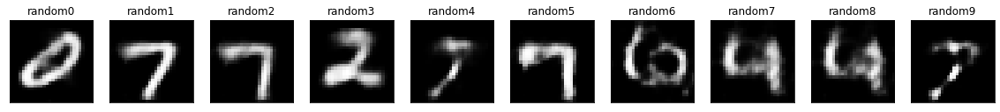

## **학습목적**
이 포스팅에선 GAN을 배우기 전 이미지를 생성하는 오토인코더에 대해서 알아보도록 하겠습니다.<br>

#### **오토인코더란?**
- 오토인코더(Autoencoder)의 기본적인 개념은 저차원(직관적)인 데이터를 고차원(추상적)의 데이터로 표현(representation)하고 다시 저차원의 데이터로 만들어 데이터 생성, 노이즈 제거, 특성 변화 등을 할 수 있도록 만들어주는 기법으로, 오토 인코더라고 불리지만 실제로는 인코더와 디코더가 같이 묶여있는 네트워크입니다.
    - 저차원과 고차원
        - 인코더는 차원 축소라고 표현되나, 잠재공간(Latent Space)가 늘어나며 추상적인 고차원 데이터로 변환됩니다..
        - 128x128x3의 이미지는 사람의 눈으로도 판단 가능한 직관적인 데이터지만 2x2x32 같이 잠재공간(Latent Space)가 많은 경우는 사람의 눈으로는 판단할 수 없는 추상적인 데이터라고 볼 수 있습니다.
        - 결국 차원이란 **축에 따라 달라지는 표현**일 수 있다는 것을 생각해야합니다.

<br>

![Oops](data:image/png;base64,iVBORw0KGgoAAAANSUhEUgAAAYQAAACCCAMAAABxTU9IAAABX1BMVEX///9BdMLZ2dmurq5mZmbh4eGFhYXF/qP7UlX8/PxSUlLd3d309PTx8fFjY2O//Zq9z+oybL/7R0qv0sHfhohUkvb9ycr8XWDnj5HewarC/6CNsuulys/IOD+czHxlnfjLPkfG6LH9rq/c4rivw+WNjY1alvVKecOysrJvpfXL/614eHj8c3W6urrHx8fO/7VHR0f8enzBwcGGs/fj6vbX/cFii8z5mZv+vr+Ar/ePufdUgceXtuV4m9OioqLf1bam0Yz+z9DUZ232//HU0Muso5d/iI/k/9XJ6Lew0OC62NPTbW/SW2Oq1Izs5d//6urc/8dYfbjW4PGVnaWkqbKTjIZvcnq2r6h4gYuIfXhvaGLIvrm1wct0cG2HfnZ+gIGTn62ThHuqwOOvlpflq6vs/+Lj/9TWlpf+oKH+jpDf0LTCydO/2d7isKi62riwzfyImbK6i4xziat2iqqVqs2Jvs7OAAAPKElEQVR4nO2diX/UNhbHHc1oQLE0JS0NtN2WhtaNwdiACXfRNo0Tuj0mwFzAzGToQa90F5bu//9ZyU7m1GV7EjKJfyQfckw8sr56T9KT9WRZhQoVKlSoUKFChTIIk7ddgvkUwshCmeouAuPfsotE9fFrw+zlmndBSgPBj1GAR19kJ/8TSiy7jsZeacZks2u71CYlCmohDmC1ji3bJ37Jd0u4Rl0MS04D0gDpr3QcFbXCMowoQG1KatTHgVsiNnWjagP6bgDILvYpbLbWbFZDHccjVs3FQcn3S+zV7NO07ja77VazHlWp13lKnoHnDWR1tmCVPq/3um2vvNt0euGO1zqh1hC13AroeVvtFg2b1PMrTqW7WXai592o6tKG/bTjUZ9u2c+8VqlHy8SKPNirV7e8bsdj9VfvuU2vbGvfhkFo1LaiPumVnsIe3GHWxyB4pAk2GwyA3+w7oOfStUO44yOoqNVr1Fp+afMFBD24SSvAb0TUA8/Woj5qN6Kn7ToE7QZ57lK6VesxCH3YX2uCtkudne5m34l2GlTfgNu7nUatHl0rO7DpeWubT9esTh06hMJ2l3rMCipO0Pa2TmhfHdWjvt306nav3G33POCAkPkHz246AbWiXu8F7FUbUY/VkAN2yswdAYewurPbfptZwo99J2R1p4dAMCGIRC2ALQIJwjZmoyMU/8PYhvA5rdSxfUIZ8IEijOsEQoRsaLEK4rXCqor9BkHIOgEbIUh4DfHqs9Be3RH26tpz2txKUXc1V9J7oLZjYE6FhOo4VN8fFCpUqFChQoUKFSo0t0InNIBnLHwQFYTWL95ZR9bLhw9fIuvJq58aASw4yISA+/MvvLZ+TWrr1Rms/yMD3bly5Y/z2y+vXr658vLJjUs3vnwdoYPBPddiHoJAC//23fXbZ7cf8traOHP30r2Pzszi4svXr/xx9vt/sqt+88NfdxmD1c/5UsZJDSGJhUjgQx5pYy3297PffcZr66t/MQZfLswAAr/q7fNfxwy+Shgsfc5/bll24ZYSYWKRMK4MdJHV1oDBJc5gaQYQmB3cHtgB90X3F2IITASEUf43mG8hCHjMNG6Uey02ZvBoJbGD1VlA4L7o/Pd/xgy+vRszGEDgy9msIzqx1sA7Ad8fWWLe80W8xa4kdsBrKzeEO9eHvihmsLowCsFKlv558PyEiXl/C0LeCoca90WJHcwAQmIHiS/6NvFFkxC4bN8/WesMOPBDPDlhGvqimys/DBjkhYCWYzv4c2gHMYNpCMwcSManbOZNfDxCLGxP2/4IAzaCubTPIC+EMV80sAMRBC4MWFd9vN0StoOA9QPC2deIL1oZ+qLcENavjPTJIwwkEHhBfN8+thh4JxACmdtN7ODrwWzq3rC2ckBAd4b9wagvUkFgbikkxy+2hDBf2gcqdzvpi27s20E+CLEv+n7EFw2uqoAQCx6rBW3WpKAfasbhe3Yw4osWFmYAYT22gw+uXr464Yv0ENiwjQTHY7SELBSReDiq1oQvGq+trBDGYhXfTlxVB8GK3ZI/94MlGLqsGzbwrdOxitWFGUAQzw/MIVhxP0YIFiljmQ5IwiJiC7IPwThUqClftLqQHwJa3vdF+wxuLaSGwESgUKZxDrQXHhx5Of8SRzPrc5BNsLiMxDxSz0cwt/djFWPjolwQpnzRGFljCJL7c0u+WfC11lqzCICo6SNiYwxtHHls7PWj1+vybxAE8ROJ2Z/LBH4oLqLtmnMWxypyQxiL2U35ImMIEgZ+yYaBkUtiEBB1HNDbiiqVbqfn1TuLXQZhy4WdllevOZVG5PV325WtDB6Oz+8hkdgqK6PxdYZ98misIicEWawidZ8guz8X8kEH1FdcAqEMmrudqlNv10E/8izefntue6tWjpxK3+kSu1oppx6KsQLw7RridmL7JWMII75oLFaRE8LYHE1kB2YQpL6IQ+De2ABCtRT2aBls1jseDduNWr/WAwg9azTr7Rbtt1s7lXaf79dw0vkjRECgKiNjYAxB54uyQdD6IjMIivtz99ot0s0lcBCCyA9IzYeRD2s2BoiHbqDvk07LhyQMAWEj4Zqfcv8W9JPJr6KMhhCmfZGottJCSMZFSl9kBEHqi0YgsMow6xsE6tT1rxELDsIqqjKaQVDEKvJAkMVNU0JQtbEhBEsdjlG+QaY/RDwGt/+XyjIaQZiOVYgYpIawvu+LBLGKFBDU9+eOeSEZB32oIBYUbWqViIzO4tVlNIKgilVkh3Bn2B9wX3RXclUdBImduyURBCJ+gqlW5ZtECd+uFcdu2AciJB5UYTYPp4BvQqo5JHLZvByxX+scG3ubcCTMrvRFRhDMfFFqCMuTcVMJAw0ETRubgMDuJhI8wlRr2c+6kePYbKIAN/sBddygQm2+X6tSccDzOnCo217cjVzoVLpsHtFQGw4BYzNvXRn1EEZ8ERsX3ZD5orQQlifjprckV1VD0N7fJAQLR1M/smplZgk7Xi/sgWZ3x40WvZZbplGvX47KwAuegZrj9KMW6bD5Q9TqbEUtxb5e3hmPWYq2jFoIk2s48habCoLRuEgPQT4/kEKwYrcz3pJrrcCDTYeCXqmyu7NbK9NSRKtuhVLbI8+Cpt8uN/ugDDr1zlZpq1OveVIIMJx8CkHni/QQ9mIVgyfi5HaQCoI6bmoMQd/GRBCsePV87Do+9kGNurDnuDiEVocCm5ZIREPis+8jCkqlEJdCO8AlatcC9npxeRCCk5EqgzLqIIyMi8SxikwQRnxR0idLfZESgsn9iSEg0QI6+9l+C0eJT0eD3wz/k/YGiA2Cp9mYlFENIYlVjD4Zqmix5hDW/7jO40U3r3JfdO+u+qpyCHpfJIVg8aDQdJAbZX/aFQPhkowRAxUEhJevX+e+KK6tv27cVdqBOYTt27dv//Lpv3+9+ejXH/7z6svXL16vLjx+vLBw/754+iGBYHZ/UgiIhDNcFGXzcRFAszIKICAcx13ZbMP97/nff/v0g0c3H33zyXuv7t17pWyxxhCW3z197vzHH3z4zqmVT9678P6FjziAxwurb16/frxw/80CI/KYvdOqGoJBf6eEYMX+ZyarovHkIkcZBxDYNIXEj9vavh8m4yxy8fTpc2c//ewdXlv/eJ/VltIQskL4YnhZ9sUqI/L4778Zijf3GZE3j1eXfhL5CMM2poRg8ec78wrLUZqWsRRAnt7DQoHvg9gnIjx4kufiu4cMYSD+E+acGIQ3q0v/gzzEGYw9+mh8f2oIVl4OBMifizUqI+WfbpDYEsbTT1G9PQhjl+U7dQhPa8IffQSuH3AHIFSJ0tQQiO+CrII4lAW2WYnFZfSTemcfdFBaVRmPDoShMOFN1xbWiV2iUxS0EKzAqWSUQyWjKczXIQJxGd3SVENRDlGPIoRERAJhYOTUGEIeBlUwfT0e/AN8GUFSRncKwXGFMDQJDQQUZEVQcUrla+MQEB+quvsOqoAw7PTUzx3lsYPy4igEFK9WkOEjBQWEERC+Yhd0LjtYHEIgAR8ujL9NAWEglzdNwAa5gp1u+XzR4h4EPq4Xbe8tIIxAsJJ4XRjv+xq7Sj5fxBUCIA04FRDGIcTiC+82jNNK7zHIaQeLi72SItNAAUEAIQbBTIJNvjH/Kqj0MzPwqozA4uI1wRC1gKCDEIMg8YPoUDBpMhXtJ5ZQQMgKISGBnax2UKHO4p4KCLkgWJZXzap+AWF2EMrZVK0UEAoIBYQCQgGhgFBAKCAUEAoIBYQCghyCqvYKCIcCoeqrbrOAcCgQfOXKaQHhECBcU9pBAeEwIFRDzW0WEIY6KAhqX5QOwrw9gZcWgnT/fU4IGl8kL6MAgnKX+zGAIM+BkAfCNfW4SFnGaQjqPA3zD0HRxnJAqCyGBjt6TCFosj3MPQTV/eVZWXNNbtMQgi7jxtGAcEuwXdUMgtLOqZNV1CwlrhkEbc6YlBAeGGZRSQfh1hPzG0zRxhCQ7HHQa2obtFhGEPSZZ1JBWHpgenp1GgiSq5pAkLYxhPlmsBwbdFDgR/rNbiYQDLL/pIFgziAVBJEvkt+gmZ0Hfu59mzwdLtJUoAEEk/xVaSCYM0gDQeiL5Deob2N8x9WMDsEgmrw7egihif82h5DCDtJAkF5VC0HQxhDkzXemmYRRqEhkpYVglsfNGMKSaZ8cyxiCzA70EKbsgCdk9Gd/ThgM5PmhdRBM5hpWCghp7MAYwpKcgQ7CFANyYEdeYCTbhKuBYJqRzxBCKl9kmUJYkvTJqhsU2TkBfIP2QR6ygLElyhushmCcU9IMQjpfZJlCUNiBBsKwjSGepCAwyEybVziYztSphGDUJ8cyg5DSDswgqHyR/AbHGPAGCoyS4c9AbO4xmb1HBSFFdlATCGl9kWUGQeWL5Dc4Yuesy1Q9CnEgsscSjSggpMlvawIhrS+yTCBo7EAFId6Fw7fymR5HMFvB4RBMDiFVllw9hAx2YAJBx0AOIdhPVvO2hEGEknGAFEK6TMVaCJkY6CFofJH8BksBCP23f9ART8OGpBDM++RYWgiZGGghaO1AeoMBJkfiADyE+KBMVsZ019JAyGYHOgjK+UFyEm2AxSm1jgSAPZEgkJUxXSk1EDIy0EBQMiCAJxhC/EOgbMU5KAmLyNNMBiBNa1FDyMpACUEZq4jTFxyx46IyCPKj3Y2bjBJCZgYqCDJfFKcPF2QdnVfxXm0kt4BKKggPskckFRAkdgBDP0XS/LkQswR+dkmulbXsdqCAIPZFbOZlfBDcfAnzFQ7dCRlSCFnHRYmkEKZ8Eeanm2bP2jsXIjY/p0F+j1IIGWIVI5JBmLID6B9+/OdtCKvWmyQQ8tmBDMKEL+LdsOEhK/MvhJPstCKJIeRlIIFwf3BVnkcRHfez36fFUwSD6RG4GEJeBkIIo3YgSf59AoTA9JnGQgi5GQghJH1yklHxqE19D1V8zXrsRB4RhPwMRBC4HbABW6BI3HhyxBdlA7DvDAQQZsBAAOHWE342fZj5lN3jJwL8PZcQQ/h4BMJMGCQQzm7wy66scQjMF2U+DfA4C/LQRgzh/MO4ts68z2prJgys9dPnzi1vb5w6dfnhxtqlSw9edA9rOX7OFIc2fv7uypX17Ycfnrr8cuPMhS8uvJoJAwttb2+zSt/Y2GBfr62lCuyeOGES1UZra62orEKFChUqVKhQoUKFCs1M/wf8QNdjXVRbtgAAAABJRU5ErkJggg==)

> 출처: https://excelsior-cjh.tistory.com/187

---

#### **오토인코더 실습**


```python
from google.colab import drive
drive.mount("/content/drive")
%cd drive/MyDrive/cj/portfolio/Chanjun-kim.github.io/_ipynb
!pwd
```

    Mounted at /content/drive
    /content/drive/MyDrive/cj/portfolio/Chanjun-kim.github.io/_ipynb
    /content/drive/MyDrive/cj/portfolio/Chanjun-kim.github.io/_ipynb
    


```python
import os
import sys
import warnings

import random

import numpy as np
import pandas as pd

import scipy
import scipy.stats
from scipy.spatial import ConvexHull, convex_hull_plot_2d
from sklearn.datasets import make_regression
from sklearn.ensemble import GradientBoostingRegressor
from sklearn.model_selection import train_test_split
from sklearn.metrics import accuracy_score, precision_score, recall_score

import matplotlib as mpl
import matplotlib.pyplot as plt
from plotnine import * 

import tensorflow as tf
from tensorflow.keras.layers import Input, Conv2D, Flatten, Dense, Conv2DTranspose, Reshape, Lambda, Activation, BatchNormalization, LeakyReLU, Dropout
from tensorflow.keras.models import Model, Sequential
from tensorflow.keras import backend as K
from tensorflow.keras.optimizers import Adam
from tensorflow.keras.callbacks import ModelCheckpoint 
from tensorflow.keras import layers, losses
from tensorflow.keras.datasets import mnist, fashion_mnist
```


```python
%matplotlib inline
warnings.filterwarnings(action='ignore')
```


```python
class Autoencoder():
    def __init__(self
        , input_dim
        , encoder_conv_filters
        , encoder_conv_kernel_size
        , encoder_conv_strides
        , decoder_conv_t_filters
        , decoder_conv_t_kernel_size
        , decoder_conv_t_strides
        , z_dim
        , use_batch_norm = False
        , use_dropout = False
        ):

        self.name = 'autoencoder'

        self.input_dim = input_dim
        self.encoder_conv_filters = encoder_conv_filters
        self.encoder_conv_kernel_size = encoder_conv_kernel_size
        self.encoder_conv_strides = encoder_conv_strides
        self.decoder_conv_t_filters = decoder_conv_t_filters
        self.decoder_conv_t_kernel_size = decoder_conv_t_kernel_size
        self.decoder_conv_t_strides = decoder_conv_t_strides
        self.z_dim = z_dim

        self.use_batch_norm = use_batch_norm
        self.use_dropout = use_dropout

        self.n_layers_encoder = len(encoder_conv_filters)
        self.n_layers_decoder = len(decoder_conv_t_filters)

        self._build()

    def _build(self):

        ### THE ENCODER
        encoder_input = Input(shape=self.input_dim, name='encoder_input')

        x = encoder_input

        for i in range(self.n_layers_encoder):
            conv_layer = Conv2D(
                filters = self.encoder_conv_filters[i]
                , kernel_size = self.encoder_conv_kernel_size[i]
                , strides = self.encoder_conv_strides[i]
                , padding = 'same'
                , name = 'encoder_conv_' + str(i)
                )

            x = conv_layer(x)

            x = LeakyReLU()(x)

            if self.use_batch_norm:
                x = BatchNormalization()(x)

            if self.use_dropout:
                x = Dropout(rate = 0.25)(x)

        shape_before_flattening = K.int_shape(x)[1:]

        x = Flatten()(x)
        encoder_output= Dense(self.z_dim, name='encoder_output')(x)

        self.encoder = Model(encoder_input, encoder_output)


        ### THE DECODER
        decoder_input = Input(shape=(self.z_dim,), name='decoder_input')

        x = Dense(np.prod(shape_before_flattening))(decoder_input)
        x = Reshape(shape_before_flattening)(x)

        for i in range(self.n_layers_decoder):
            conv_t_layer = Conv2DTranspose(
                filters = self.decoder_conv_t_filters[i]
                , kernel_size = self.decoder_conv_t_kernel_size[i]
                , strides = self.decoder_conv_t_strides[i]
                , padding = 'same'
                , name = 'decoder_conv_t_' + str(i)
                )

            x = conv_t_layer(x)

            if i < self.n_layers_decoder - 1:
                x = LeakyReLU()(x)
                
                if self.use_batch_norm:
                    x = BatchNormalization()(x)
                
                if self.use_dropout:
                    x = Dropout(rate = 0.25)(x)
            else:
                x = Activation('sigmoid')(x)

        decoder_output = x

        self.decoder = Model(decoder_input, decoder_output)

        ### THE FULL AUTOENCODER
        model_input = encoder_input
        model_output = self.decoder(encoder_output)

        self.model = Model(model_input, model_output)
        
    def compile(self, learning_rate):
        self.learning_rate = learning_rate
        optimizer = Adam(lr=learning_rate)

        self.model.compile(optimizer=optimizer, loss = tf.keras.losses.MeanSquaredError(reduction="auto", name="mean_squared_error")) 

    def train(self, x_train, y_train, batch_size, epochs, verbose = 1):
        self.model.fit(     
        x_train
        , y_train
        , batch_size = batch_size
        , shuffle = True
        , epochs = epochs
        , verbose = verbose
        )
```

> 출처 : https://github.com/davidADSP/GDL_code

- **설명**
    1. 최초의 데이터를 28 x 28 데이터를 인풋으로 받습니다.
    2. Encoder와 Decoder의 깊이는 len(encoder_conv_filters), len(decoder_conv_t_filters)로 정해지므로 각각 4개의 Convolution 층을 갖게 됩니다.
       - Convolution Filter의 차원은 1(Grey Scale Input) - (32 - 64 - 64 -64, Encoder Convolution Filter) - 2(represention) - (64 - 64 - 32, Decoder Convolution Filter) - 1(Grey Scale Output) 으로 구성됩니다.
    3. Encoder와 Decoder 모두 Activation Function은 LeakyRelu를 활용합니다.
    4. kernel size는 3x3으로 진행됩니다.
    5. stride를 2로 주어 차원 1/2로 축소합니다.
    6. encoder의 최종 차원을 2차원으로 만들어 잠재공간에 어떻게 분포되는지 확인하겠습니다.
    7. decoder는 encoder에 의해 줄어진 차원을 다시 키워줄 수 있도록 Conv2DTranspose를 사용하여 28 x 28의 크기로 점차 늘려줍니다.
    8. loss function은 MSE를 사용하고 최종 Activation function은 Sigmoid를 사용합니다.
    9. Optimizer는 Adam을 활용합니다.
    10. Auto Encoder 같은 경우는 Input과 Output이 같습니다. 그렇기 때문에 마지막 fit 부분에 x = x_train, y = x_train으로 들어가게 됩니다.
      - 주의점
        - 네트워크 상에는 BN Layer를 추가할 수 있게 되어있지만 사실 사용하면 안됩니다. batch normalization 이름에서 나오듯 특정 데이터를 가지고만 normalization을 하기 때문에 generator 모델에서는 그 값이 대표하지 않을 가능성이 농후하기 때문입니다.
        - 여기서 2차원까지 줄인건 mnist데이터셋의 차원이 충분히 표현될 수 있기 때문입니다. 복잡한 이미지셋은 당연히 더 고차원으로 줄여야합니다.


```python
AE = Autoencoder(
    input_dim = (28,28,1)
    , encoder_conv_filters = [32,64,64,64]
    , encoder_conv_kernel_size = [3,3,3,3]
    , encoder_conv_strides = [1,2,2,1]
    , decoder_conv_t_filters = [64,64,32,1]
    , decoder_conv_t_kernel_size = [3,3,3,3]
    , decoder_conv_t_strides = [1,2,2,1]
    , z_dim = 2
)
```


```python
AE.compile(0.00005)
```


```python
AE.model.summary()
```

    Model: "model_2"
    _________________________________________________________________
    Layer (type)                 Output Shape              Param #   
    =================================================================
    encoder_input (InputLayer)   [(None, 28, 28, 1)]       0         
    _________________________________________________________________
    encoder_conv_0 (Conv2D)      (None, 28, 28, 32)        320       
    _________________________________________________________________
    leaky_re_lu (LeakyReLU)      (None, 28, 28, 32)        0         
    _________________________________________________________________
    encoder_conv_1 (Conv2D)      (None, 14, 14, 64)        18496     
    _________________________________________________________________
    leaky_re_lu_1 (LeakyReLU)    (None, 14, 14, 64)        0         
    _________________________________________________________________
    encoder_conv_2 (Conv2D)      (None, 7, 7, 64)          36928     
    _________________________________________________________________
    leaky_re_lu_2 (LeakyReLU)    (None, 7, 7, 64)          0         
    _________________________________________________________________
    encoder_conv_3 (Conv2D)      (None, 7, 7, 64)          36928     
    _________________________________________________________________
    leaky_re_lu_3 (LeakyReLU)    (None, 7, 7, 64)          0         
    _________________________________________________________________
    flatten (Flatten)            (None, 3136)              0         
    _________________________________________________________________
    encoder_output (Dense)       (None, 2)                 6274      
    _________________________________________________________________
    model_1 (Functional)         (None, 28, 28, 1)         102017    
    =================================================================
    Total params: 200,963
    Trainable params: 200,963
    Non-trainable params: 0
    _________________________________________________________________
    


```python
AE.encoder.summary()
```

    Model: "model"
    _________________________________________________________________
    Layer (type)                 Output Shape              Param #   
    =================================================================
    encoder_input (InputLayer)   [(None, 28, 28, 1)]       0         
    _________________________________________________________________
    encoder_conv_0 (Conv2D)      (None, 28, 28, 32)        320       
    _________________________________________________________________
    leaky_re_lu (LeakyReLU)      (None, 28, 28, 32)        0         
    _________________________________________________________________
    encoder_conv_1 (Conv2D)      (None, 14, 14, 64)        18496     
    _________________________________________________________________
    leaky_re_lu_1 (LeakyReLU)    (None, 14, 14, 64)        0         
    _________________________________________________________________
    encoder_conv_2 (Conv2D)      (None, 7, 7, 64)          36928     
    _________________________________________________________________
    leaky_re_lu_2 (LeakyReLU)    (None, 7, 7, 64)          0         
    _________________________________________________________________
    encoder_conv_3 (Conv2D)      (None, 7, 7, 64)          36928     
    _________________________________________________________________
    leaky_re_lu_3 (LeakyReLU)    (None, 7, 7, 64)          0         
    _________________________________________________________________
    flatten (Flatten)            (None, 3136)              0         
    _________________________________________________________________
    encoder_output (Dense)       (None, 2)                 6274      
    =================================================================
    Total params: 98,946
    Trainable params: 98,946
    Non-trainable params: 0
    _________________________________________________________________
    


```python
AE.decoder.summary()
```

    Model: "model_1"
    _________________________________________________________________
    Layer (type)                 Output Shape              Param #   
    =================================================================
    decoder_input (InputLayer)   [(None, 2)]               0         
    _________________________________________________________________
    dense (Dense)                (None, 3136)              9408      
    _________________________________________________________________
    reshape (Reshape)            (None, 7, 7, 64)          0         
    _________________________________________________________________
    decoder_conv_t_0 (Conv2DTran (None, 7, 7, 64)          36928     
    _________________________________________________________________
    leaky_re_lu_4 (LeakyReLU)    (None, 7, 7, 64)          0         
    _________________________________________________________________
    decoder_conv_t_1 (Conv2DTran (None, 14, 14, 64)        36928     
    _________________________________________________________________
    leaky_re_lu_5 (LeakyReLU)    (None, 14, 14, 64)        0         
    _________________________________________________________________
    decoder_conv_t_2 (Conv2DTran (None, 28, 28, 32)        18464     
    _________________________________________________________________
    leaky_re_lu_6 (LeakyReLU)    (None, 28, 28, 32)        0         
    _________________________________________________________________
    decoder_conv_t_3 (Conv2DTran (None, 28, 28, 1)         289       
    _________________________________________________________________
    activation (Activation)      (None, 28, 28, 1)         0         
    =================================================================
    Total params: 102,017
    Trainable params: 102,017
    Non-trainable params: 0
    _________________________________________________________________
    


```python
mnist
(x_train, y_train), (x_test, y_test) = mnist.load_data()
```

    Downloading data from https://storage.googleapis.com/tensorflow/tf-keras-datasets/mnist.npz
    11493376/11490434 [==============================] - 0s 0us/step
    


```python
n = 10
plt.figure(figsize=(20, 4))
for i in range(n):
    # display original
    ax = plt.subplot(2, n, i + 1)
    plt.imshow(x_train[i])
    plt.title(y_train[i])
    plt.gray()
    ax.get_xaxis().set_visible(False)
    ax.get_yaxis().set_visible(False)
plt.show()
```




- **픽셀값을 0~1까지로 정규화해주고, keras에서 학습할 수 있도록 차원을 하나 늘려준다.(grey scale)**


```python
x_train, x_test = x_train / 255.0, x_test / 255.0
x_train = np.reshape(x_train, (len(x_train), 28, 28, 1))  # adapt this if using `channels_first` image data format
x_test = np.reshape(x_test, (len(x_test), 28, 28, 1))  # adapt this if using `channels_first` image data format
x_train.shape
```


    (60000, 28, 28, 1)


- **X값이 곧 Y값이 되므로 x, y 모두에 x_train을 넣어준다**


```python
AE.train(x_train, x_train, batch_size = 32, epochs = 100)
```

    Epoch 1/100
    1875/1875 [==============================] - 40s 4ms/step - loss: 0.0724
    Epoch 2/100
    1875/1875 [==============================] - 8s 4ms/step - loss: 0.0572
    Epoch 3/100
    1875/1875 [==============================] - 8s 4ms/step - loss: 0.0546
    Epoch 4/100
    1875/1875 [==============================] - 8s 4ms/step - loss: 0.0531
    Epoch 5/100
    1875/1875 [==============================] - 9s 5ms/step - loss: 0.0519
    Epoch 6/100
    1875/1875 [==============================] - 9s 5ms/step - loss: 0.0507
    Epoch 7/100
    1875/1875 [==============================] - 9s 5ms/step - loss: 0.0497
    Epoch 8/100
    1875/1875 [==============================] - 9s 5ms/step - loss: 0.0489
    Epoch 9/100
    1875/1875 [==============================] - 9s 5ms/step - loss: 0.0481
    Epoch 10/100
    1875/1875 [==============================] - 8s 4ms/step - loss: 0.0475
    Epoch 11/100
    1875/1875 [==============================] - 8s 4ms/step - loss: 0.0470
    Epoch 12/100
    1875/1875 [==============================] - 8s 5ms/step - loss: 0.0466
    Epoch 13/100
    1875/1875 [==============================] - 9s 5ms/step - loss: 0.0463
    Epoch 14/100
    1875/1875 [==============================] - 9s 5ms/step - loss: 0.0459
    Epoch 15/100
    1875/1875 [==============================] - 9s 5ms/step - loss: 0.0456
    Epoch 16/100
    1875/1875 [==============================] - 9s 5ms/step - loss: 0.0454
    Epoch 17/100
    1875/1875 [==============================] - 9s 5ms/step - loss: 0.0451
    Epoch 18/100
    1875/1875 [==============================] - 9s 5ms/step - loss: 0.0449
    Epoch 19/100
    1875/1875 [==============================] - 9s 5ms/step - loss: 0.0447
    Epoch 20/100
    1875/1875 [==============================] - 8s 4ms/step - loss: 0.0445
    Epoch 21/100
    1875/1875 [==============================] - 8s 4ms/step - loss: 0.0443
    Epoch 22/100
    1875/1875 [==============================] - 8s 4ms/step - loss: 0.0442
    Epoch 23/100
    1875/1875 [==============================] - 8s 4ms/step - loss: 0.0440
    Epoch 24/100
    1875/1875 [==============================] - 9s 5ms/step - loss: 0.0438
    Epoch 25/100
    1875/1875 [==============================] - 9s 5ms/step - loss: 0.0437
    Epoch 26/100
    1875/1875 [==============================] - 9s 5ms/step - loss: 0.0436
    Epoch 27/100
    1875/1875 [==============================] - 9s 5ms/step - loss: 0.0434
    Epoch 28/100
    1875/1875 [==============================] - 8s 4ms/step - loss: 0.0433
    Epoch 29/100
    1875/1875 [==============================] - 8s 5ms/step - loss: 0.0432
    Epoch 30/100
    1875/1875 [==============================] - 8s 4ms/step - loss: 0.0430
    Epoch 31/100
    1875/1875 [==============================] - 8s 4ms/step - loss: 0.0429
    Epoch 32/100
    1875/1875 [==============================] - 9s 5ms/step - loss: 0.0428
    Epoch 33/100
    1875/1875 [==============================] - 9s 5ms/step - loss: 0.0427
    Epoch 34/100
    1875/1875 [==============================] - 9s 5ms/step - loss: 0.0426
    Epoch 35/100
    1875/1875 [==============================] - 8s 4ms/step - loss: 0.0425
    Epoch 36/100
    1875/1875 [==============================] - 8s 5ms/step - loss: 0.0424
    Epoch 37/100
    1875/1875 [==============================] - 8s 5ms/step - loss: 0.0423
    Epoch 38/100
    1875/1875 [==============================] - 8s 4ms/step - loss: 0.0422
    Epoch 39/100
    1875/1875 [==============================] - 8s 4ms/step - loss: 0.0421
    Epoch 40/100
    1875/1875 [==============================] - 9s 5ms/step - loss: 0.0420
    Epoch 41/100
    1875/1875 [==============================] - 9s 5ms/step - loss: 0.0420
    Epoch 42/100
    1875/1875 [==============================] - 9s 5ms/step - loss: 0.0419
    Epoch 43/100
    1875/1875 [==============================] - 8s 5ms/step - loss: 0.0418
    Epoch 44/100
    1875/1875 [==============================] - 8s 5ms/step - loss: 0.0417
    Epoch 45/100
    1875/1875 [==============================] - 8s 4ms/step - loss: 0.0417
    Epoch 46/100
    1875/1875 [==============================] - 8s 4ms/step - loss: 0.0416
    Epoch 47/100
    1875/1875 [==============================] - 9s 5ms/step - loss: 0.0415
    Epoch 48/100
    1875/1875 [==============================] - 9s 5ms/step - loss: 0.0415
    Epoch 49/100
    1875/1875 [==============================] - 9s 5ms/step - loss: 0.0414
    Epoch 50/100
    1875/1875 [==============================] - 9s 5ms/step - loss: 0.0413
    Epoch 51/100
    1875/1875 [==============================] - 9s 5ms/step - loss: 0.0413
    Epoch 52/100
    1875/1875 [==============================] - 9s 5ms/step - loss: 0.0412
    Epoch 53/100
    1875/1875 [==============================] - 9s 5ms/step - loss: 0.0411
    Epoch 54/100
    1875/1875 [==============================] - 9s 5ms/step - loss: 0.0411
    Epoch 55/100
    1875/1875 [==============================] - 8s 5ms/step - loss: 0.0410
    Epoch 56/100
    1875/1875 [==============================] - 8s 5ms/step - loss: 0.0410
    Epoch 57/100
    1875/1875 [==============================] - 8s 4ms/step - loss: 0.0409
    Epoch 58/100
    1875/1875 [==============================] - 8s 5ms/step - loss: 0.0408
    Epoch 59/100
    1875/1875 [==============================] - 9s 5ms/step - loss: 0.0408
    Epoch 60/100
    1875/1875 [==============================] - 9s 5ms/step - loss: 0.0407
    Epoch 61/100
    1875/1875 [==============================] - 9s 5ms/step - loss: 0.0407
    Epoch 62/100
    1875/1875 [==============================] - 8s 5ms/step - loss: 0.0406
    Epoch 63/100
    1875/1875 [==============================] - 8s 5ms/step - loss: 0.0406
    Epoch 64/100
    1875/1875 [==============================] - 8s 5ms/step - loss: 0.0405
    Epoch 65/100
    1875/1875 [==============================] - 8s 5ms/step - loss: 0.0405
    Epoch 66/100
    1875/1875 [==============================] - 8s 5ms/step - loss: 0.0404
    Epoch 67/100
    1875/1875 [==============================] - 9s 5ms/step - loss: 0.0404
    Epoch 68/100
    1875/1875 [==============================] - 9s 5ms/step - loss: 0.0404
    Epoch 69/100
    1875/1875 [==============================] - 9s 5ms/step - loss: 0.0403
    Epoch 70/100
    1875/1875 [==============================] - 8s 5ms/step - loss: 0.0403
    Epoch 71/100
    1875/1875 [==============================] - 8s 4ms/step - loss: 0.0402
    Epoch 72/100
    1875/1875 [==============================] - 8s 5ms/step - loss: 0.0402
    Epoch 73/100
    1875/1875 [==============================] - 8s 4ms/step - loss: 0.0402
    Epoch 74/100
    1875/1875 [==============================] - 8s 5ms/step - loss: 0.0401
    Epoch 75/100
    1875/1875 [==============================] - 9s 5ms/step - loss: 0.0401
    Epoch 76/100
    1875/1875 [==============================] - 9s 5ms/step - loss: 0.0401
    Epoch 77/100
    1875/1875 [==============================] - 9s 5ms/step - loss: 0.0400
    Epoch 78/100
    1875/1875 [==============================] - 8s 5ms/step - loss: 0.0400
    Epoch 79/100
    1875/1875 [==============================] - 8s 4ms/step - loss: 0.0400
    Epoch 80/100
    1875/1875 [==============================] - 8s 4ms/step - loss: 0.0399
    Epoch 81/100
    1875/1875 [==============================] - 8s 5ms/step - loss: 0.0399
    Epoch 82/100
    1875/1875 [==============================] - 9s 5ms/step - loss: 0.0399
    Epoch 83/100
    1875/1875 [==============================] - 9s 5ms/step - loss: 0.0398
    Epoch 84/100
    1875/1875 [==============================] - 9s 5ms/step - loss: 0.0398
    Epoch 85/100
    1875/1875 [==============================] - 9s 5ms/step - loss: 0.0398
    Epoch 86/100
    1875/1875 [==============================] - 8s 5ms/step - loss: 0.0397
    Epoch 87/100
    1875/1875 [==============================] - 8s 5ms/step - loss: 0.0397
    Epoch 88/100
    1875/1875 [==============================] - 8s 5ms/step - loss: 0.0397
    Epoch 89/100
    1875/1875 [==============================] - 8s 5ms/step - loss: 0.0396
    Epoch 90/100
    1875/1875 [==============================] - 9s 5ms/step - loss: 0.0396
    Epoch 91/100
    1875/1875 [==============================] - 9s 5ms/step - loss: 0.0396
    Epoch 92/100
    1875/1875 [==============================] - 9s 5ms/step - loss: 0.0395
    Epoch 93/100
    1875/1875 [==============================] - 8s 5ms/step - loss: 0.0395
    Epoch 94/100
    1875/1875 [==============================] - 9s 5ms/step - loss: 0.0395
    Epoch 95/100
    1875/1875 [==============================] - 9s 5ms/step - loss: 0.0395
    Epoch 96/100
    1875/1875 [==============================] - 9s 5ms/step - loss: 0.0394
    Epoch 97/100
    1875/1875 [==============================] - 8s 5ms/step - loss: 0.0394
    Epoch 98/100
    1875/1875 [==============================] - 8s 4ms/step - loss: 0.0394
    Epoch 99/100
    1875/1875 [==============================] - 8s 5ms/step - loss: 0.0394
    Epoch 100/100
    1875/1875 [==============================] - 8s 4ms/step - loss: 0.0393
    


```python
latent_splace_x_test = pd.DataFrame(AE.encoder.predict(x_test), columns = ["x", "y"])
latent_splace_x_test["label"] = y_test
latent_splace_x_test["label"] = latent_splace_x_test.label.astype(str)
```

- 각각의 숫자마다 Encoder를 거친 잠재공간을 뿌려보았습니다. 
    - 대부분의 숫자들이 자기만의 영역을 가지고 있습니다.
    - 하지만 3, 5, 8이 가까이 붙어있고, 4, 9가 가까이 붙어있습니다.
        - 이것이 오토인코더를 거칠 때 어떤 영향을 미치는 지 validation set을 통하여 알아보겠습니다.


```python

(
    ggplot() +   
    geom_point(data = latent_splace_x_test, mapping = aes(x = "x", y = "y", color = "label"), alpha = 0.5) + 
    geom_label(data = latent_splace_x_test.groupby("label").mean(["x", "y"]).reset_index(), mapping = aes(x = "x", y = "y", label = "label"), size = 10, alpha = 0.5) +
    stat_hull(data = latent_splace_x_test, mapping = aes(x = "x", y = "y", color = "label")) +
    theme_bw()
)
```


    <ggplot: (8763240984113)>


- 오토인코더를 거친 숫자들입니다.
    - 잘 구분된 숫자들은 확실히 그 숫자들을 띄는 것 같지만, 4, 5, 9 같이 자신의 영역을 확실히 구분하지 못한 숫자들은 뭉개지거나 혹은 다른 숫자 더 비슷하게 보이기도 합니다.


```python
predict_x = AE.model.predict(x_test)
```


```python
n = 10
plt.figure(figsize=(20, 4))
for i in range(n):
    # display original
    ax = plt.subplot(2, n, i + 1)
    plt.imshow(np.reshape(predict_x[i], (28, 28)))
    plt.title(y_test[i])
    plt.gray()
    ax.get_xaxis().set_visible(False)
    ax.get_yaxis().set_visible(False)
plt.show()
```





```python
# 비슷한 좌표 생성
```


```python
latent_convex = latent_splace_x_test.groupby("label")[["x", "y"]].apply(lambda x : ConvexHull(x))
```


```python
latent_convex = pd.DataFrame(latent_convex.apply(lambda x : x.points[random.randint(0, 100)]).to_list(), columns = ["x", "y"]).reset_index().rename(columns = {"index" : "label"})
latent_convex["label"] = latent_convex["label"].astype(str)
```


```python
(
    ggplot() +   
    geom_point(data = latent_splace_x_test, mapping = aes(x = "x", y = "y", color = "label"), alpha = 0.5) + 
    stat_hull(data = latent_splace_x_test, mapping = aes(x = "x", y = "y", color = "label")) + 
    geom_point(data = latent_convex, mapping = aes(x = "x", y = "y"), color = "red") +
    geom_label(data = latent_convex, mapping = aes(x = "x", y = "y", label = "label"), size = 10, alpha = 0.5) +
    theme_bw()
)
```


    <ggplot: (8763250292769)>





```python
predict_decoder = AE.decoder.predict(np.reshape(latent_convex[["x", "y"]].to_numpy(), (10, 2, 1)))

n = 10
plt.figure(figsize=(20, 4))
for i in range(n):
    # display original
    ax = plt.subplot(2, n, i + 1)
    plt.imshow(np.reshape(predict_decoder[i], (28, 28)))
    plt.title(latent_convex.label[i])
    plt.gray()
    ax.get_xaxis().set_visible(False)
    ax.get_yaxis().set_visible(False)
plt.show()
```





```python
# 엉뚱한 좌표 생성
```


```python
random_points = [[random.randint(int(latent_splace_x_test.x.min()), int(latent_splace_x_test.x.max())) + random.random(), random.randint(int(latent_splace_x_test.y.min()), int(latent_splace_x_test.y.max())) + random.random()]  for _ in range(10)]
random_points = pd.DataFrame(random_points, columns = ["x", "y"]).reset_index().rename(columns = {"index" : "label"})
random_points["label"] = [f"random{i}" for i in range(10)]
```


```python
(
    ggplot() +   
    geom_point(data = latent_splace_x_test, mapping = aes(x = "x", y = "y", color = "label"), alpha = 0.5) + 
    stat_hull(data = latent_splace_x_test, mapping = aes(x = "x", y = "y", color = "label")) + 
    geom_point(data = random_points, mapping = aes(x = "x", y = "y"), color = "red") +
    geom_label(data = random_points, mapping = aes(x = "x", y = "y", label = "label"), size = 10, alpha = 0.5) +
    theme_bw()
)
```


    <ggplot: (8763239487357)>


```python
predict_decoder = AE.decoder.predict(np.reshape(random_points[["x", "y"]].to_numpy(), (10, 2, 1)))

n = 10
plt.figure(figsize=(20, 4))
for i in range(n):
    # display original
    ax = plt.subplot(2, n, i + 1)
    plt.imshow(np.reshape(predict_decoder[i], (28, 28)))
    plt.title(random_points.label[i])
    plt.gray()
    ax.get_xaxis().set_visible(False)
    ax.get_yaxis().set_visible(False)
plt.show()
```




- #### **결론 :**
    - **오토인코더를 왜 쓰는가?**
        - 인코더를 거치면 일종의 차원축소처럼 보이게되는데 이 때 확실한 영역을 구분하게 된다면, 그 주변의 좌표들을 통하여 비슷한 이미지를 생성하는데 기여할 수 있습니다.
    - **오터인코더의 한계?**
        - 모든 데이터가 인코더를 거치며 정확히 구분되지 않을 뿐 아니라 잠재 공간 모두에 분포하지 않습니다. 즉, 잠재공간이 존재하지만 엉뚱한 곳을 찍었을 때는 전혀 다른 데이터를 생성할 수 있습니다.

---

code : https://github.com/Chanjun-kim/Chanjun-kim.github.io/blob/main/_ipynb/2021-07-25-AE1_AutoEncoder.ipynb

> 참고자료 : [https://www.tensorflow.org/tutorials/generative/autoencoder?hl=ko](https://www.tensorflow.org/tutorials/generative/autoencoder?hl=ko)<br>
> 참고자료 : [https://github.com/davidADSP/GDL_code](https://github.com/davidADSP/GDL_code)<br>
