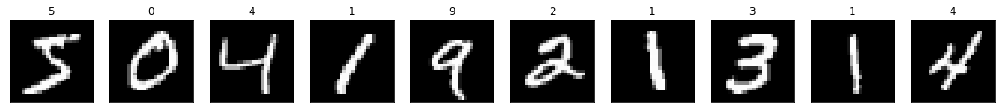
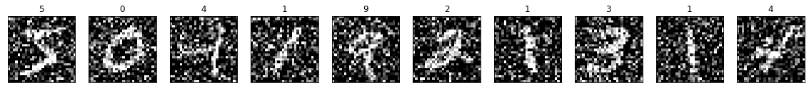
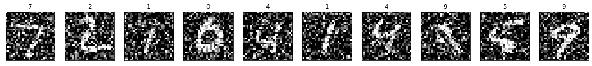
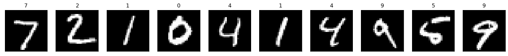
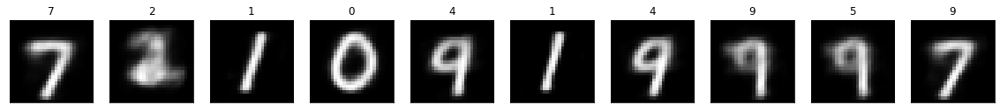
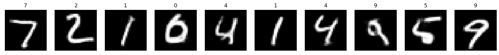

## **학습목적**
이 포스팅에선 오터인코더의 한 사례인 노이즈가 추가된 데이터에서 깨끗한 이미지를 뽑아낼 수 있는 Denoising AutoEncoder에 대해서 알아보겠습니다.


---

#### **Denosing AutoEncoder**
- Denosing AutoEncoder는 이미지 데이터에 노이즈가 있을 때 제거할 수 있도록 학습되는 AutoEncoder 중에 하나입니다. 크게 네트워크 모양이 바뀌지는 않지만 기존 AE와 다르게 X, Y값이 다르다는 점이 있습니다.

##### **왜 노이즈 제거에 AE를 사용할까?**
- AutoEncoder는 차원을 축소시키면서 데이터를 함축적으로 표현하게 되어있습니다. 즉, 핵심적인 데이터만 저장하도록 되어있습니다. 이러한 원리를 이용하여 노이즈가 추가된 데이터에서 핵심적인 데이터를 추출할 수 있는 AutoEncoder를 활용하게 됬습니다. 
    - 자세한 내용은 Manifold Learning에 대해서 한번 포스팅하겠습니다.
 
<br>


---

#### **오토인코더 실습**


```python
import os
import sys
import warnings

import random

import numpy as np
import pandas as pd

import scipy
import scipy.stats
from scipy.spatial import ConvexHull, convex_hull_plot_2d
from sklearn.datasets import make_regression
from sklearn.ensemble import GradientBoostingRegressor
from sklearn.model_selection import train_test_split
from sklearn.metrics import accuracy_score, precision_score, recall_score

import matplotlib as mpl
import matplotlib.pyplot as plt
from plotnine import * 

import tensorflow as tf
from tensorflow.keras.layers import Input, Conv2D, Flatten, Dense, Conv2DTranspose, Reshape, Lambda, Activation, BatchNormalization, LeakyReLU, Dropout
from tensorflow.keras.models import Model, Sequential
from tensorflow.keras import backend as K
from tensorflow.keras.optimizers import Adam
from tensorflow.keras.callbacks import ModelCheckpoint 
from tensorflow.keras import layers, losses
from tensorflow.keras.datasets import mnist, fashion_mnist
```


```python
%matplotlib inline
warnings.filterwarnings(action='ignore')
```


```python
(x_train, y_train), (x_test, y_test) = mnist.load_data()
```

- 데이터에 임의로 노이즈를 추가해보겠습니다.


```python
x_train = x_train.astype('float32') / 255.
x_test = x_test.astype('float32') / 255.
x_train = np.reshape(x_train, (len(x_train), 28, 28, 1))  # adapt this if using `channels_first` image data format
x_test = np.reshape(x_test, (len(x_test), 28, 28, 1))  # adapt this if using `channels_first` image data format

noise_factor = 0.5
x_train_noisy = x_train + noise_factor * np.random.normal(loc=0.0, scale=1.0, size=x_train.shape) 
x_test_noisy = x_test + noise_factor * np.random.normal(loc=0.0, scale=1.0, size=x_test.shape) 

x_train_noisy = np.clip(x_train_noisy, 0., 1.)
x_test_noisy = np.clip(x_test_noisy, 0., 1.)
```


```python
n = 10
plt.figure(figsize=(20, 4))
for i in range(n):
    # display original
    ax = plt.subplot(2, n, i + 1)
    plt.imshow(np.reshape(x_train[i], (28, 28)))
    plt.title(y_train[i])
    plt.gray()
    ax.get_xaxis().set_visible(False)
    ax.get_yaxis().set_visible(False)
plt.show()
```





```python
n = 10
plt.figure(figsize=(20, 4))
for i in range(n):
    # display original
    ax = plt.subplot(2, n, i + 1)
    plt.imshow(np.reshape(x_train_noisy[i], (28, 28)))
    plt.title(y_train[i])
    plt.gray()
    ax.get_xaxis().set_visible(False)
    ax.get_yaxis().set_visible(False)
plt.show()
```




---

##### **Denoising AutoEncoder 모델 구성**
- 기본적인 AE와 비슷하게 Encoder로 차원을 축소하고 Decoder로 다시 원본으로 맞추는 작업을 하되, X값에는 noise가 추가된 이미지를 Y값에는 정상 이미지를 넣어 학습을 시키게 됩니다.


```python
class Denoising_Autoencoder_V1():
    def __init__(self
        , input_dim
        , encoder_conv_filters
        , encoder_conv_kernel_size
        , encoder_conv_strides
        , decoder_conv_t_filters
        , decoder_conv_t_kernel_size
        , decoder_conv_t_strides
        , z_dim
        , use_batch_norm = False
        , use_dropout = False
        ):

        self.name = 'autoencoder'

        self.input_dim = input_dim
        self.encoder_conv_filters = encoder_conv_filters
        self.encoder_conv_kernel_size = encoder_conv_kernel_size
        self.encoder_conv_strides = encoder_conv_strides
        self.decoder_conv_t_filters = decoder_conv_t_filters
        self.decoder_conv_t_kernel_size = decoder_conv_t_kernel_size
        self.decoder_conv_t_strides = decoder_conv_t_strides
        self.z_dim = z_dim

        self.use_batch_norm = use_batch_norm
        self.use_dropout = use_dropout

        self.n_layers_encoder = len(encoder_conv_filters)
        self.n_layers_decoder = len(decoder_conv_t_filters)

        self._build()

    def _build(self):

        ### THE ENCODER
        encoder_input = Input(shape=self.input_dim, name='encoder_input')

        x = encoder_input

        for i in range(self.n_layers_encoder):
            conv_layer = Conv2D(
                filters = self.encoder_conv_filters[i]
                , kernel_size = self.encoder_conv_kernel_size[i]
                , strides = self.encoder_conv_strides[i]
                , padding = 'same'
                , name = 'encoder_conv_' + str(i)
                )

            x = conv_layer(x)

            x = LeakyReLU()(x)

            if self.use_batch_norm:
                x = BatchNormalization()(x)

            if self.use_dropout:
                x = Dropout(rate = 0.25)(x)

        shape_before_flattening = K.int_shape(x)[1:]

        x = Flatten()(x)
        encoder_output= Dense(self.z_dim, name='encoder_output')(x)

        self.encoder = Model(encoder_input, encoder_output)


        ### THE DECODER
        decoder_input = Input(shape=(self.z_dim,), name='decoder_input')

        x = Dense(np.prod(shape_before_flattening))(decoder_input)
        x = Reshape(shape_before_flattening)(x)

        for i in range(self.n_layers_decoder):
            conv_t_layer = Conv2DTranspose(
                filters = self.decoder_conv_t_filters[i]
                , kernel_size = self.decoder_conv_t_kernel_size[i]
                , strides = self.decoder_conv_t_strides[i]
                , padding = 'same'
                , name = 'decoder_conv_t_' + str(i)
                )

            x = conv_t_layer(x)

            if i < self.n_layers_decoder - 1:
                x = LeakyReLU()(x)
                
                if self.use_batch_norm:
                    x = BatchNormalization()(x)
                
                if self.use_dropout:
                    x = Dropout(rate = 0.25)(x)
            else:
                x = Activation('sigmoid')(x)

        decoder_output = x

        self.decoder = Model(decoder_input, decoder_output)

        ### THE FULL AUTOENCODER
        model_input = encoder_input
        model_output = self.decoder(encoder_output)

        self.model = Model(model_input, model_output)
        
    def compile(self, learning_rate):
        self.learning_rate = learning_rate
        optimizer = Adam(lr=learning_rate)

        self.model.compile(optimizer=optimizer, loss = tf.keras.losses.MeanSquaredError(reduction="auto", name="mean_squared_error")) 

    def train(self, x_train, y_train, batch_size, epochs, verbose = 1):
        self.model.fit(     
        x_train
        , y_train
        , batch_size = batch_size
        , shuffle = True
        , epochs = epochs
        , verbose = verbose
        )
```


```python
DAE_V1 = Denoising_Autoencoder_V1(
    input_dim = (28,28,1)
    , encoder_conv_filters = [32,64,64,64]
    , encoder_conv_kernel_size = [3,3,3,3]
    , encoder_conv_strides = [1,2,2,1]
    , decoder_conv_t_filters = [64,64,32,1]
    , decoder_conv_t_kernel_size = [3,3,3,3]
    , decoder_conv_t_strides = [1,2,2,1]
    , z_dim = 2
)
```


```python
DAE_V1.compile(0.00005)
```


```python
DAE_V1.encoder.summary()
```

    Model: "model_4"
    _________________________________________________________________
    Layer (type)                 Output Shape              Param #   
    =================================================================
    encoder_input (InputLayer)   [(None, 28, 28, 1)]       0         
    _________________________________________________________________
    encoder_conv_0 (Conv2D)      (None, 28, 28, 32)        320       
    _________________________________________________________________
    leaky_re_lu_10 (LeakyReLU)   (None, 28, 28, 32)        0         
    _________________________________________________________________
    encoder_conv_1 (Conv2D)      (None, 14, 14, 64)        18496     
    _________________________________________________________________
    leaky_re_lu_11 (LeakyReLU)   (None, 14, 14, 64)        0         
    _________________________________________________________________
    encoder_conv_2 (Conv2D)      (None, 7, 7, 64)          36928     
    _________________________________________________________________
    leaky_re_lu_12 (LeakyReLU)   (None, 7, 7, 64)          0         
    _________________________________________________________________
    encoder_conv_3 (Conv2D)      (None, 7, 7, 64)          36928     
    _________________________________________________________________
    leaky_re_lu_13 (LeakyReLU)   (None, 7, 7, 64)          0         
    _________________________________________________________________
    flatten (Flatten)            (None, 3136)              0         
    _________________________________________________________________
    encoder_output (Dense)       (None, 2)                 6274      
    =================================================================
    Total params: 98,946
    Trainable params: 98,946
    Non-trainable params: 0
    _________________________________________________________________
    


```python
DAE_V1.decoder.summary()
```

    Model: "model_5"
    _________________________________________________________________
    Layer (type)                 Output Shape              Param #   
    =================================================================
    decoder_input (InputLayer)   [(None, 2)]               0         
    _________________________________________________________________
    dense (Dense)                (None, 3136)              9408      
    _________________________________________________________________
    reshape (Reshape)            (None, 7, 7, 64)          0         
    _________________________________________________________________
    decoder_conv_t_0 (Conv2DTran (None, 7, 7, 64)          36928     
    _________________________________________________________________
    leaky_re_lu_14 (LeakyReLU)   (None, 7, 7, 64)          0         
    _________________________________________________________________
    decoder_conv_t_1 (Conv2DTran (None, 14, 14, 64)        36928     
    _________________________________________________________________
    leaky_re_lu_15 (LeakyReLU)   (None, 14, 14, 64)        0         
    _________________________________________________________________
    decoder_conv_t_2 (Conv2DTran (None, 28, 28, 32)        18464     
    _________________________________________________________________
    leaky_re_lu_16 (LeakyReLU)   (None, 28, 28, 32)        0         
    _________________________________________________________________
    decoder_conv_t_3 (Conv2DTran (None, 28, 28, 1)         289       
    _________________________________________________________________
    activation_2 (Activation)    (None, 28, 28, 1)         0         
    =================================================================
    Total params: 102,017
    Trainable params: 102,017
    Non-trainable params: 0
    _________________________________________________________________
    


```python
DAE_V1.train(x_train_noisy, x_train, batch_size = 32, epochs = 200)
```

    Epoch 1/200
    1875/1875 [==============================] - 9s 4ms/step - loss: 0.0757
    Epoch 2/200
    1875/1875 [==============================] - 8s 4ms/step - loss: 0.0592
    Epoch 3/200
    1875/1875 [==============================] - 8s 4ms/step - loss: 0.0567
    Epoch 4/200
    1875/1875 [==============================] - 8s 4ms/step - loss: 0.0558
    Epoch 5/200
    1875/1875 [==============================] - 8s 4ms/step - loss: 0.0552
    Epoch 6/200
    1875/1875 [==============================] - 8s 4ms/step - loss: 0.0546
    Epoch 7/200
    1875/1875 [==============================] - 8s 4ms/step - loss: 0.0540
    Epoch 8/200
    1875/1875 [==============================] - 8s 4ms/step - loss: 0.0533
    Epoch 9/200
    1875/1875 [==============================] - 8s 4ms/step - loss: 0.0528
    Epoch 10/200
    1875/1875 [==============================] - 8s 4ms/step - loss: 0.0523
    Epoch 11/200
    1875/1875 [==============================] - 8s 4ms/step - loss: 0.0518
    Epoch 12/200
    1875/1875 [==============================] - 8s 4ms/step - loss: 0.0514
    Epoch 13/200
    1875/1875 [==============================] - 8s 4ms/step - loss: 0.0510
    Epoch 14/200
    1875/1875 [==============================] - 8s 4ms/step - loss: 0.0506
    Epoch 15/200
    1875/1875 [==============================] - 8s 4ms/step - loss: 0.0502
    Epoch 16/200
    1875/1875 [==============================] - 8s 4ms/step - loss: 0.0499
    Epoch 17/200
    1875/1875 [==============================] - 8s 4ms/step - loss: 0.0495
    Epoch 18/200
    1875/1875 [==============================] - 8s 4ms/step - loss: 0.0492
    Epoch 19/200
    1875/1875 [==============================] - 8s 4ms/step - loss: 0.0489
    Epoch 20/200
    1875/1875 [==============================] - 8s 4ms/step - loss: 0.0487
    Epoch 21/200
    1875/1875 [==============================] - 8s 4ms/step - loss: 0.0484
    Epoch 22/200
    1875/1875 [==============================] - 8s 4ms/step - loss: 0.0482
    Epoch 23/200
    1875/1875 [==============================] - 8s 4ms/step - loss: 0.0480
    Epoch 24/200
    1875/1875 [==============================] - 8s 4ms/step - loss: 0.0478
    Epoch 25/200
    1875/1875 [==============================] - 8s 4ms/step - loss: 0.0476
    Epoch 26/200
    1875/1875 [==============================] - 8s 4ms/step - loss: 0.0474
    Epoch 27/200
    1875/1875 [==============================] - 8s 4ms/step - loss: 0.0472
    Epoch 28/200
    1875/1875 [==============================] - 8s 4ms/step - loss: 0.0471
    Epoch 29/200
    1875/1875 [==============================] - 8s 4ms/step - loss: 0.0469
    Epoch 30/200
    1875/1875 [==============================] - 8s 4ms/step - loss: 0.0468
    Epoch 31/200
    1875/1875 [==============================] - 8s 4ms/step - loss: 0.0467
    Epoch 32/200
    1875/1875 [==============================] - 8s 4ms/step - loss: 0.0465
    Epoch 33/200
    1875/1875 [==============================] - 8s 4ms/step - loss: 0.0464
    Epoch 34/200
    1875/1875 [==============================] - 8s 4ms/step - loss: 0.0463
    Epoch 35/200
    1875/1875 [==============================] - 8s 4ms/step - loss: 0.0462
    Epoch 36/200
    1875/1875 [==============================] - 8s 4ms/step - loss: 0.0461
    Epoch 37/200
    1875/1875 [==============================] - 8s 4ms/step - loss: 0.0460
    Epoch 38/200
    1875/1875 [==============================] - 8s 4ms/step - loss: 0.0458
    Epoch 39/200
    1875/1875 [==============================] - 8s 4ms/step - loss: 0.0457
    Epoch 40/200
    1875/1875 [==============================] - 8s 4ms/step - loss: 0.0457
    Epoch 41/200
    1875/1875 [==============================] - 8s 4ms/step - loss: 0.0456
    Epoch 42/200
    1875/1875 [==============================] - 8s 4ms/step - loss: 0.0455
    Epoch 43/200
    1875/1875 [==============================] - 8s 4ms/step - loss: 0.0454
    Epoch 44/200
    1875/1875 [==============================] - 8s 4ms/step - loss: 0.0453
    Epoch 45/200
    1875/1875 [==============================] - 8s 4ms/step - loss: 0.0452
    Epoch 46/200
    1875/1875 [==============================] - 8s 4ms/step - loss: 0.0452
    Epoch 47/200
    1875/1875 [==============================] - 8s 4ms/step - loss: 0.0451
    Epoch 48/200
    1875/1875 [==============================] - 8s 4ms/step - loss: 0.0450
    Epoch 49/200
    1875/1875 [==============================] - 8s 4ms/step - loss: 0.0450
    Epoch 50/200
    1875/1875 [==============================] - 8s 4ms/step - loss: 0.0449
    Epoch 51/200
    1875/1875 [==============================] - 8s 4ms/step - loss: 0.0448
    Epoch 52/200
    1875/1875 [==============================] - 8s 4ms/step - loss: 0.0447
    Epoch 53/200
    1875/1875 [==============================] - 8s 4ms/step - loss: 0.0447
    Epoch 54/200
    1875/1875 [==============================] - 8s 4ms/step - loss: 0.0446
    Epoch 55/200
    1875/1875 [==============================] - 8s 4ms/step - loss: 0.0446
    Epoch 56/200
    1875/1875 [==============================] - 8s 4ms/step - loss: 0.0445
    Epoch 57/200
    1875/1875 [==============================] - 8s 4ms/step - loss: 0.0445
    Epoch 58/200
    1875/1875 [==============================] - 8s 4ms/step - loss: 0.0444
    Epoch 59/200
    1875/1875 [==============================] - 8s 4ms/step - loss: 0.0444
    Epoch 60/200
    1875/1875 [==============================] - 8s 4ms/step - loss: 0.0443
    Epoch 61/200
    1875/1875 [==============================] - 8s 4ms/step - loss: 0.0443
    Epoch 62/200
    1875/1875 [==============================] - 8s 4ms/step - loss: 0.0442
    Epoch 63/200
    1875/1875 [==============================] - 8s 4ms/step - loss: 0.0442
    Epoch 64/200
    1875/1875 [==============================] - 8s 4ms/step - loss: 0.0442
    Epoch 65/200
    1875/1875 [==============================] - 8s 4ms/step - loss: 0.0441
    Epoch 66/200
    1875/1875 [==============================] - 8s 4ms/step - loss: 0.0441
    Epoch 67/200
    1875/1875 [==============================] - 8s 4ms/step - loss: 0.0440
    Epoch 68/200
    1875/1875 [==============================] - 8s 4ms/step - loss: 0.0440
    Epoch 69/200
    1875/1875 [==============================] - 8s 4ms/step - loss: 0.0439
    Epoch 70/200
    1875/1875 [==============================] - 8s 4ms/step - loss: 0.0439
    Epoch 71/200
    1875/1875 [==============================] - 8s 4ms/step - loss: 0.0438
    Epoch 72/200
    1875/1875 [==============================] - 8s 4ms/step - loss: 0.0438
    Epoch 73/200
    1875/1875 [==============================] - 8s 4ms/step - loss: 0.0438
    Epoch 74/200
    1875/1875 [==============================] - 8s 4ms/step - loss: 0.0437
    Epoch 75/200
    1875/1875 [==============================] - 8s 4ms/step - loss: 0.0437
    Epoch 76/200
    1875/1875 [==============================] - 8s 4ms/step - loss: 0.0436
    Epoch 77/200
    1875/1875 [==============================] - 8s 4ms/step - loss: 0.0436
    Epoch 78/200
    1875/1875 [==============================] - 8s 4ms/step - loss: 0.0436
    Epoch 79/200
    1875/1875 [==============================] - 8s 4ms/step - loss: 0.0435
    Epoch 80/200
    1875/1875 [==============================] - 8s 4ms/step - loss: 0.0435
    Epoch 81/200
    1875/1875 [==============================] - 8s 4ms/step - loss: 0.0435
    Epoch 82/200
    1875/1875 [==============================] - 8s 4ms/step - loss: 0.0434
    Epoch 83/200
    1875/1875 [==============================] - 8s 4ms/step - loss: 0.0434
    Epoch 84/200
    1875/1875 [==============================] - 8s 4ms/step - loss: 0.0434
    Epoch 85/200
    1875/1875 [==============================] - 8s 4ms/step - loss: 0.0433
    Epoch 86/200
    1875/1875 [==============================] - 8s 4ms/step - loss: 0.0433
    Epoch 87/200
    1875/1875 [==============================] - 8s 4ms/step - loss: 0.0433
    Epoch 88/200
    1875/1875 [==============================] - 8s 4ms/step - loss: 0.0432
    Epoch 89/200
    1875/1875 [==============================] - 8s 4ms/step - loss: 0.0432
    Epoch 90/200
    1875/1875 [==============================] - 8s 4ms/step - loss: 0.0432
    Epoch 91/200
    1875/1875 [==============================] - 8s 4ms/step - loss: 0.0431
    Epoch 92/200
    1875/1875 [==============================] - 8s 4ms/step - loss: 0.0431
    Epoch 93/200
    1875/1875 [==============================] - 8s 4ms/step - loss: 0.0431
    Epoch 94/200
    1875/1875 [==============================] - 8s 4ms/step - loss: 0.0430
    Epoch 95/200
    1875/1875 [==============================] - 8s 4ms/step - loss: 0.0430
    Epoch 96/200
    1875/1875 [==============================] - 8s 4ms/step - loss: 0.0430
    Epoch 97/200
    1875/1875 [==============================] - 8s 4ms/step - loss: 0.0430
    Epoch 98/200
    1875/1875 [==============================] - 8s 4ms/step - loss: 0.0429
    Epoch 99/200
    1875/1875 [==============================] - 8s 4ms/step - loss: 0.0429
    Epoch 100/200
    1875/1875 [==============================] - 8s 4ms/step - loss: 0.0429
    Epoch 101/200
    1875/1875 [==============================] - 8s 4ms/step - loss: 0.0428
    Epoch 102/200
    1875/1875 [==============================] - 8s 4ms/step - loss: 0.0428
    Epoch 103/200
    1875/1875 [==============================] - 8s 4ms/step - loss: 0.0428
    Epoch 104/200
    1875/1875 [==============================] - 8s 4ms/step - loss: 0.0428
    Epoch 105/200
    1875/1875 [==============================] - 8s 4ms/step - loss: 0.0427
    Epoch 106/200
    1875/1875 [==============================] - 8s 4ms/step - loss: 0.0427
    Epoch 107/200
    1875/1875 [==============================] - 8s 4ms/step - loss: 0.0427
    Epoch 108/200
    1875/1875 [==============================] - 8s 4ms/step - loss: 0.0427
    Epoch 109/200
    1875/1875 [==============================] - 8s 4ms/step - loss: 0.0426
    Epoch 110/200
    1875/1875 [==============================] - 8s 4ms/step - loss: 0.0426
    Epoch 111/200
    1875/1875 [==============================] - 8s 4ms/step - loss: 0.0426
    Epoch 112/200
    1875/1875 [==============================] - 8s 4ms/step - loss: 0.0425
    Epoch 113/200
    1875/1875 [==============================] - 8s 4ms/step - loss: 0.0425
    Epoch 114/200
    1875/1875 [==============================] - 8s 4ms/step - loss: 0.0425
    Epoch 115/200
    1875/1875 [==============================] - 8s 4ms/step - loss: 0.0425
    Epoch 116/200
    1875/1875 [==============================] - 8s 4ms/step - loss: 0.0425
    Epoch 117/200
    1875/1875 [==============================] - 8s 4ms/step - loss: 0.0424
    Epoch 118/200
    1875/1875 [==============================] - 8s 4ms/step - loss: 0.0424
    Epoch 119/200
    1875/1875 [==============================] - 8s 4ms/step - loss: 0.0424
    Epoch 120/200
    1875/1875 [==============================] - 8s 4ms/step - loss: 0.0424
    Epoch 121/200
    1875/1875 [==============================] - 8s 4ms/step - loss: 0.0423
    Epoch 122/200
    1875/1875 [==============================] - 8s 4ms/step - loss: 0.0423
    Epoch 123/200
    1875/1875 [==============================] - 8s 4ms/step - loss: 0.0423
    Epoch 124/200
    1875/1875 [==============================] - 8s 4ms/step - loss: 0.0422
    Epoch 125/200
    1875/1875 [==============================] - 8s 4ms/step - loss: 0.0422
    Epoch 126/200
    1875/1875 [==============================] - 8s 4ms/step - loss: 0.0422
    Epoch 127/200
    1875/1875 [==============================] - 8s 4ms/step - loss: 0.0422
    Epoch 128/200
    1875/1875 [==============================] - 8s 4ms/step - loss: 0.0421
    Epoch 129/200
    1875/1875 [==============================] - 8s 4ms/step - loss: 0.0421
    Epoch 130/200
    1875/1875 [==============================] - 8s 4ms/step - loss: 0.0421
    Epoch 131/200
    1875/1875 [==============================] - 8s 4ms/step - loss: 0.0421
    Epoch 132/200
    1875/1875 [==============================] - 8s 4ms/step - loss: 0.0421
    Epoch 133/200
    1875/1875 [==============================] - 8s 4ms/step - loss: 0.0420
    Epoch 134/200
    1875/1875 [==============================] - 8s 4ms/step - loss: 0.0420
    Epoch 135/200
    1875/1875 [==============================] - 8s 4ms/step - loss: 0.0420
    Epoch 136/200
    1875/1875 [==============================] - 8s 4ms/step - loss: 0.0420
    Epoch 137/200
    1875/1875 [==============================] - 8s 4ms/step - loss: 0.0419
    Epoch 138/200
    1875/1875 [==============================] - 8s 4ms/step - loss: 0.0419
    Epoch 139/200
    1875/1875 [==============================] - 8s 4ms/step - loss: 0.0419
    Epoch 140/200
    1875/1875 [==============================] - 8s 4ms/step - loss: 0.0419
    Epoch 141/200
    1875/1875 [==============================] - 8s 4ms/step - loss: 0.0419
    Epoch 142/200
    1875/1875 [==============================] - 8s 4ms/step - loss: 0.0418
    Epoch 143/200
    1875/1875 [==============================] - 8s 4ms/step - loss: 0.0418
    Epoch 144/200
    1875/1875 [==============================] - 8s 4ms/step - loss: 0.0418
    Epoch 145/200
    1875/1875 [==============================] - 8s 4ms/step - loss: 0.0418
    Epoch 146/200
    1875/1875 [==============================] - 8s 4ms/step - loss: 0.0418
    Epoch 147/200
    1875/1875 [==============================] - 8s 4ms/step - loss: 0.0417
    Epoch 148/200
    1875/1875 [==============================] - 8s 4ms/step - loss: 0.0417
    Epoch 149/200
    1875/1875 [==============================] - 8s 4ms/step - loss: 0.0417
    Epoch 150/200
    1875/1875 [==============================] - 8s 4ms/step - loss: 0.0417
    Epoch 151/200
    1875/1875 [==============================] - 8s 4ms/step - loss: 0.0417
    Epoch 152/200
    1875/1875 [==============================] - 8s 4ms/step - loss: 0.0416
    Epoch 153/200
    1875/1875 [==============================] - 8s 4ms/step - loss: 0.0416
    Epoch 154/200
    1875/1875 [==============================] - 8s 4ms/step - loss: 0.0416
    Epoch 155/200
    1875/1875 [==============================] - 8s 4ms/step - loss: 0.0416
    Epoch 156/200
    1875/1875 [==============================] - 8s 4ms/step - loss: 0.0416
    Epoch 157/200
    1875/1875 [==============================] - 8s 4ms/step - loss: 0.0416
    Epoch 158/200
    1875/1875 [==============================] - 8s 4ms/step - loss: 0.0415
    Epoch 159/200
    1875/1875 [==============================] - 8s 4ms/step - loss: 0.0415
    Epoch 160/200
    1875/1875 [==============================] - 8s 4ms/step - loss: 0.0415
    Epoch 161/200
    1875/1875 [==============================] - 8s 4ms/step - loss: 0.0415
    Epoch 162/200
    1875/1875 [==============================] - 8s 4ms/step - loss: 0.0414
    Epoch 163/200
    1875/1875 [==============================] - 8s 4ms/step - loss: 0.0414
    Epoch 164/200
    1875/1875 [==============================] - 8s 4ms/step - loss: 0.0414
    Epoch 165/200
    1875/1875 [==============================] - 8s 4ms/step - loss: 0.0414
    Epoch 166/200
    1875/1875 [==============================] - 8s 4ms/step - loss: 0.0414
    Epoch 167/200
    1875/1875 [==============================] - 8s 4ms/step - loss: 0.0414
    Epoch 168/200
    1875/1875 [==============================] - 8s 4ms/step - loss: 0.0413
    Epoch 169/200
    1875/1875 [==============================] - 8s 4ms/step - loss: 0.0413
    Epoch 170/200
    1875/1875 [==============================] - 8s 4ms/step - loss: 0.0413
    Epoch 171/200
    1875/1875 [==============================] - 8s 4ms/step - loss: 0.0413
    Epoch 172/200
    1875/1875 [==============================] - 8s 4ms/step - loss: 0.0413
    Epoch 173/200
    1875/1875 [==============================] - 8s 4ms/step - loss: 0.0413
    Epoch 174/200
    1875/1875 [==============================] - 9s 5ms/step - loss: 0.0412
    Epoch 175/200
    1875/1875 [==============================] - 8s 4ms/step - loss: 0.0412
    Epoch 176/200
    1875/1875 [==============================] - 8s 4ms/step - loss: 0.0412
    Epoch 177/200
    1875/1875 [==============================] - 8s 4ms/step - loss: 0.0412
    Epoch 178/200
    1875/1875 [==============================] - 8s 5ms/step - loss: 0.0412
    Epoch 179/200
    1875/1875 [==============================] - 8s 4ms/step - loss: 0.0412
    Epoch 180/200
    1875/1875 [==============================] - 8s 4ms/step - loss: 0.0411
    Epoch 181/200
    1875/1875 [==============================] - 8s 4ms/step - loss: 0.0411
    Epoch 182/200
    1875/1875 [==============================] - 8s 4ms/step - loss: 0.0411
    Epoch 183/200
    1875/1875 [==============================] - 8s 4ms/step - loss: 0.0411
    Epoch 184/200
    1875/1875 [==============================] - 8s 4ms/step - loss: 0.0411
    Epoch 185/200
    1875/1875 [==============================] - 8s 4ms/step - loss: 0.0411
    Epoch 186/200
    1875/1875 [==============================] - 8s 4ms/step - loss: 0.0410
    Epoch 187/200
    1875/1875 [==============================] - 9s 5ms/step - loss: 0.0410
    Epoch 188/200
    1875/1875 [==============================] - 8s 4ms/step - loss: 0.0410
    Epoch 189/200
    1875/1875 [==============================] - 8s 4ms/step - loss: 0.0410
    Epoch 190/200
    1875/1875 [==============================] - 8s 4ms/step - loss: 0.0410
    Epoch 191/200
    1875/1875 [==============================] - 8s 4ms/step - loss: 0.0410
    Epoch 192/200
    1875/1875 [==============================] - 8s 4ms/step - loss: 0.0409
    Epoch 193/200
    1875/1875 [==============================] - 8s 5ms/step - loss: 0.0409
    Epoch 194/200
    1875/1875 [==============================] - 9s 5ms/step - loss: 0.0409
    Epoch 195/200
    1875/1875 [==============================] - 8s 5ms/step - loss: 0.0409
    Epoch 196/200
    1875/1875 [==============================] - 8s 4ms/step - loss: 0.0409
    Epoch 197/200
    1875/1875 [==============================] - 8s 4ms/step - loss: 0.0409
    Epoch 198/200
    1875/1875 [==============================] - 8s 4ms/step - loss: 0.0408
    Epoch 199/200
    1875/1875 [==============================] - 8s 4ms/step - loss: 0.0408
    Epoch 200/200
    1875/1875 [==============================] - 8s 4ms/step - loss: 0.0408
    


```python
n = 10
plt.figure(figsize=(20, 4))
for i in range(n):
    # display original
    ax = plt.subplot(1, n, i + 1)
    plt.imshow(np.reshape(x_test_noisy[i], (28, 28)))
    plt.title(y_test[i])
    plt.gray()
    ax.get_xaxis().set_visible(False)
    ax.get_yaxis().set_visible(False)
plt.show()
```





```python
n = 10
plt.figure(figsize=(20, 4))
for i in range(n):
    # display original
    ax = plt.subplot(1, n, i + 1)
    plt.imshow(np.reshape(x_test[i], (28, 28)))
    plt.title(y_test[i])
    plt.gray()
    ax.get_xaxis().set_visible(False)
    ax.get_yaxis().set_visible(False)
plt.show()
```




- 결과를 보게되면 AutoEncoder를 돌렸을 때 Convexhull이 잘 생성된 이미지는 잘 구분하지만, 결국 잘 구분되지 않은 애들은 노이즈 제거도 잘 하지 못한다는 것을 알 수 있습니다.
- 왜냐하면 Latent Space에 각자의 영역을 충분히 만들어내지 못했기 때문에 다시 Decoder를 통해서도 생성이 잘 되지 않습니다.


```python
dae_predict = DAE_V1.model.predict(x_test_noisy)

n = 10
plt.figure(figsize=(20, 4))
for i in range(n):
    # display original
    ax = plt.subplot(2, n, i + 1)
    plt.imshow(np.reshape(dae_predict[i], (28, 28)))
    plt.title(y_test[i])
    plt.gray()
    ax.get_xaxis().set_visible(False)
    ax.get_yaxis().set_visible(False)
plt.show()
```




---

##### **Denoising AutoEncoder 모델 구성 Version2**
- 위의 AutoEncoder가 잠재공간 내에 각각의 이미지를 잘 표현(representation)을 하지 못했기 때문에, 잠재공간을 늘려서 학습을 하면 좀 더 잘되지 않을까 라는 시도를 해볼 수 있습니다. 차원을 flatten이나 2차원으로 만들지 않고 잠재공간(latent space)가 충분한(7, 7, 128) 상태로 학습을 시켜보겠습니다.


```python
class Denoising_Autoencoder_V2():
    def __init__(self
        , input_dim
        , encoder_conv_filters
        , encoder_conv_kernel_size
        , encoder_conv_strides
        , decoder_conv_t_filters
        , decoder_conv_t_kernel_size
        , decoder_conv_t_strides
        , z_dim
        , use_batch_norm = False
        , use_dropout = False
        ):

        self.name = 'autoencoder'

        self.input_dim = input_dim
        self.encoder_conv_filters = encoder_conv_filters
        self.encoder_conv_kernel_size = encoder_conv_kernel_size
        self.encoder_conv_strides = encoder_conv_strides
        self.decoder_conv_t_filters = decoder_conv_t_filters
        self.decoder_conv_t_kernel_size = decoder_conv_t_kernel_size
        self.decoder_conv_t_strides = decoder_conv_t_strides
        self.z_dim = z_dim

        self.use_batch_norm = use_batch_norm
        self.use_dropout = use_dropout

        self.n_layers_encoder = len(encoder_conv_filters)
        self.n_layers_decoder = len(decoder_conv_t_filters)

        self._build()

    def _build(self):

        ### THE ENCODER
        encoder_input = Input(shape=self.input_dim, name='encoder_input')

        x = encoder_input

        for i in range(self.n_layers_encoder):
            conv_layer = Conv2D(
                filters = self.encoder_conv_filters[i]
                , kernel_size = self.encoder_conv_kernel_size[i]
                , strides = self.encoder_conv_strides[i]
                , padding = 'same'
                , name = 'encoder_conv_' + str(i)
                )

            x = conv_layer(x)

            x = LeakyReLU()(x)

            if self.use_batch_norm:
                x = BatchNormalization()(x)

            if self.use_dropout:
                x = Dropout(rate = 0.25)(x)

        # encoder_output= Conv2D(
        #         filters = self.z_dim
        #         , kernel_size = 1
        #         , strides = 1
        #         , padding = 'same'
        #         , name = 'encoder_conv_' + str(i + 1)
        #         , activation = "sigmoid"
        #         )
        
        # x = encoder_output(x)
        
        self.encoder = Model(encoder_input, x)

        ### THE DECODER

        for i in range(self.n_layers_decoder):
            conv_t_layer = Conv2DTranspose(
                filters = self.decoder_conv_t_filters[i]
                , kernel_size = self.decoder_conv_t_kernel_size[i]
                , strides = self.decoder_conv_t_strides[i]
                , padding = 'same'
                , name = 'decoder_conv_t_' + str(i)
                )

            x = conv_t_layer(x)

            if i < self.n_layers_decoder - 1:
                x = LeakyReLU()(x)
                
                if self.use_batch_norm:
                    x = BatchNormalization()(x)
                
                if self.use_dropout:
                    x = Dropout(rate = 0.25)(x)
            else:
                x = Activation('sigmoid')(x)

        decoder_output = x

        ### THE FULL AUTOENCODER
        model_input = encoder_input

        self.model = Model(model_input, decoder_output)
        
    def compile(self, learning_rate, loss_func = "BCE"):
        self.learning_rate = learning_rate
        optimizer = Adam(lr=learning_rate)

        if loss_func == "BCE" :
            self.model.compile(optimizer=optimizer, loss = tf.keras.losses.BinaryCrossentropy(reduction="auto", name="BCE")) 

        elif loss_func == "mse" :
            self.model.compile(optimizer=optimizer, loss = tf.keras.losses.MeanSquaredError(reduction="auto", name="mean_squared_error")) 
        
        else :
            self.model.compile(optimizer=optimizer, loss = tf.keras.losses.BinaryCrossentropy(reduction="auto", name="BCE")) 
          

    def train(self, x_train, y_train, batch_size, epochs, verbose = 1):
        self.model.fit(     
        x_train
        , y_train
        , batch_size = batch_size
        , shuffle = True
        , epochs = epochs
        , verbose = verbose
        )
```


```python
DAE_V2 = Denoising_Autoencoder_V2(
    input_dim = (28,28,1)
    , encoder_conv_filters = [32,64,128]
    , encoder_conv_kernel_size = [3,3,3,3]
    , encoder_conv_strides = [1,2,2]
    , decoder_conv_t_filters = [64,32,1]
    , decoder_conv_t_kernel_size = [3,3,3,3]
    , decoder_conv_t_strides = [2,2,1]
    , z_dim = 256
)
```


```python
DAE_V2.model.summary()
```

    Model: "model_3"
    _________________________________________________________________
    Layer (type)                 Output Shape              Param #   
    =================================================================
    encoder_input (InputLayer)   [(None, 28, 28, 1)]       0         
    _________________________________________________________________
    encoder_conv_0 (Conv2D)      (None, 28, 28, 32)        320       
    _________________________________________________________________
    leaky_re_lu_5 (LeakyReLU)    (None, 28, 28, 32)        0         
    _________________________________________________________________
    encoder_conv_1 (Conv2D)      (None, 14, 14, 64)        18496     
    _________________________________________________________________
    leaky_re_lu_6 (LeakyReLU)    (None, 14, 14, 64)        0         
    _________________________________________________________________
    encoder_conv_2 (Conv2D)      (None, 7, 7, 128)         73856     
    _________________________________________________________________
    leaky_re_lu_7 (LeakyReLU)    (None, 7, 7, 128)         0         
    _________________________________________________________________
    decoder_conv_t_0 (Conv2DTran (None, 14, 14, 64)        73792     
    _________________________________________________________________
    leaky_re_lu_8 (LeakyReLU)    (None, 14, 14, 64)        0         
    _________________________________________________________________
    decoder_conv_t_1 (Conv2DTran (None, 28, 28, 32)        18464     
    _________________________________________________________________
    leaky_re_lu_9 (LeakyReLU)    (None, 28, 28, 32)        0         
    _________________________________________________________________
    decoder_conv_t_2 (Conv2DTran (None, 28, 28, 1)         289       
    _________________________________________________________________
    activation_1 (Activation)    (None, 28, 28, 1)         0         
    =================================================================
    Total params: 185,217
    Trainable params: 185,217
    Non-trainable params: 0
    _________________________________________________________________
    


```python
DAE_V2.compile(0.0005)
```


```python
DAE_V2.train(x_train_noisy, x_train, batch_size = 128, epochs = 100)
```

    Epoch 1/100
    469/469 [==============================] - 6s 13ms/step - loss: 0.0975
    Epoch 2/100
    469/469 [==============================] - 6s 13ms/step - loss: 0.0968
    Epoch 3/100
    469/469 [==============================] - 6s 12ms/step - loss: 0.0963
    Epoch 4/100
    469/469 [==============================] - 6s 12ms/step - loss: 0.0958
    Epoch 5/100
    469/469 [==============================] - 6s 12ms/step - loss: 0.0955
    Epoch 6/100
    469/469 [==============================] - 6s 12ms/step - loss: 0.0952
    Epoch 7/100
    469/469 [==============================] - 6s 12ms/step - loss: 0.0949
    Epoch 8/100
    469/469 [==============================] - 6s 12ms/step - loss: 0.0947
    Epoch 9/100
    469/469 [==============================] - 6s 12ms/step - loss: 0.0945
    Epoch 10/100
    469/469 [==============================] - 6s 12ms/step - loss: 0.0943
    Epoch 11/100
    469/469 [==============================] - 6s 13ms/step - loss: 0.0942
    Epoch 12/100
    469/469 [==============================] - 6s 13ms/step - loss: 0.0940
    Epoch 13/100
    469/469 [==============================] - 6s 13ms/step - loss: 0.0938
    Epoch 14/100
    469/469 [==============================] - 6s 13ms/step - loss: 0.0937
    Epoch 15/100
    469/469 [==============================] - 6s 12ms/step - loss: 0.0936
    Epoch 16/100
    469/469 [==============================] - 6s 12ms/step - loss: 0.0934
    Epoch 17/100
    469/469 [==============================] - 6s 12ms/step - loss: 0.0933
    Epoch 18/100
    469/469 [==============================] - 6s 13ms/step - loss: 0.0932
    Epoch 19/100
    469/469 [==============================] - 6s 12ms/step - loss: 0.0931
    Epoch 20/100
    469/469 [==============================] - 6s 12ms/step - loss: 0.0930
    Epoch 21/100
    469/469 [==============================] - 6s 12ms/step - loss: 0.0929
    Epoch 22/100
    469/469 [==============================] - 6s 12ms/step - loss: 0.0928
    Epoch 23/100
    469/469 [==============================] - 6s 12ms/step - loss: 0.0927
    Epoch 24/100
    469/469 [==============================] - 6s 12ms/step - loss: 0.0927
    Epoch 25/100
    469/469 [==============================] - 6s 12ms/step - loss: 0.0925
    Epoch 26/100
    469/469 [==============================] - 6s 12ms/step - loss: 0.0924
    Epoch 27/100
    469/469 [==============================] - 6s 12ms/step - loss: 0.0924
    Epoch 28/100
    469/469 [==============================] - 6s 12ms/step - loss: 0.0924
    Epoch 29/100
    469/469 [==============================] - 6s 12ms/step - loss: 0.0923
    Epoch 30/100
    469/469 [==============================] - 6s 12ms/step - loss: 0.0922
    Epoch 31/100
    469/469 [==============================] - 6s 12ms/step - loss: 0.0921
    Epoch 32/100
    469/469 [==============================] - 6s 12ms/step - loss: 0.0921
    Epoch 33/100
    469/469 [==============================] - 6s 13ms/step - loss: 0.0920
    Epoch 34/100
    469/469 [==============================] - 6s 13ms/step - loss: 0.0919
    Epoch 35/100
    469/469 [==============================] - 6s 13ms/step - loss: 0.0918
    Epoch 36/100
    469/469 [==============================] - 6s 13ms/step - loss: 0.0918
    Epoch 37/100
    469/469 [==============================] - 6s 13ms/step - loss: 0.0918
    Epoch 38/100
    469/469 [==============================] - 6s 12ms/step - loss: 0.0917
    Epoch 39/100
    469/469 [==============================] - 6s 12ms/step - loss: 0.0917
    Epoch 40/100
    469/469 [==============================] - 6s 12ms/step - loss: 0.0916
    Epoch 41/100
    469/469 [==============================] - 6s 12ms/step - loss: 0.0915
    Epoch 42/100
    469/469 [==============================] - 6s 12ms/step - loss: 0.0915
    Epoch 43/100
    469/469 [==============================] - 6s 12ms/step - loss: 0.0915
    Epoch 44/100
    469/469 [==============================] - 6s 13ms/step - loss: 0.0914
    Epoch 45/100
    469/469 [==============================] - 6s 13ms/step - loss: 0.0914
    Epoch 46/100
    469/469 [==============================] - 6s 13ms/step - loss: 0.0913
    Epoch 47/100
    469/469 [==============================] - 6s 13ms/step - loss: 0.0913
    Epoch 48/100
    469/469 [==============================] - 6s 12ms/step - loss: 0.0912
    Epoch 49/100
    469/469 [==============================] - 6s 12ms/step - loss: 0.0912
    Epoch 50/100
    469/469 [==============================] - 6s 12ms/step - loss: 0.0912
    Epoch 51/100
    469/469 [==============================] - 6s 12ms/step - loss: 0.0911
    Epoch 52/100
    469/469 [==============================] - 6s 12ms/step - loss: 0.0911
    Epoch 53/100
    469/469 [==============================] - 6s 12ms/step - loss: 0.0911
    Epoch 54/100
    469/469 [==============================] - 6s 12ms/step - loss: 0.0910
    Epoch 55/100
    469/469 [==============================] - 6s 12ms/step - loss: 0.0909
    Epoch 56/100
    469/469 [==============================] - 6s 13ms/step - loss: 0.0910
    Epoch 57/100
    469/469 [==============================] - 6s 13ms/step - loss: 0.0909
    Epoch 58/100
    469/469 [==============================] - 6s 12ms/step - loss: 0.0908
    Epoch 59/100
    469/469 [==============================] - 6s 12ms/step - loss: 0.0908
    Epoch 60/100
    469/469 [==============================] - 6s 12ms/step - loss: 0.0908
    Epoch 61/100
    469/469 [==============================] - 6s 13ms/step - loss: 0.0908
    Epoch 62/100
    469/469 [==============================] - 6s 13ms/step - loss: 0.0908
    Epoch 63/100
    469/469 [==============================] - 6s 13ms/step - loss: 0.0907
    Epoch 64/100
    469/469 [==============================] - 6s 13ms/step - loss: 0.0907
    Epoch 65/100
    469/469 [==============================] - 6s 12ms/step - loss: 0.0906
    Epoch 66/100
    469/469 [==============================] - 6s 12ms/step - loss: 0.0906
    Epoch 67/100
    469/469 [==============================] - 6s 12ms/step - loss: 0.0906
    Epoch 68/100
    469/469 [==============================] - 6s 12ms/step - loss: 0.0906
    Epoch 69/100
    469/469 [==============================] - 6s 12ms/step - loss: 0.0905
    Epoch 70/100
    469/469 [==============================] - 6s 12ms/step - loss: 0.0905
    Epoch 71/100
    469/469 [==============================] - 6s 12ms/step - loss: 0.0905
    Epoch 72/100
    469/469 [==============================] - 6s 13ms/step - loss: 0.0904
    Epoch 73/100
    469/469 [==============================] - 6s 13ms/step - loss: 0.0904
    Epoch 74/100
    469/469 [==============================] - 6s 13ms/step - loss: 0.0904
    Epoch 75/100
    469/469 [==============================] - 6s 13ms/step - loss: 0.0904
    Epoch 76/100
    469/469 [==============================] - 6s 13ms/step - loss: 0.0903
    Epoch 77/100
    469/469 [==============================] - 6s 12ms/step - loss: 0.0903
    Epoch 78/100
    469/469 [==============================] - 6s 12ms/step - loss: 0.0903
    Epoch 79/100
    469/469 [==============================] - 6s 12ms/step - loss: 0.0903
    Epoch 80/100
    469/469 [==============================] - 6s 12ms/step - loss: 0.0902
    Epoch 81/100
    469/469 [==============================] - 6s 12ms/step - loss: 0.0902
    Epoch 82/100
    469/469 [==============================] - 6s 12ms/step - loss: 0.0902
    Epoch 83/100
    469/469 [==============================] - 6s 13ms/step - loss: 0.0902
    Epoch 84/100
    469/469 [==============================] - 6s 13ms/step - loss: 0.0901
    Epoch 85/100
    469/469 [==============================] - 6s 13ms/step - loss: 0.0901
    Epoch 86/100
    469/469 [==============================] - 6s 13ms/step - loss: 0.0901
    Epoch 87/100
    469/469 [==============================] - 6s 13ms/step - loss: 0.0901
    Epoch 88/100
    469/469 [==============================] - 6s 12ms/step - loss: 0.0900
    Epoch 89/100
    469/469 [==============================] - 6s 12ms/step - loss: 0.0900
    Epoch 90/100
    469/469 [==============================] - 6s 12ms/step - loss: 0.0900
    Epoch 91/100
    469/469 [==============================] - 6s 12ms/step - loss: 0.0899
    Epoch 92/100
    469/469 [==============================] - 6s 12ms/step - loss: 0.0900
    Epoch 93/100
    469/469 [==============================] - 6s 12ms/step - loss: 0.0899
    Epoch 94/100
    469/469 [==============================] - 6s 13ms/step - loss: 0.0899
    Epoch 95/100
    469/469 [==============================] - 6s 13ms/step - loss: 0.0899
    Epoch 96/100
    469/469 [==============================] - 6s 13ms/step - loss: 0.0899
    Epoch 97/100
    469/469 [==============================] - 6s 13ms/step - loss: 0.0898
    Epoch 98/100
    469/469 [==============================] - 6s 13ms/step - loss: 0.0898
    Epoch 99/100
    469/469 [==============================] - 6s 13ms/step - loss: 0.0898
    Epoch 100/100
    469/469 [==============================] - 6s 13ms/step - loss: 0.0898
    


```python
n = 10
plt.figure(figsize=(20, 4))
for i in range(n):
    # display original
    ax = plt.subplot(2, n, i + 1)
    plt.imshow(np.reshape(x_test_noisy[i], (28, 28)))
    plt.title(y_test[i])
    plt.gray()
    ax.get_xaxis().set_visible(False)
    ax.get_yaxis().set_visible(False)
plt.show()
```


- 잠재공간을 축소했을 때보다 훨씬 좋은 결과를 얻을 수 있습니다. 결과론적으로는 잠재공간이 충분할 경우에 AutoEncoder의 라벨별 경계(Boundary)가 잘 생성될 것이라고 생각할 수 있습니다.
    - 하지만 AutoEncoder는 이것을 보장하지 않습니다.(관련 : VAE)
- 차원을 늘리면서 기존의 loss function을 Binary Cross Entropy로 바꾸어주었습니다.(mse로 진행하면 특정 minima에 빠져버리게됩니다. 이것은 좀 더 자세히 살펴봐야할 것 같습니다.)


```python
n = 10
plt.figure(figsize=(20, 4))
for i in range(n):
    # display original
    ax = plt.subplot(2, n, i + 1)
    plt.imshow(np.reshape(x_test[i], (28, 28)))
    plt.title(y_test[i])
    plt.gray()
    ax.get_xaxis().set_visible(False)
    ax.get_yaxis().set_visible(False)
plt.show()
```


```python
dae_predict = DAE_V2.model.predict(x_test_noisy)

n = 10
plt.figure(figsize=(20, 4))
for i in range(n):
    # display original
    ax = plt.subplot(2, n, i + 1)
    plt.imshow(np.reshape(dae_predict[i], (28, 28)))
    plt.title(y_test[i])
    plt.gray()
    ax.get_xaxis().set_visible(False)
    ax.get_yaxis().set_visible(False)
plt.show()
```




---

###### **Denoising AutoEncoder 모델 구성 Version2 - loss function : MSE**
- 잠재공간의 차원을 늘리자 기존의 MSE Loss function 을 사용하자 loss가 0.1120으로 수렴되고 학습이 더이상 되지 않는 현상을 볼 수 있었습니다.


```python
DAE_V2_MSE = Denoising_Autoencoder_V2(
    input_dim = (28,28,1)
    , encoder_conv_filters = [32,64,128]
    , encoder_conv_kernel_size = [3,3,3,3]
    , encoder_conv_strides = [1,2,2]
    , decoder_conv_t_filters = [64,32,1]
    , decoder_conv_t_kernel_size = [3,3,3,3]
    , decoder_conv_t_strides = [2,2,1]
    , z_dim = 256
)
```


```python
DAE_V2_MSE.compile(0.0005, loss_func = "mse")
```


```python
DAE_V2_MSE.train(x_train_noisy, x_train, batch_size = 128, epochs = 10)
```

    Epoch 1/10
    469/469 [==============================] - 6s 13ms/step - loss: 0.1153
    Epoch 2/10
    469/469 [==============================] - 6s 12ms/step - loss: 0.1120
    Epoch 3/10
    469/469 [==============================] - 6s 12ms/step - loss: 0.1120
    Epoch 4/10
    469/469 [==============================] - 6s 13ms/step - loss: 0.1120
    Epoch 5/10
    469/469 [==============================] - 6s 13ms/step - loss: 0.1120
    Epoch 6/10
    469/469 [==============================] - 6s 13ms/step - loss: 0.1120
    Epoch 7/10
    469/469 [==============================] - 6s 13ms/step - loss: 0.1120
    Epoch 8/10
    469/469 [==============================] - 6s 13ms/step - loss: 0.1120
    Epoch 9/10
    469/469 [==============================] - 6s 12ms/step - loss: 0.1120
    Epoch 10/10
    469/469 [==============================] - 6s 12ms/step - loss: 0.1120
    

- #### **결론 :**
    - **Denoising AutoEncoder의 성능을 높이려면?**
        - loss function과 잠재공간을 여유롭게 주는 방법들이 있을 것으로 보입니다.
        - 하지만 학습속도를 생각했을 때 input 이미지의 차원을 고려하여 설계를 하는 것이 맞을 것으로 예상되며, 너무 넓은 잠재공간이 있을 시에는 의미없는 공간들이 많이 생성될 것으로 생각됩니다.

---

code : https://github.com/Chanjun-kim/Chanjun-kim.github.io/blob/main/_ipynb/2021-07-27-AE3_DenoisingAE.ipynb

> 참고자료 : [https://www.tensorflow.org/tutorials/generative/autoencoder?hl=ko](https://www.tensorflow.org/tutorials/generative/autoencoder?hl=ko)<br>
> 참고자료 : [https://github.com/davidADSP/GDL_code](https://github.com/davidADSP/GDL_code)<br>
> 참고자료 : [https://wikidocs.net/3413](https://wikidocs.net/3413)<br>
